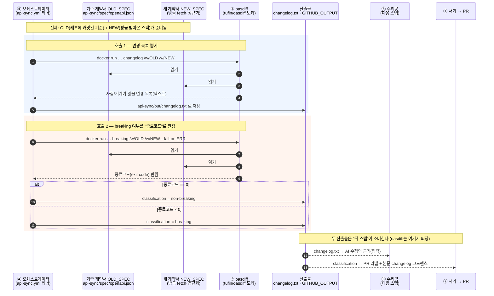
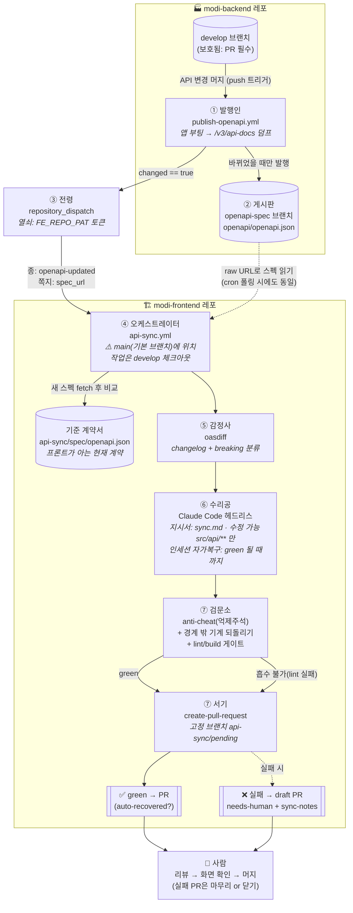
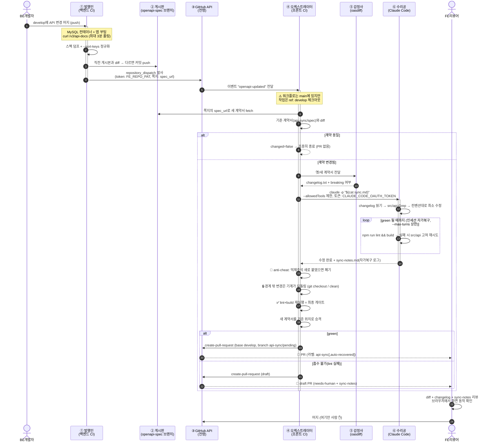

# API 자동 동기화, 큰 그림 완전 해부 — 등장인물·실제 코드·다이어그램으로 이해하기

> 대상: 이 자동화를 **처음 보는 초보 개발자**. GitHub Actions를 잘 몰라도 따라올 수 있게 쓴다.
> 성격: `blog-openapi-frontend-auto-sync.md`(구축기)의 **2장 "큰 그림"을 확대한 심화 문서**. 전체 메커니즘을 "역할(등장인물)"로 추상화해 누가·무엇을·어떻게·왜 하는지 실제 파일·코드와 함께 설명한다.
> 실제 구현: `team-modi/modi-backend` · `team-modi/modi-frontend`에 적용되어 라이브로 동작 검증된 코드들을 그대로 인용한다.

---

## 0. 한 문장 요약

**"백엔드가 API를 바꾸면, 로봇들이 릴레이로 일해서 프론트 레포에 '이렇게 고치면 됩니다'라는 PR을 만들어 놓는다. 사람은 그 PR을 리뷰하고 머지만 한다."**

이 문서는 그 "로봇들"이 각각 누구이고, 어느 파일에 살고 있으며, 왜 그렇게 설계됐는지를 하나씩 뜯어본다.

---

## 1. 왜 이런 구조가 필요한가 — 문제를 다시 보기

우리 팀 구조를 보자.

- **백엔드**: Spring Boot. API의 "명세(계약)"는 springdoc이 `/v3/api-docs`라는 주소로 자동 생성해 준다. (컨트롤러 코드를 읽어서 "이 서버에는 이런 엔드포인트가 있고, 이런 파라미터를 받고, 이런 응답을 준다"를 JSON으로 뽑아주는 것. 이 JSON 형식의 표준이 **OpenAPI 스펙**이다.)
- **프론트엔드**: React. 서버 호출 코드를 `src/api/` 폴더에 **사람이 직접** 작성한다.

여기서 문제. 백엔드 개발자가 `GET /exhibitions`에 파라미터를 추가하거나 새 엔드포인트를 만들면, **프론트의 `src/api`는 그 사실을 모른다.** 사람이 말로 전달하고, 사람이 기억해서, 사람이 고쳐야 한다. 이 "전달–기억–수정" 사슬은 반드시 끊어진다(바쁘면 까먹고, 전달이 누락되고, 고치다 오타 낸다).

그래서 이 사슬 전체를 기계에게 맡긴다. 단, **마지막 승인(머지)만은 사람이 한다.** 기계의 수정이 항상 옳다는 보장이 없기 때문이다.

---

## 2. 등장인물(역할) 소개 — 누가, 무엇을, 왜

전체 시스템에는 7명의 등장인물이 있다. 각자 딱 한 가지 일만 한다(단일 책임). 아래 표를 먼저 훑고, 3장에서 한 명씩 코드와 함께 만난다.

| # | 역할(별명) | 실체 | 사는 곳(파일) | 하는 일 한 줄 |
|---|---|---|---|---|
| ① | **발행인** (Publisher) | 백엔드 CI 워크플로 | `modi-backend/.github/workflows/publish-openapi.yml` | 앱을 부팅해 최신 계약서(스펙)를 뽑아 게시판에 붙인다 |
| ② | **게시판** (Bulletin board) | `openapi-spec` 브랜치 | `modi-backend`의 `openapi-spec` 브랜치 → `openapi/openapi.json` | 누구나 URL로 읽을 수 있는 "공식 최신 계약서" 보관소 |
| ③ | **전령** (Messenger) | `repository_dispatch` 이벤트 + PAT 토큰 | 발행인의 마지막 스텝 (`FE_REPO_PAT` 시크릿) | 프론트 레포로 달려가 "계약 바뀌었소!" 종을 친다 |
| ④ | **오케스트레이터** (Orchestrator) | 프론트 CI 워크플로 | `modi-frontend/.github/workflows/api-sync.yml` (main 브랜치) | 종소리에 깨어나 아래 ⑤⑥⑦을 순서대로 지휘한다 |
| ⑤ | **감정사** (Appraiser) | oasdiff (스펙 비교 도구) | 오케스트레이터의 스텝 4 (docker `tufin/oasdiff`) | 옛 계약서와 새 계약서를 대조해 "무엇이 어떻게 바뀌었는지" 감정서를 쓴다 |
| ⑥ | **수리공** (Mechanic) | Claude Code 헤드리스 (AI) | 오케스트레이터의 스텝 5 + 지시서 `api-sync/prompts/sync.md` | 감정서를 읽고 `src/api/` 코드를 새 계약에 맞게 고친다 |
| ⑦ | **검문소 + 서기** (Gate + Clerk) | anti-cheat + 결정론적 되돌리기 + lint/build 게이트 + create-pull-request | 오케스트레이터의 스텝 3.5~7 | 억제주석 치팅을 막고, 경계 밖 변경을 기계가 되돌리고, lint+build로 최종 판정해 green이면 PR·실패면 draft(needs-human)로 사람에게 올린다 |

핵심 설계 사상 세 가지:

1. **계약서(스펙)는 파일로 박제한다.** "지금 프론트가 알고 있는 계약"을 `api-sync/spec/openapi.json`이라는 실제 파일로 프론트 레포에 커밋해 둔다. 그래야 "바뀌었는가?"를 `diff` 한 줄로 판정할 수 있다.
2. **AI는 좁은 우리 안에서만 일한다.** 수리공(AI)은 `src/api/`만 수정할 수 있고, 이는 부탁이 아니라 **검문소가 기계적으로 강제**한다.
3. **최종 결정은 사람.** 모든 결과물은 PR이며 자동 머지는 없다.

---

## 3. 등장인물 한 명씩 뜯어보기 (실제 코드와 함께)

### ① 발행인 — "최신 계약서를 뽑아서 게시한다"

**누가**: `modi-backend` 레포의 GitHub Actions 워크플로.
**언제 일하나**: `develop` 브랜치에 push(=PR 머지)가 일어나고, 그 변경이 API에 영향을 줄 만한 파일(`src/main/**`, `build.gradle*`)일 때만.

```yaml
# modi-backend/.github/workflows/publish-openapi.yml
on:
  push:
    branches: [develop]        # develop 머지 트리거
    paths:
      - 'src/main/**'          # API에 영향 없는 변경(문서 등)엔 안 돈다
      - 'build.gradle*'
  workflow_dispatch: {}         # Actions 탭에서 수동 실행도 가능(테스트용)
```

**무엇을 하나**: 스펙(계약서)은 앱이 떠 있어야 뽑을 수 있다(springdoc이 런타임에 생성하므로). 그래서 CI가 **일회용 MySQL을 띄우고, 앱을 부팅하고, `/v3/api-docs`를 curl로 받아온다.**

```yaml
    services:
      mysql:                    # 일회용 DB (앱 부팅용. 진짜 데이터 아님)
        image: mysql:8.4
        env:
          MYSQL_DATABASE: modi
          MYSQL_ROOT_PASSWORD: root
```

```yaml
      - name: Boot app & dump OpenAPI spec
        run: |
          ./gradlew bootRun --no-daemon &     # 앱을 백그라운드로 부팅
          BOOT_PID=$!
          ok=false
          for i in $(seq 1 90); do            # 최대 90회 × 2초 = 3분 폴링
            if curl -sf http://localhost:8080/v3/api-docs -o /tmp/openapi.json; then
              ok=true; break                  # 스펙 받기 성공
            fi
            kill -0 "$BOOT_PID" 2>/dev/null || break   # 앱이 죽었으면 즉시 포기
            sleep 2
          done
          # ...실패 시 job 실패 처리...
          # 커밋 diff 안정화를 위해 키 정렬로 정규화
          python3 -m json.tool --sort-keys /tmp/openapi.json > /tmp/openapi.pretty.json
```

**왜 정규화(`--sort-keys`)하나**: JSON은 키 순서가 실행마다 달라질 수 있다. 정렬해 두면 "내용이 같으면 파일도 완전히 같다"가 보장되어, 이후 모든 비교를 단순한 `diff`로 할 수 있다.

---

### ② 게시판 — "공식 최신 계약서가 붙어 있는 곳"

**실체**: `modi-backend` 레포의 **`openapi-spec`이라는 전용 브랜치**. 여기에 `openapi/openapi.json` 파일 하나만 계속 갱신된다.

**왜 develop에 직접 커밋하지 않고 별도 브랜치인가**: 처음엔 develop에 커밋하려 했다. 그런데 develop은 "PR 필수" **보호 브랜치**라 CI 로봇의 직접 push가 거부됐다(`GH006` 에러 — 실제로 겪었다). 보호 규칙을 푸는 것은 본말전도이므로, **사람이 절대 안 만지는 기계 전용 비보호 브랜치**를 게시판으로 쓴다.

```yaml
      - name: Publish spec to openapi-spec branch if changed
        id: commit
        run: |
          cp /tmp/openapi.pretty.json openapi/openapi.json
          # 직전 게시본과 비교 → 실제로 바뀌었을 때만 발행
          git fetch origin openapi-spec --depth=1 2>/dev/null || true
          if git cat-file -e origin/openapi-spec:openapi/openapi.json 2>/dev/null; then
            git show origin/openapi-spec:openapi/openapi.json > /tmp/prev.json
            if diff -q /tmp/prev.json openapi/openapi.json >/dev/null; then
              echo "changed=false" >> "$GITHUB_OUTPUT"; exit 0   # 안 바뀜 → 종 안 침
            fi
          fi
          git checkout -B openapi-spec
          git add openapi/openapi.json
          git commit -m "chore: publish openapi spec [skip ci]"
          git push -f origin openapi-spec
          echo "changed=true" >> "$GITHUB_OUTPUT"                # 바뀜 → 종 친다
```

게시판의 주소는 곧 raw URL이다. 프론트는 언제든 이 주소로 최신 계약서를 읽는다:

```
https://raw.githubusercontent.com/team-modi/modi-backend/openapi-spec/openapi/openapi.json
```

**"바뀌었을 때만"이 중요한 이유**: 스펙이 그대로인데 종을 치면 프론트 CI가 헛돌고(비용), 매번 빈 PR이 생길 뻔한다. 그래서 발행인은 게시 전에 반드시 직전 게시본과 대조한다.

---

### ③ 전령 — "프론트 레포의 종을 친다"

**문제**: 백엔드 레포와 프론트 레포는 **완전히 분리된 별개의 저장소**다. 한 레포의 CI가 다른 레포의 CI를 어떻게 깨우나?

**해법**: GitHub의 `repository_dispatch`라는 공식 메커니즘. "저 레포에 이벤트를 하나 던진다"는 API 호출이다. 단, 남의 레포에 이벤트를 던지려면 **그 레포에 쓰기 권한이 있는 토큰(PAT)**이 필요하다. 이 토큰이 두 레포를 잇는 유일한 다리다.

```yaml
      - name: Dispatch to modi-frontend
        if: steps.commit.outputs.changed == 'true'      # 계약이 바뀌었을 때만
        uses: peter-evans/repository-dispatch@v3
        with:
          token: ${{ secrets.FE_REPO_PAT }}             # 프론트 레포 쓰기 권한 토큰
          repository: team-modi/modi-frontend           # 종을 칠 대상 레포
          event-type: openapi-updated                   # 종소리의 이름
          client-payload: >-                            # 종소리에 실어 보내는 쪽지
            {
              "backend_sha": "${{ github.sha }}",
              "source_branch": "${{ github.ref_name }}",
              "spec_url": "https://raw.githubusercontent.com/team-modi/modi-backend/openapi-spec/openapi/openapi.json"
            }
```

**쪽지(client-payload)에 뭘 담나**: 가장 중요한 건 `spec_url` — "새 계약서는 여기서 읽어라"라는 주소. 스펙 파일 자체를 안 실어 보내는 이유는 dispatch payload 크기 제한(수십 KB) 때문이다. 우리 스펙만 해도 91KB라 URL 전달이 정답이다.

**실전 함정(중요)**: 이 토큰을 fine-grained PAT로 만들 때 Resource owner를 개인 계정으로 하면, **조직(team-modi) 소유 레포에는 쓰기가 안 되어 403이 난다**(권한을 아무리 켜도 소용없음 — 실제로 겪었다). **클래식 PAT + `repo` 스코프**가 가장 확실하다.

---

### ④ 오케스트레이터 — "종소리에 깨어나 전체 작업을 지휘한다"

**누가**: `modi-frontend` 레포의 GitHub Actions 워크플로 `api-sync.yml`.
**언제 일하나**: 세 가지 종소리 중 아무거나.

```yaml
# modi-frontend/.github/workflows/api-sync.yml
on:
  repository_dispatch:
    types: [openapi-updated]   # ③전령이 친 종 (옵션 A: 머지 즉시)
  schedule:
    - cron: '0 0 * * *'        # 매일 09:00 KST 자명종 (옵션 B: 폴링 — 종을 놓쳐도 하루 안에 따라잡음)
  workflow_dispatch:            # 사람이 누르는 수동 버튼
```

**치명적 함정 — 이 파일은 반드시 기본 브랜치(main)에 있어야 한다**: GitHub은 `repository_dispatch`·`schedule`·`workflow_dispatch`를 **기본 브랜치에 존재하는 워크플로만** 실행한다. 우리는 처음에 develop에만 뒀다가 종을 쳐도 아무 일도 안 일어나는 것을 겪었다. 파일은 main에 살되, **일은 develop에서 한다**:

```yaml
      # dispatch/schedule은 기본 브랜치를 체크아웃하므로,
      # 백엔드 develop과 짝을 맞추려면 프론트도 develop을 명시해야 한다.
      - uses: actions/checkout@v4
        with:
          ref: develop
```

**스펙 주소는 어떻게 아나**: 종소리 쪽지의 `spec_url`이 있으면 그걸, 없으면(자명종/수동 실행) 저장해 둔 변수를 쓴다:

```yaml
env:
  SPEC_URL: ${{ github.event.client_payload.spec_url || vars.BACKEND_SPEC_URL }}
  OLD_SPEC: api-sync/spec/openapi.json     # "프론트가 아는 현재 계약" (레포에 커밋됨)
  NEW_SPEC: api-sync/out/openapi.new.json  # 방금 받아온 새 계약
```

**첫 번째 판단 — 바뀌긴 했나**: 새 계약서를 받아 정규화한 뒤, 박제해 둔 옛 계약서와 diff. 같으면 전원 퇴근(이후 스텝 전부 skip).

```yaml
      - name: Fetch spec & detect change
        id: change
        run: |
          curl -sSfL "$SPEC_URL" | python3 -m json.tool --sort-keys > "$NEW_SPEC"
          if [ -f "$OLD_SPEC" ] && diff -q "$OLD_SPEC" "$NEW_SPEC" > /dev/null; then
            echo "changed=false" >> "$GITHUB_OUTPUT"   # 변경 없음 → 이후 전부 skip
          else
            echo "changed=true" >> "$GITHUB_OUTPUT"
          fi
```

실제로 우리가 데모 엔드포인트를 원복(제거)했을 때, 이 판정 덕에 프론트는 "계약이 기준과 같네" 하고 **PR 없이 조용히 종료**했다. 진짜 변경에만 반응한다는 증거.

---

### ⑤ 감정사 — "무엇이 어떻게 바뀌었는지 감정서를 쓴다"

**왜 필요한가**: 수리공(AI)에게 "계약서 두 장 줄 테니 알아서 비교해서 고쳐"라고 하면, 91KB짜리 JSON 두 개를 통째로 읽으며 비교부터 해야 한다. 느리고 비싸고 실수 여지가 크다. 그래서 **기계적 비교는 전문 도구(oasdiff)에게** 시키고, AI에게는 요약된 감정서만 준다.

```yaml
      - name: Diff changelog (oasdiff)
        if: steps.change.outputs.changed == 'true'
        id: classify
        run: |
          # 사람이 읽을 수 있는 변경 목록 생성
          docker run --rm -v "$PWD:/w" tufin/oasdiff changelog "/w/$OLD_SPEC" "/w/$NEW_SPEC" \
            > api-sync/out/changelog.txt || true
          # 하위호환 깨는 변경(breaking)인지 분류 → PR 라벨로 사용
          if docker run --rm -v "$PWD:/w" tufin/oasdiff breaking "/w/$OLD_SPEC" "/w/$NEW_SPEC" --fail-on ERR > /dev/null 2>&1; then
            echo "classification=non-breaking" >> "$GITHUB_OUTPUT"
          else
            echo "classification=breaking" >> "$GITHUB_OUTPUT"
          fi
```

실제 라이브 검증 때 감정서는 이렇게 나왔다:

```
1 changes: 0 error, 0 warning, 1 info
info  [endpoint-added] in API GET /api/v1/exhibitions/featured
      endpoint added
```

`breaking`/`non-breaking` 분류는 PR에 라벨로 붙는다. 리뷰어가 "이건 급한 PR인가"를 라벨만 보고 판단할 수 있게.

---

### ⑤-심화. oasdiff 톺아보기 — 왜 이 툴이고, 무엇을 쓰나

감정사(oasdiff)는 우리가 만든 게 아니라 가져다 쓰는 **외부 오픈소스 CLI 도구**다(Go로 작성, github.com/oasdiff/oasdiff, 도커 이미지 `tufin/oasdiff`). 자주 나오는 질문들을 정리한다.

#### oasdiff가 제공하는 기능(서브커맨드) 전체

| 서브커맨드 | 하는 일 |
|---|---|
| `diff` | 두 스펙의 **전체** 차이를 구조적으로 출력(yaml/json/html 등) |
| `breaking` | **하위호환 깨는 변경만** 골라냄. `--fail-on`으로 심각도 기준 종료코드 제어 |
| `changelog` | 사람이 읽을 변경 목록(신뢰도 info/warn/err 태그 포함) |
| `summary` | 변경 개수 요약(추가/삭제/수정 카운트) |
| `flatten` | `allOf` 스키마 병합 |
| `upgrade` | OpenAPI 3.0 → 최신 3.x 정규화 |
| `validate` | 단일 스펙 RFC 위반 검사 |
| `checks` | breaking 판정 규칙 목록 출력 |
| `git-diff-driver` | git log와 연동(리비전 간 비교) |

- **출력 형식**: text / json / yaml / markdown / markup / html
- **입력**: 로컬 파일, HTTP(S) URL, **git 리비전(브랜치·태그·커밋)**, YAML/JSON 모두
- **OpenAPI 3.0 · 3.1 지원**, 실행 방식: 단일 바이너리(brew/curl/asdf) · 도커 이미지 · GitHub Action(`oasdiff/oasdiff-action`)

#### 그중 우리가 실제로 쓰는 건 딱 2개 — `changelog`와 `breaking`

우리 파이프라인이 감정사에게 원하는 건 두 가지뿐이다.

1. **`changelog`** → "무엇이 바뀌었나"의 사람/AI가 읽을 요약. 이걸 ⑥수리공(AI)에게 근거로 넘기고, PR 본문에도 붙인다. **91KB 스펙 전문 대신 요약을 주는 게 핵심** — AI가 diff부터 하느라 헤매지 않게.
2. **`breaking --fail-on ERR`** → "이 변경이 하위호환을 깨나?"를 **종료코드(exit code)** 로 알려준다. 0이면 non-breaking, 0이 아니면 breaking. 셸 `if` 한 줄로 분류해서 PR 라벨로 쓴다.

나머지(diff/summary/flatten/upgrade/validate/html 리포트/git-diff-driver)는 **안 쓴다.** 우리에겐 과하다.

#### 사용법 & 우리 프로젝트에서의 활용 (실제 코드)

기본 문법은 `oasdiff <서브커맨드> <옛_스펙> <새_스펙>`. 도커로 돌릴 땐 작업 폴더를 컨테이너에 마운트(`-v "$PWD:/w"`)해서 컨테이너 안 경로(`/w/...`)로 파일을 넘긴다.

```yaml
# api-sync.yml 스텝 4 (⑤감정사) — 실제 코드
- name: Diff changelog (oasdiff)
  run: |
    # (1) 사람/AI가 읽을 변경 목록 → 파일로 저장 (AI 입력 + PR 본문에 사용)
    docker run --rm -v "$PWD:/w" tufin/oasdiff changelog \
      "/w/$OLD_SPEC" "/w/$NEW_SPEC" > api-sync/out/changelog.txt || true

    # (2) breaking 여부를 "종료코드"로 판정 → PR 라벨용 분류값 결정
    if docker run --rm -v "$PWD:/w" tufin/oasdiff breaking \
         "/w/$OLD_SPEC" "/w/$NEW_SPEC" --fail-on ERR > /dev/null 2>&1; then
      echo "classification=non-breaking" >> "$GITHUB_OUTPUT"   # 종료코드 0
    else
      echo "classification=breaking" >> "$GITHUB_OUTPUT"       # 0 아님
    fi
```

즉 우리 프로젝트에서 oasdiff는 **"AI에게 줄 근거 요약(changelog)"과 "리뷰어에게 줄 위험 신호(breaking 라벨)" 두 산출물을 만드는 감정사**로만 쓰인다. 로컬에서 직접 확인하고 싶으면 바이너리로도 똑같이:

```bash
oasdiff changelog old.json new.json          # 변경 목록
oasdiff breaking  old.json new.json --fail-on ERR; echo $?   # 0=non-breaking
```

#### 우리 프로젝트에서 oasdiff가 도는 순서 (시퀀스 다이어그램)

api-sync 워크플로의 "스텝 4"에서 oasdiff가 어떻게 두 번 호출되고, 그 두 산출물(changelog·분류값)이 각각 어디로 흘러가는지를 시간순으로 본 것이다. (이 스텝은 앞 스텝에서 `changed==true`로 판정됐을 때만 실행된다.)



읽는 법: oasdiff는 **두 번 호출되고 곧바로 퇴장**한다. 첫 호출의 산출물(`changelog.txt`)은 ⑥수리공의 입력이 되고, 둘째 호출의 산출물(`classification`)은 ⑦서기가 PR 라벨·본문으로 쓴다. oasdiff 자신은 상태를 갖지 않는 **일회성 감정만** 하고, 판단·수정은 전혀 하지 않는다.

#### 왜 하필 oasdiff였나 — 대안과의 비교

우리 요구는 명확했다: **① 두 스펙을 의미(semantic) 단위로 비교** ② **사람/기계가 읽을 changelog** ③ **breaking 여부를 CI 종료코드로** ④ **CI에서 설치 부담 0**. 이 4개를 한 툴로 가장 깔끔하게 채운 게 oasdiff였다.

| 툴 | 구현/런타임 | breaking 판정 | 강점 | 약점(우리 기준) |
|---|---|---|---|---|
| **oasdiff** (선택) | Go, 단일 바이너리/도커, 런타임 無 | ✅ `breaking`+`--fail-on`(종료코드) | changelog+breaking을 **한 툴**로, CI 친화(종료코드), 3.0/3.1, 설치 0(도커) | 화려한 시각 리포트는 약함(우린 불필요) |
| **openapi-changes** (pb33f) | Go+JS, 도커/brew/npm | ✅ (changes-rules.yaml) | **git 히스토리 타임라인 + 대화형 HTML/터미널 UI**가 아름다움. 사람이 탐색하기 최고 | 자동 파이프라인에 넣기엔 시각탐색 지향. 우린 중간 산출물이 "기계가 읽을 텍스트"라 오버스펙 |
| **openapi-diff** (OpenAPITools) | **Java 8+ (JVM 필요)** | ✅ breaking/호환 구분 | 성숙, 출력형식 다양(html/md/asciidoc) | **JVM 런타임 부담**, OpenAPI **3.0만**(3.1 X), 종료코드 게이팅이 oasdiff만큼 매끄럽지 않음 |
| **Optic / Redocly 등** | 제품/서비스(일부 유료·클라우드) | ✅ | PR 게이팅·거버넌스·대시보드 등 **팀 운영 기능** 풍부 | 우리 lean 하네스엔 과함(설정·비용·외부 의존) |

정리하면, **openapi-changes가 "사람이 눈으로 보기"엔 더 예쁘지만**, 우리 감정사는 결과를 사람이 아니라 **AI와 셸 `if`가 소비**한다. 그래서 "기계가 읽을 changelog + 종료코드 breaking 판정 + 런타임 없는 단일 도커"가 맞아떨어지는 oasdiff가 정답이었다. 나중에 "리뷰어용 예쁜 시각 리포트"가 필요해지면 openapi-changes를 **PR 아티팩트 생성 스텝으로 추가**하는 식으로 공존시킬 수 있다(감정사를 갈아치울 필요 없이).

---

### ⑥ 수리공 — "감정서를 읽고 src/api를 고친다" (AI 등장)

**실체**: 로컬에서 개발할 때 쓰는 그 Claude Code CLI 그대로다. CI 안에서는 `-p`(headless, 비대화형) 모드로 돌고, 인증은 환경변수 토큰으로 한다.

```yaml
      - name: AI sync (Claude Code headless)
        if: steps.change.outputs.changed == 'true'
        env:
          # Claude Max/Pro 구독 인증. `claude setup-token`으로 발급한 장기 OAuth 토큰.
          CLAUDE_CODE_OAUTH_TOKEN: ${{ secrets.CLAUDE_CODE_OAUTH_TOKEN }}
        run: |
          npm install -g @anthropic-ai/claude-code
          claude -p "$(cat api-sync/prompts/sync.md)" \
            --allowedTools "Read,Grep,Glob,Edit,Bash(npm run lint*),Bash(npm run build*)" \
            --max-turns 30
```

여기서 두 가지 통제 장치를 보라.

- **`--allowedTools`**: AI가 쓸 수 있는 도구를 "읽기, 검색, 파일 편집, lint/build 실행"으로 제한한다. 임의 셸 명령, 네트워크 접근, git push 같은 건 아예 못 한다.
- **`sync.md` 지시서**: AI에게 주는 작업 명세서. 별도 파일(`api-sync/prompts/sync.md`)로 관리해서, AI의 행동 규칙을 코드 리뷰로 관리할 수 있다.

지시서의 핵심 대목(실제 파일에서 발췌):

```markdown
## 입력 (반드시 이 순서로 읽어라)
1. api-sync/out/changelog.txt — 무엇이 어떻게 바뀌었는가. 모든 수정의 근거는 여기서 출발한다.
2. api-sync/out/openapi.new.json — 새 스펙 전문. changelog만으로 모호하면 여기서 확인.
3. src/api/ — Grep으로 changelog에 등장한 엔드포인트를 사용하는 코드를 찾아라.

## 불변 규칙
1. 수정 허용 경로는 src/api/** 뿐이다. 컴포넌트/페이지/스토어/라우터 금지
   — 별도 가드레일이 git diff로 강제하며, 위반 시 수정 전체가 폐기된다.
2. changelog에 근거 없는 수정 금지. "이왕 하는 김에" 리팩토링 금지.
3. src/api 수정만으로 흡수 불가능한 변경은 수정하지 말고 sync-notes에 기록 후 중단.
   그것은 사람이 결정할 문제다.

## 완료 조건 (반드시 green으로 끝내라)
- npm run lint / build가 모두 통과해야 완료. 실패하면 에러(파일:라인)를 읽고 src/api를
  고쳐 green 될 때까지 반복하라 — 너는 네 도구로 직접 lint/build를 돌릴 수 있다(자가복구).
- 치팅 금지: eslint-disable / @ts-ignore 추가로 "통과시키지" 마라(메타 가드레일이 폐기).
- 여러 번 시도해도 src/api만으론 green이 안 되면 멈추고 sync-notes에 원인을 남겨라.
```

즉 수리공은 **자기 세션 안에서 lint/build를 돌려 green이 될 때까지 스스로 고친다**(인세션 자가복구). 검문소(⑦)로 넘어갈 때쯤이면 대개 이미 통과 상태다.

그리고 결정적으로, **이 레포의 실제 코딩 컨벤션을 지시서에 박아 둔다.** 이걸 안 하면 AI가 "자기 스타일"로 코드를 짠다:

```markdown
## 이 레포의 실제 컨벤션 (반드시 지켜서 수정하라)
- HTTP 클라이언트는 항상 @utils/axiosInstance 의 default import 하나뿐이다.
- 함수는 named export const 화살표 async 함수. export default 금지.
- 메서드는 get/post/put/delete. PATCH는 쓰지 않는다(백엔드가 PATCH 미사용).
- 경로는 baseURL에 상대적(예: /exhibitions). /api/v1 을 중복해 붙이지 마라.
```

실제 라이브 검증에서 수리공이 만든 결과물 — `src/api/exhibition.js`에 정확히 컨벤션대로 함수를 추가했다:

```js
// 추천 전시 조회
export const getFeaturedExhibition = async () => {
  const data = await axiosInstance.get("/exhibitions/featured");
  return data;
};
```

**왜 "changelog에 근거 없는 수정 금지"인가**: AI는 시키지 않은 개선을 하고 싶어 하는 경향이 있다. 리뷰어가 "이 PR의 모든 변경은 스펙 변경에서 나온 것"이라고 신뢰할 수 있어야 리뷰가 빨라진다. diff의 모든 줄이 감정서의 어떤 항목과 1:1로 대응돼야 한다.

---

### ⑦ 검문소 + 서기 — "고치고, 되돌리고, 검사하고, 서류를 만든다"

수리공이 일을 마치면 검문소가 돈다. 핵심 원칙: **AI는 자기 실수(lint 실패)를 스스로 고칠 수 있지만, 경계 위반은 AI가 아니라 기계가 되돌린다.** 이 **비대칭**이 설계의 뼈대다 — 안 그러면 경계를 침범한 AI에게 "네 침범을 네가 고쳐"라고 맡기는 꼴이라 경계가 협상 가능해진다.

**0단계 — 자가복구는 이미 수리공 안에서 끝난다.** 수리공(⑥)은 자기 턴에서 `npm run lint`/`npm run build`를 직접 돌려, 실패하면 `src/api`를 고쳐 **green이 될 때까지 반복**한다(인세션 자가복구). `--max-turns`가 그 상한(유계). 그래서 아래 검문소에 도달할 때쯤이면 대개 이미 green이다. 별도 외부 재시도 루프를 만들지 않은 이유 = AI가 이미 자기 세션 안에서 lint/build를 돌릴 수 있으니, 인세션 반복이 가장 간단·강력하다.

**검문소 1 — 치팅 통과 차단 (메타 가드레일)**: AI가 lint를 넘기려고 `eslint-disable`·`@ts-ignore` 같은 억제 주석을 새로 붙였으면 폐기. "규칙을 끄고 통과"를 sync.md 금지 규칙만으로는 못 믿으니 기계로 막는다.
```yaml
- name: Anti-cheat (no new suppression comments)
  run: |
    if git diff -- src/api | grep -E '^\+' | grep -Eq 'eslint-disable|@ts-ignore|@ts-nocheck'; then
      echo "::error::억제 주석으로 통과 시도 감지 — 폐기"; exit 1
    fi
```

**검문소 2 — 경계 위반은 "실패"가 아니라 "결정론적 되돌리기"**: 예전엔 경계 밖 수정이 있으면 job 전체를 실패시켰다. 지금은 **기계가 경계 밖 변경만 되돌린다**(편집은 `git checkout`, 새 파일은 `git clean`). 되돌린 뒤 아래 lint+build 재실행이 사후 판정한다.
```yaml
- name: Guardrail — deterministic revert
  run: |
    bad=$(git diff --name-only | grep -Ev '^(src/api/|api-sync/)' || true)
    new=$(git ls-files --others --exclude-standard | grep -Ev '^(src/api/|api-sync/)' || true)
    printf '%s\n' "$bad" | while IFS= read -r f; do [ -n "$f" ] && git checkout -- "$f"; done
    printf '%s\n' "$new" | while IFS= read -r f; do [ -n "$f" ] && git clean -f -- "$f"; done
```

**검문소 3 — 검증 게이트(lint+build), 최종 판정**: 되돌린 뒤 다시 돌린다. 여기서 두 갈래로 갈린다 —
- **green** → 그 경계 밖 오버리치는 애초에 불필요했던 것("이왕 하는 김에"). 안전하게 버리고 PR로.
- **실패** → src/api 변경이 그 바깥 파일에 **실제로 의존**했다 = `src/api`만으론 흡수 불가 → 사람에게 에스컬레이션. (원래 "src/api 흡수?" 관문에서 놓쳤어야 할 케이스를 **되돌리기 + lint 게이트가 사후에 다시 잡아준다** — 경계는 여전히 hard하고 AI는 자기 우리를 넓히지 못한다.)
```yaml
- name: Verify (lint + build)
  run: |
    if npm run lint && npm run build; then echo "green=true" >> "$GITHUB_OUTPUT"
    else echo "green=false" >> "$GITHUB_OUTPUT"; fi   # 실패해도 여기서 죽지 않고 결과만 기록
```

**서기 — 계약서 갱신 + PR (조용한 죽음 없음)**: 새 계약서를 기준 위치로 승격하고, 결과에 따라 —
- **green** → 일반 PR (자가복구·되돌리기가 있었으면 `auto-recovered` 라벨로 "더 의심하며 보라" 신호).
- **실패** → **draft PR + `needs-human` 라벨** + sync-notes에 "왜 src/api만으론 안 됐는지". 성공이든 실패든 **항상 사람이 보는 산출물**로 끝난다(조용한 성공도, 조용한 죽음도 없음).
```yaml
- name: Create PR
  uses: peter-evans/create-pull-request@v6
  with:
    base: develop
    branch: api-sync/pending                 # 고정 브랜치 = 미머지 시 새 PR 안 쌓고 그 하나를 갱신
    draft: ${{ steps.prep.outputs.draft }}   # 실패면 draft
    labels: ${{ steps.prep.outputs.labels }} # api-sync,<breaking>[,auto-recovered|needs-human]
    add-paths: |
      api-sync/spec/**
      src/api/**
```

**함정 하나 더**: `create-pull-request`는 조직 설정 **"Allow GitHub Actions to create and approve pull requests"** 가 켜져 있어야 동작한다(기본 OFF — 우리도 여기서 막혔다).

여기서 릴레이가 끝난다. 이후는 사람: PR 리뷰 → 화면 확인 → 머지.

> **복구가 지켜야 할 불변식 4개** — ① 유계(turn·재시도 상한, 초과 시 실패가 아니라 에스컬레이션) ② 항상 사람이 보는 산출물(성공=PR, 실패=draft+sync-notes) ③ 경계는 결정론(lint는 AI가 고쳐도, 위반은 기계가 되돌린다 — 이 비대칭) ④ 관찰 가능성(몇 번 시도/무엇을 되돌림/검증결과를 PR 본문에 기록).

---

## 4. 추상화 구조도 — 역할과 책임의 지도



읽는 법: 백엔드 쪽 세 역할(①②③)은 "계약서를 만들어 알리는" 책임, 프론트 쪽 네 역할(④~⑦)은 "받아서 반영·검증하는" 책임이다. 두 세계를 잇는 건 **전령의 열쇠(PAT) 하나**와 **게시판의 URL 하나**뿐 — 결합이 최소라 한쪽이 죽어도 다른 쪽은 cron 폴링으로 산다. ⑦에서 길이 **green→PR / 흡수불가→draft(needs-human)** 로 갈리지만, 어느 쪽이든 **사람이 보는 산출물**로 끝난다(조용한 죽음 없음).

---

## 5. 시퀀스 다이어그램 — 시간 순서로 보는 하루

백엔드 개발자가 새 엔드포인트를 머지한 순간부터 프론트 PR이 열리기까지. (실제 라이브 검증에서 이 전체가 **사람 개입 0으로 약 5분**에 완주했다.)



---

## 6. "왜?"에 대한 총정리 — 설계 Q&A

**Q. 백엔드 CI가 프론트 코드를 직접 고치면 더 간단하지 않나?**
A. 안 된다. 권한·책임·이력이 다 꼬인다. 백엔드 CI는 "계약이 바뀌었다"는 **사실만 알리고 끝**낸다. 프론트 수정은 프론트 레포의 워크플로가, 프론트 레포의 체크아웃 안에서, 프론트 레포의 권한으로 한다. 각 레포의 히스토리에 각자의 일만 남는다.

**Q. 스펙을 왜 프론트 레포에도 커밋하나(기준 계약서)? 매번 백엔드에서 읽으면 되잖아.**
A. "바뀌었는가?"를 판정하려면 **비교 기준점**이 필요하다. 기준을 파일로 커밋해 두면 ① diff 한 줄로 변경 감지 ② PR diff에 계약 변화가 그대로 보임 ③ "프론트가 어느 시점의 계약까지 반영했는지"가 git 이력으로 남는다.

**Q. AI를 어떻게 믿나?**
A. 안 믿는다. 그래서 다중 방어다: ① `--allowedTools`로 능력 제한 ② **억제주석 치팅 차단**(anti-cheat) ③ **경계 위반은 AI가 아니라 기계가 되돌린다**(결정론) ④ 결과는 반드시 PR, 머지는 사람. AI가 이상한 짓을 하면 최악이라야 "이상한 PR 하나"이고 닫으면 그만이다. 핵심은 **비대칭** — lint 실패 같은 "자기 실수"는 AI가 고치게 두되, "경계 침범"은 협상 불가라 기계가 되돌린다.

**Q. 실패하면 바로 사람한테 넘기나?**
A. 아니다. **먼저 AI가 스스로 복구**한다 — 수리공은 자기 세션 안에서 lint/build를 돌려 green이 될 때까지 `src/api`를 고친다(인세션 자가복구, `--max-turns`가 상한). lint+build 실패는 재현 가능하고 구조화된 에러(파일:라인)라 자가복구에 딱 맞는 대상이다. 그래도 `src/api` 수정만으로 green이 안 되면(진짜 흡수 불가) 그때 사람에게 넘긴다 — **draft PR + `needs-human` 라벨 + sync-notes**. 성공이든 실패든 조용히 끝나지 않는다.

**Q. lint+build만으로 충분한가?**
A. 불충분하다 — 그리고 그걸 숨기지 않는다. lint+build는 "자가복구의 성공 신호"이자 "최소 게이트"일 뿐, **의미가 맞는지는 사람 리뷰의 몫**이다. PR 본문에 "검증은 lint+build까지만, 동작 확인은 리뷰어 몫"이 항상 박히고, sync-notes에 "리뷰어가 브라우저에서 확인할 화면 목록"이 들어간다. 더 강한 검증(Playwright 목서버 게이트)은 이 구조를 유지한 채 스텝만 추가하면 된다.

**Q. dispatch가 실패하면(토큰 만료 등) 동기화가 영영 멈추나?**
A. 아니다. 오케스트레이터에 매일 도는 `schedule`(cron)이 있어서, 종소리를 놓쳐도 **최대 하루 안에** 게시판을 직접 읽고 따라잡는다. 즉시성(옵션 A)과 견고함(옵션 B)의 이중화다.

---

## 부록: 전체 파일 지도

```
modi-backend/
├─ .github/workflows/publish-openapi.yml   ← ① 발행인 + ③ 전령
├─ (openapi-spec 브랜치) openapi/openapi.json  ← ② 게시판 (기계 전용)
└─ Secrets: FE_REPO_PAT                    ← 전령의 열쇠 (클래식 PAT, repo 스코프)

modi-frontend/
├─ .github/workflows/api-sync.yml          ← ④~⑦ 전원 (⚠️ main 브랜치에 위치)
├─ api-sync/
│  ├─ prompts/sync.md                      ← ⑥ 수리공의 작업 지시서
│  ├─ spec/openapi.json                    ← 기준 계약서 (develop에 커밋)
│  └─ out/                                 ← 런타임 산출물 (gitignore)
├─ Secrets: CLAUDE_CODE_OAUTH_TOKEN        ← 수리공의 신분증 (claude setup-token 발급)
└─ Variables: BACKEND_SPEC_URL             ← 폴링용 게시판 주소

조직 설정: "Allow GitHub Actions to create and approve pull requests" ON
```

> 함께 읽기: 구축 과정 전체와 실전 함정 5개는 `blog-openapi-frontend-auto-sync.md` 참고.
