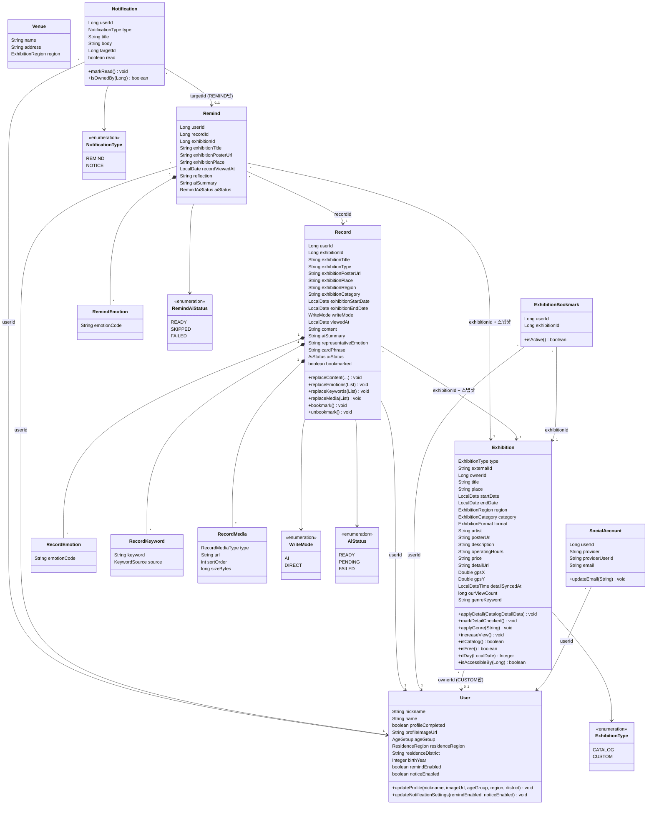

# 클래스 다이어그램

> 도메인 엔티티 중심의 클래스 다이어그램.

---

## 다이어그램

> 이 외의 분류 축 enum — Exhibition: `ExhibitionCategory`(회화·사진·미디어 등 9종), `ExhibitionRegion`(광역 14 + ETC), `ExhibitionFormat`(SOLO/GROUP/CURATED/ART_FAIR), `ExhibitionSection`(ENDING_SOON/OPENING_THIS_MONTH/FREE) / User: `AgeGroup`(TEENS~FIFTIES_PLUS, UNSPECIFIED), `ResidenceRegion`(전국 17개 시·도) / Record: `KeywordSource`(USER/AI), `RecordMediaType`(PHOTO/VIDEO). Venue는 전시와 같은 `ExhibitionRegion` 축을 재사용한다.

---

## 값 객체(record) 규칙

이 프로젝트는 영속 VO 대신 도메인 경계에서 쓰는 순수 record 값 객체를 둔다.

| 값 객체 | 검증/행위 | 비즈니스 규칙 |
|---|---|---|
| ExhibitionSnapshot (record) | 생성 시 검증 | 기록의 전시 박제 — 제목은 필수, 문자열 기반(전시 enum 비의존) |
| RemindExhibitionSnapshot (remind) | — | 리마인드 저장 시점의 전시 카드 복사본. 원본 삭제에도 카드 유지 |
| GenreClassification (exhibition) | toPromptText() | 장르 분류 입력 — 값 있는 필드만 "라벨: 값"으로 이어붙인 프롬프트 텍스트 생성 |
| GenreKeyword (exhibition) | contains()/random()/all() | 장르 키워드 마스터 10종의 단일 진실 원천. AI 응답이 마스터를 벗어나면 검증 실패 |
| ExhibitionQuery (exhibition) | — | 목록 조회 조건 + 키셋 커서 경계(정렬 판별자·커서값·마지막 id) |
| Cursor (support) | decode(cursor, sort) | 커서 인코딩/디코딩. 정렬 판별자 불일치·손상 커서는 INVALID_CURSOR |
| AuthTokens / TokenClaims (auth) | isAccess()/isRefresh() | 자체 JWT 발급 결과와 파싱 클레임. 용도(access/refresh) 구분 검증 |
| OAuthUserInfo (auth) | — | provider 사용자 정보(sub·nickname·name·email·ageGroup·birthYear) 표준화 |

---

## 엔티티별 비즈니스 규칙

| 엔티티 | 메서드 | 비즈니스 규칙 |
|---|---|---|
| User | updateProfile(...) | 부분 갱신(null 아닌 필드만). 닉네임 1~20자·공백만 불가, 구/군 단독 입력 불가. 완료 시 profileCompleted=true |
| User | updateNotificationSettings(...) | 리마인드·공지 수신 여부 전체 갱신 |
| SocialAccount | updateEmail(String) | 재로그인 시 provider 이메일 최신화 |
| Exhibition | createCustom(...) / createCatalog(...) | 제목 1~100자 필수, 기간 start≤end, SOLO면 artist 필수(정적 팩토리 + guard) |
| Exhibition | applyDetail(...) / markDetailChecked() | 상세 지연수집 — 상세를 채우고 detailSyncedAt 기록 / 상세 미보유 확인만 표기 |
| Exhibition | applyGenre(String) | 유효한(공백 아닌) 값일 때만 장르 반영 |
| Exhibition | isFree() | "무료" 포함 또는 표기 금액이 0뿐이면 무료. null/공백은 무료 아님 |
| Exhibition | isAccessibleBy(Long) | CATALOG는 공개, CUSTOM은 등록자 본인만 |
| Exhibition | dDay(LocalDate) | 종료 D-데이(오늘=종료일이면 D-0). 종료일 없거나 지났으면 null |
| ExhibitionBookmark | isActive() | deletedAt == null이면 활성. 해제=soft-delete, 재등록=restore |
| Record | replaceContent/Emotions/Keywords/Media | 수정은 전체 교체(orphanRemoval). 키워드는 폐지 개념이라 수정 시 빈 목록으로 정리 |
| Record | bookmark() / unbookmark() | 기록 북마크 토글(멱등) |
| Remind | create(...) + guard() | 소감(reflection) 필수. 감정 코드는 공백 제거·중복 제거 후 부착 |
| Notification | markRead() | 읽음 처리(멱등) |
| Notification | isOwnedBy(Long) | 소유자 확인 — 타인 알림 접근을 404로 차단하는 판정에 사용 |
| BaseEntity(공통) | delete() / restore() | soft delete·복원, 멱등. guard() 훅은 PrePersist/PreUpdate 시 불변식 검증 |

---

## 관계 정리

| 관계 | 카디널리티 | 설명 |
|---|---|---|
| User → SocialAccount | 1 : N | 한 유저가 여러 소셜 연결(카카오/구글/…). (provider, providerUserId) 유일 |
| User → Exhibition(CUSTOM) | 1 : N | 사용자가 직접 등록한 개인 전시. CATALOG는 ownerId=null(공개) |
| User → ExhibitionBookmark | 1 : N | 한 유저의 관심 전시들 |
| Exhibition → ExhibitionBookmark | 1 : N | 한 전시가 여러 사용자에게 관심 등록됨 (교차 테이블) |
| User → Record | 1 : N | 한 유저가 여러 기록 |
| Exhibition → Record | 1 : N | 한 전시에 여러 기록. 전시 정보는 기록에 스냅샷으로 박제 |
| Record → RecordEmotion / RecordKeyword / RecordMedia | 1 : N | 애그리거트 내부 자식 — cascade + orphanRemoval로 수명 공유 |
| User → Remind | 1 : N | 한 유저가 여러 리마인드 |
| Record → Remind | 1 : N | 한 기록을 시간차로 여러 번 회고할 수 있다 |
| Remind → RemindEmotion | 1 : N | 애그리거트 내부 자식 — "지금 다시 남긴" 감정 코드들 |
| User → Notification | 1 : N | 한 유저에게 여러 알림 |
| Remind → Notification | 1 : N | REMIND 알림의 이동 대상(targetId=remindId). NOTICE는 targetId=null |

---

## 설계 결정

- **Rich Domain Model**: 비즈니스 로직(불변식·상태 변경)은 엔티티 메서드에 포함한다. Facade는 load·조율·save만 담당한다.
- **경계 넘는 참조는 ID만**: 다른 애그리거트(User·Exhibition·Record)는 @ManyToOne 대신 ID 값으로 참조한다. FK 제약도 걸지 않는다.
- **애그리거트 내부는 객체 참조**: RecordEmotion·RecordKeyword·RecordMedia·RemindEmotion은 부모와 수명을 같이하는 내부 엔티티 — @ManyToOne + FK + cascade + orphanRemoval을 사용한다.
- **전시 단일 테이블**: CATALOG(외부 수집)와 CUSTOM(직접 등록)을 type 판별자로 한 테이블에서 다룬다. externalId는 CATALOG 동기화의 신규 여부 판별키(존재 시 스킵 — 기존 행 갱신 없음), ownerId는 CUSTOM 노출 제어 키다.
- **스냅샷 박제**: Record는 전시 표시정보를, Remind는 원본 기록의 전시 카드를 생성 시점에 문자열로 복사한다. 원천 변경·삭제에 영향받지 않는다.
- **Venue 비영속 참조**: 개인 전시 등록 시 venueId로 전시관을 조회해 장소명·지역만 파생하고, 전시에 venueId를 저장하지 않는다.
- **알림 targetId 다형 참조**: NotificationType에 따라 targetId의 의미가 달라진다(REMIND=remindId, NOTICE=null). FK 없는 논리 참조라 가능한 설계다.
- **북마크 soft-delete 복원 패턴**: (user_id, exhibition_id) UNIQUE 한 행을 delete()/restore()로 토글해 유니크 제약과 멱등성을 함께 만족한다.
- **조회수 비정규화**: 인기순 정렬용 ourViewCount를 Exhibition에 직접 저장하고 상세 진입 시 증가시킨다(외부 API 조회수와 별개).
- **@DynamicUpdate(Exhibition)**: 보강(장르·상세)과 조회수 증가 등이 같은 행을 짧은 시간차로 갱신할 때 서로의 전체-컬럼 UPDATE가 상대 필드를 덮는 lost update를 막는다(@Version 미도입 환경 방어).
- **BaseEntity 공통화**: id·created/updated/deleted_at·guard() 훅을 공통 상속. 단, 애그리거트 내부 자식 4종은 BaseEntity를 상속하지 않는다(교체 시 물리 삭제라 soft delete 불필요).
