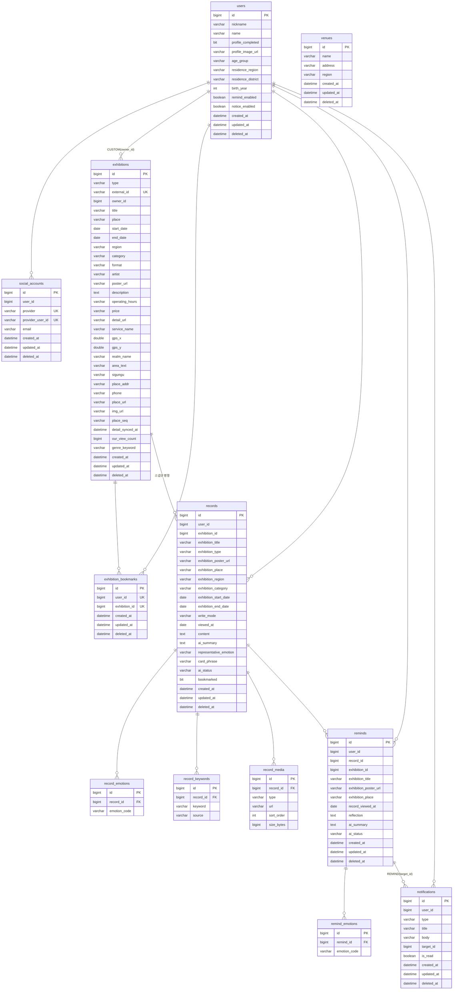

# ERD

> 애그리거트 경계를 넘는 관계에는 FK 제약조건을 사용하지 않는다. 경계 넘는 관계선은 논리적 참조(ID 컬럼)를 나타내고, 애그리거트 내부 자식 테이블(record_*, remind_emotions)에만 실제 FK가 걸려 있다.

---

## 다이어그램

---

## 제약조건

| 테이블 | 제약조건 | 설명 |
|---|---|---|
| social_accounts | UNIQUE(provider, provider_user_id) | 소셜 연결 유일성 — 한 provider 계정은 하나의 연결만 |
| exhibitions | UNIQUE(external_id) | CATALOG 동기화의 신규 판별·중복 방지 키(기존 행 갱신 없음). MySQL unique 인덱스는 다중 NULL을 허용해 CUSTOM(null)과 공존 |
| exhibition_bookmarks | UNIQUE(user_id, exhibition_id) | 한 쌍당 한 행 — 멱등 토글(soft-delete/복원)의 기준 |
| record_emotions / record_keywords / record_media | FK(record_id) → records | 애그리거트 내부 자식 — 부모와 수명 공유 |
| remind_emotions | FK(remind_id) → reminds | 애그리거트 내부 자식 — 부모와 수명 공유 |

---

## 인덱스 (마이그레이션 기준 실측)

| 테이블 | 인덱스 컬럼 | 용도 |
|---|---|---|
| exhibitions | (type, owner_id) | 노출 필터 — CATALOG 전체 / CUSTOM 본인 |
| exhibitions | (start_date, end_date) | 진행 중(기간) 필터 |
| exhibitions | our_view_count | 인기순 정렬·홈 배너 상위 조회 |
| exhibition_bookmarks | (user_id, deleted_at) | 사용자별 관심 목록·건수 조회 |
| records | (user_id, created_at) | 아카이브 목록(작성순)·리마인드 후보 조회 |
| records | (user_id, viewed_at) | 관람일 범위 필터 |
| record_emotions | emotion_code | 감정 필터·감정 키워드 빈도 집계 |
| record_keywords | keyword | 키워드 조회(레거시) |
| reminds | (user_id, created_at) | 아카이브 리마인드 목록(최신순) |
| reminds | record_id | 기록별 회고 여부 확인(소환 후보 제외 조건) |
| remind_emotions | emotion_code | 감정 코드 조회 |
| notifications | (user_id, created_at) | 사용자별 최신순 목록(커서 페이지네이션) |
| venues | name | 전시관명 자동완성(부분 일치) |

---

## 설계 원칙

- **경계 FK 미사용** — user_id, exhibition_id, record_id(reminds), target_id 등 애그리거트를 넘는 참조는 ID 컬럼만. 참조 무결성은 애플리케이션 레벨에서 검증한다.
- **애그리거트 내부 FK 사용** — 부모와 수명을 같이하는 자식(record_emotions·record_keywords·record_media·remind_emotions)은 실제 FK로 묶는다.
- **Soft Delete** — 루트 테이블에는 deleted_at으로 논리 삭제. 조회는 항상 살아있는 행만 본다.
- **Soft Delete 예외** — 애그리거트 내부 자식 4종은 created_at/deleted_at 없이, 부모 수정 시 전체 교체(물리 삭제, orphanRemoval)된다.
- **북마크 복원 패턴** — exhibition_bookmarks는 soft-delete 후 재등록 시 같은 행을 복원한다. UNIQUE(user_id, exhibition_id)와 멱등 토글이 공존하는 이유다.
- **스냅샷 비정규화** — records·reminds는 전시 표시정보를 자기 테이블에 복사해 둔다(원천 삭제·변경과 무관하게 렌더링).
- **공통 컬럼** — 루트 테이블은 BaseEntity 공통 컬럼(id, created_at, updated_at, deleted_at) 포함. 시각은 datetime(6).
- **Enum 저장** — type, write_mode, ai_status, age_group 등 Enum은 VARCHAR로 저장한다.
- **스키마 관리** — Flyway 마이그레이션(V1~V15)으로 버전 관리한다.

---

## 동시성 제어

| 대상 | 방식 | 이유 |
|---|---|---|
| exhibitions 행 갱신 | @DynamicUpdate (변경 컬럼만 UPDATE) | 보강(장르·상세)과 조회수 증가 등이 같은 행을 짧은 시간차로 갱신 — 전체-컬럼 UPDATE의 lost update 방지 |
| exhibitions.our_view_count | 단순 증가 (락 없음) | 인기순 정렬용 참고 카운터 — 정확성보다 낮은 비용 우선(best-effort) |
| AI 호출 | 사용자당 인메모리 쿨다운(AiRateLimiter) | "다른 질문 보기" 반복 클릭으로 유료 LLM 호출 폭주 방지 (단일 인스턴스 기준, 필요 시 Redis 승격) |

---

## 참조 무결성 검증 (애플리케이션 레벨)

경계 FK가 없으므로 다음을 애플리케이션에서 검증한다:

- **관심 등록/해제 시** — exhibition_id가 존재하는(삭제되지 않은) 전시인지 확인
- **기록 생성 시** — exhibition_id가 존재하고 요청자가 접근 가능한(CATALOG 또는 본인 CUSTOM) 전시인지 확인
- **리마인드 저장 시** — record_id가 존재하는 본인 기록인지 확인
- **개인 전시 등록 시** — venue_id 지정 시 존재하는 전시관인지 확인
- **로그인 시** — social_accounts.user_id가 살아있는 사용자를 가리키는지 확인(끊긴 연결은 SOCIAL_ACCOUNT_LINK_BROKEN)

---

## 스냅샷 테이블의 원본 ID 보존 이유

records·reminds는 스냅샷 컬럼(exhibition_title 등)으로 자체 렌더링이 가능하지만, 원본 추적을 위해 exhibition_id·record_id를 함께 보관한다. 전시 상세의 recorded 계산, 리마인드 후보 제외 조건(이미 회고한 기록), 상세 화면의 원본 연결(그때의 감상 라이브 조회)에 활용된다.
