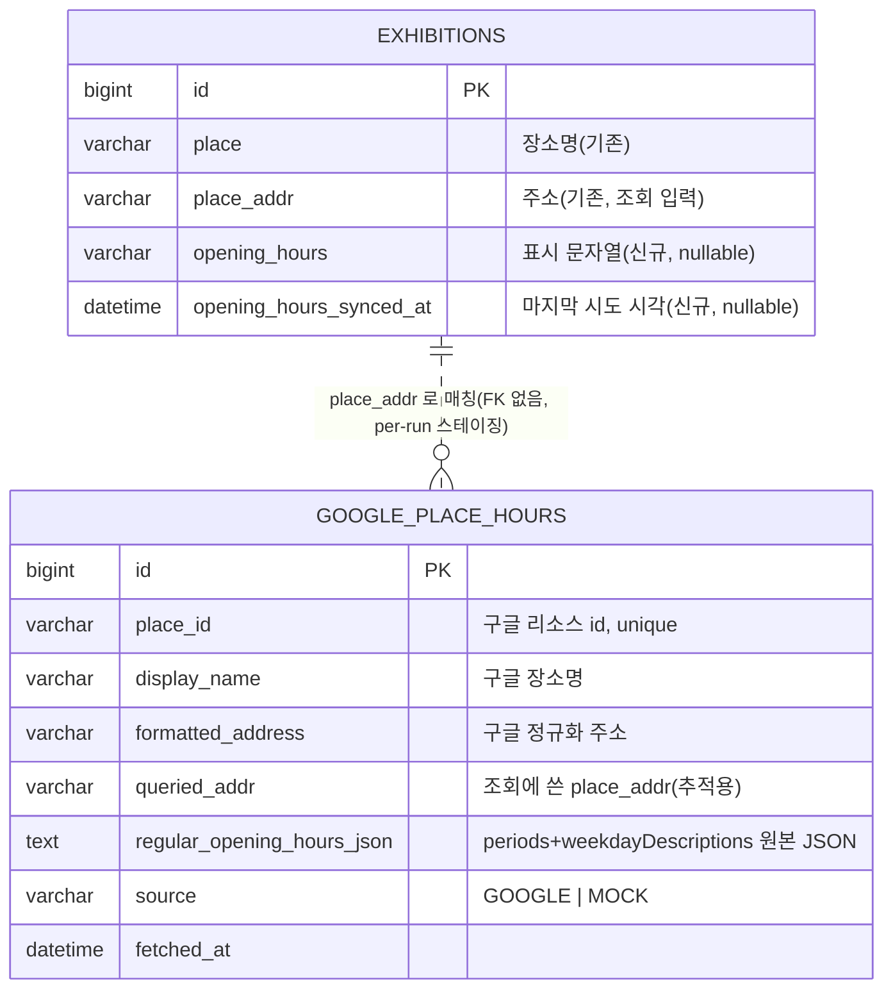

# 전시 영업시간(운영시간) 기능 개발 플랜

> 상태: 계획(승인 완료) · 작성 2026-07-14 · 브랜치 `feat/전시-영업시간-추가`
> 근거: 공공데이터 전시의 `place_addr`로 구글 Places(New)에서 영업시간을 받아 우리 규칙으로 가공해 노출.
> 관련: 장르 분류(Gemini) 구조를 포트/목 교체·설정 선택 패턴의 **레퍼런스**로 그대로 차용
> 검증: 구글 Places API (New) 실호출 성공 확인(2026-07-14, 부산현대미술관). `docs/개인 폴더/http/구글지도API.http`

## 1. 배경 / 목표

전시 상세에 **영업시간**을 표시한다. 원천은 공공데이터가 아니라 **구글 Places API (New)** 로, 전시가 이미 들고 있는 `place`(장소명) + `place_addr`(주소)로 조회한다.

- 구글 응답(영업시간 원본)을 **별도 테이블**에 그대로 적재하고, 전시는 그 원본에서 **우리 표시 규칙**으로 가공한 문자열을 저장한다.
- 유료 API이므로 **로컬·CI·develop 은 mock(0콜)**, **운영(main)만 실호출**. 실수 과금 차단이 최우선.
- 표시 규칙: 같은 시간대 요일 묶기(비연속 포함) · 요일 오름차순 · 전 영업일 동일시간이면 `매일` 축약 · 휴무 맨 아래.

## 2. 결정사항 (확정 · 2026-07-14)

| # | 주제 | 결정 |
|---|---|---|
| D1 | 실행 시점 | **매일 동기화 배치에 포함**(syncCatalog·장르 백필 뒤 이어서). 비용 상한(run당 최대 장소 수)로 보호 |
| D2 | 표시값 저장 위치 | **전시 엔티티 컬럼** `exhibitions.opening_hours`(파생 문자열). 이미 장소필드(place/addr/url/phone/gps)를 전시 행에 denormalize하는 기존 패턴과 일관 |
| D3 | mock 반환값 | 고정 샘플 `화~일 10:00~18:00, 월 휴무` → 규칙 적용 시 `매일 10:00 ~ 18:00` + `월 휴무` |
| D4 | 원본 테이블 수명 | `google_place_hours` = **매 실행 truncate 후 재적재**되는 per-run 스테이징(영속 캐시 아님). 사용자 노출값은 전시 행에만 영속 |
| D5 | 구글 호출 방식 | **Text Search (New) 1콜/장소** — 응답 FieldMask에 `regularOpeningHours` 포함해 검색 한 번으로 영업시간까지 수령(장소당 place_id 재조회 불필요) |
| D6 | 게이팅 | `PlaceHoursProvider` 포트 + `Google`/`Mock` 구현 공존, `app.exhibition.place-hours.provider`로 @Primary 선택. **기본 mock**, 운영만 `google` |
| D7 | 중복 제거 | 같은 `place_addr` 전시는 **장소당 1콜**로 묶어 호출 후, 그 장소의 전시들에 동일 결과 반영 |
| D8 | 폴백 | provider=google인데 키 미설정이면 mock로 폴백(warn). 조회 실패/미발견은 예외 없이 진행(영업시간 부가기능이 동기화를 깨지 않음) |

## 3. 데이터 흐름 (2단계)

```
[매일 배치] syncCatalog() → enrichGenres() → enrichPlaceHours()  ← 신규
                                                    │
   1) 원본 적재:  google_place_hours TRUNCATE
                  전시들을 place_addr로 그룹 → 장소마다 provider.fetch(name, addr)  ← 구글 1콜 or mock 0콜
                  응답 원본을 google_place_hours 행으로 insert
                                                    │
   2) 파생 저장:  응답을 요일별로 파싱 → OpeningHoursFormatter 로 표시문자열 생성
                  그 장소의 전시들 exhibitions.opening_hours 에 저장(+ opening_hours_synced_at)
```

- **원본(구조화)** = `google_place_hours` / **표시값(파생 문자열)** = `exhibitions.opening_hours`. 규칙이 바뀌면 원본 재호출 없이 재포맷만 하면 된다.
- 대상 선별(비용 상한): `place_addr != null` 이고 `opening_hours == null` 또는 `opening_hours_synced_at`이 `refresh-after-days`(기본 30일)보다 오래된 전시. 정상 수집된 장소는 다음날 재호출하지 않는다 → 스테디 상태 호출 ≈ 0.
- run당 처리 장소 수 상한(`max-venues-per-run`)으로 일 호출량을 캡.

## 4. 데이터 모델



- `google_place_hours`는 전시와 **FK로 묶지 않는다**(스테이징 + 매 실행 truncate). 조인해 앱이 읽는 테이블이 아니라, 배치 내에서 파생값 계산의 근거로만 쓴다.
- `opening_hours`는 여러 줄을 `\n`으로 이은 표시 문자열. length 500(넉넉).

### Flyway `V19__add_exhibition_opening_hours_and_place_hours.sql`
- `alter table exhibitions add column opening_hours varchar(500) null, add column opening_hours_synced_at datetime(6) null;`
- `create table google_place_hours (...) engine=InnoDB;` + `place_id` unique 인덱스.
- `ddl-auto: validate`이므로 엔티티/DDL 정합 필수.

## 5. 표시 규칙 (포맷터 명세 — TDD 대상)

입력: 요일별(월~일) 영업 상태. 구글 `regularOpeningHours.periods[]`(day 0=일요일~6=토요일, hour/minute)를 파싱해 요일→시간범위 리스트로 만든 뒤 적용.

1. 각 영업 요일의 **시간 시그니처**(예 `10:00~18:00`, 점심 브레이크 시 `10:00~12:00,13:00~18:00`)를 키로 만든다.
2. 같은 시그니처 요일을 한 그룹으로 묶는다 — **비연속 포함**(예: 월·수 동일시간이면 화가 휴무여도 `월 / 수`로 묶음. 확정).
3. 그룹을 **그룹 내 최소 요일(월=1…일=7)** 기준 오름차순 정렬.
4. 그룹 렌더: 요일을 월→일 순 `" / "` 조인 + 공백 + 시간범위. 시간은 **24시간 `HH:mm ~ HH:mm`**.
5. **모든 영업 요일이 단일 시그니처**면 요일 나열 대신 `매일 ` + 시간범위.
6. 휴무 요일이 있으면 **맨 아래** 한 줄: 휴무 요일 월→일 `" / "` 조인 + `" 휴무"`. (전부 영업이면 휴무 줄 없음)
7. 줄 구분 `\n`.

### 예시
| 입력 | 출력 |
|---|---|
| 월~금 10-18, 토·일 휴무 (전 영업일 동일) | `매일 10:00 ~ 18:00`<br>`토 / 일 휴무` |
| 월·화·수 10-18, 목·금 13-20, 토·일 휴무 | `월 / 화 / 수 10:00 ~ 18:00`<br>`목 / 금 13:00 ~ 20:00`<br>`토 / 일 휴무` |
| 월·수 10-18, 화 휴무(비연속) | `월 / 수 10:00 ~ 18:00`<br>`화 휴무` |
| mock 기본(화~일 10-18, 월 휴무) | `매일 10:00 ~ 18:00`<br>`월 휴무` |

### 엣지 (단순 처리 · 오픈이슈)
- 구글이 `regularOpeningHours` 미반환(정보 없음) → `opening_hours = null`(응답 null, FE 미표시/"정보 없음" 택일).
- 전 요일 휴무 → 정보 없음과 동일 취급(`null`). "매일 휴무" 축약은 P1.
- 24시간 영업·자정 넘김 period → 미술관 사실상 없음. period는 open day 기준 귀속, 파싱 실패 시 `null`. P1에서 정교화.

## 6. 아키텍처 / 컴포넌트

**장르(Gemini) 구조를 그대로 미러링** — 포트는 domain, 구현 2개 공존, 설정으로 @Primary 선택(DIP).

| 계층 | 파일 | 역할 |
|---|---|---|
| domain | `exhibition/PlaceHoursProvider` (포트) | `Optional<PlaceHoursData> fetch(name, addr)`. 미발견=empty, 전송오류만 예외 |
| domain | `exhibition/PlaceHoursData` (record) | placeId·displayName·formattedAddress·주간영업시간·rawJson |
| domain | `exhibition/OpeningHoursFormatter` (@Component, 순수) | 주간영업시간 → 표시문자열(§5 규칙) |
| domain | `exhibition/WeeklyOpeningHours` (VO) | 요일→시간범위. periods 파싱 결과 |
| domain | `exhibition/PlaceHoursSnapshot` (@Entity) | `google_place_hours` 매핑 |
| domain | `exhibition/PlaceHoursSnapshotRepository` (포트) | save·deleteAll(truncate) |
| infra | `exhibition/GoogleMapsApi` (HTTP Interface) | `POST /places:searchText`(GeminiApi와 동형) |
| infra | `exhibition/GooglePlaceHoursProvider` (@Component) | GoogleMapsApi 호출 + 응답→PlaceHoursData 매핑 |
| infra | `exhibition/MockPlaceHoursProvider` (@Component) | 0콜, D3 고정 샘플 반환 |
| infra | `exhibition/GoogleMapsDto` | 구글 요청/응답 record(`@JsonIgnoreProperties(ignoreUnknown)`) |
| infra | `exhibition/PlaceHoursSnapshotJpaRepository`·`...RepositoryImpl` | 3-클래스 규약 |
| config | `PlaceHoursConfig` | WebClient·GoogleMapsApi 빈 + @Primary provider 선택 |
| config | `PlaceHoursProperties` | `app.exhibition.place-hours.*` 바인딩 |
| application | `exhibition/PlaceHoursEnricher` | 오케스트레이션(truncate→그룹→호출→파생저장). CatalogEnricher와 동형 |
| application | `ExhibitionFacade#syncPlaceHours(...)` | 장소 단위 트랜잭션 메서드(외부호출은 트랜잭션 밖, save만 안) |
| interfaces | `ExhibitionDto`·`ExhibitionV1ApiSpec` | 상세 응답에 `openingHours` 필드 + @Schema |
| domain | `Exhibition` | `openingHours`·`openingHoursSyncedAt` 필드 + `applyOpeningHours(text, at)` 행위 메서드 |

- 상태 변경은 `Exhibition.applyOpeningHours(...)` 안에서만(핵심 컨벤션). Facade는 load·조율·save만.
- 배치 루프는 트랜잭션 밖, 장소 단위 save만 각 트랜잭션(커넥션 장기 점유 방지 — syncCatalog 패턴).

## 7. mock / 운영 게이팅 · 설정 주입

### 설정 (`application.yaml`)
```yaml
app:
  exhibition:
    place-hours:
      provider: ${PLACE_HOURS_PROVIDER:mock}   # 기본 mock(로컬·CI·develop 0콜). 운영만 google
      base-url: ${GOOGLE_MAPS_BASE_URL:https://places.googleapis.com}
      api-key: ${GOOGLE_MAPS_API_KEY:}          # 운영 시크릿 주입. google인데 비면 mock 폴백
      language-code: ko
      region-code: KR
      timeout-seconds: ${GOOGLE_MAPS_TIMEOUT_SECONDS:10}
      refresh-after-days: 30                     # 이보다 오래된 장소만 재호출
      max-venues-per-run: ${PLACE_HOURS_MAX_VENUES_PER_RUN:100}   # 일 호출량 상한
```

### 배포 (`deploy.yml`, main만 배포)
- `env`/`envs`에 `GOOGLE_MAPS_API_KEY: ${{ secrets.GOOGLE_MAPS_API_KEY }}`, `PLACE_HOURS_PROVIDER=google` 추가.
- develop은 배포 자체가 없음(deploy.yml이 main 전용) → **어디서도 실호출되지 않음**을 코드 기본값(mock)이 보장.

### 선택 로직 (GenreConfig 동형)
```java
@Bean @Primary
PlaceHoursProvider placeHoursProvider(PlaceHoursProperties p,
        MockPlaceHoursProvider mock, GooglePlaceHoursProvider google) {
    boolean useGoogle = "google".equalsIgnoreCase(p.provider()) && p.hasApiKey();
    return useGoogle ? google : mock;   // 키 없으면 mock 폴백
}
```

## 8. 에러 처리
- 장소 조회 전송 실패 → 그 장소만 이번 run 스킵(warn 로그), `synced_at` 미설정 → 다음 run 재시도(syncCatalog defer 패턴).
- 미발견(검색결과 0) → `opening_hours=null`, `synced_at=now`로 표기(실패 조회를 매일 두드리지 않도록 백오프).
- provider=google + 키 없음 → mock 폴백 + 起動 warn(Gemini 동형).
- 영업시간은 **부가 기능**: 어떤 실패도 syncCatalog/장르 백필/등록 흐름을 깨지 않는다.

## 9. 테스트 계획 (통합테스트만 — 2026-07-14 확정)

단위 테스트는 두지 않는다. **@SpringBootTest 통합테스트**로 mock provider를 태워 전 경로(truncate → 장소 그룹 호출 → 원본 적재 → 파싱 → 포맷 → 전시 저장)를 실제 컴포넌트·실 DB(Testcontainers-MySQL)로 검증한다. 포맷 규칙 엣지는 mock provider가 반환하는 주간 패턴을 케이스별로 바꿔 통합 경로로 커버.

| 통합테스트 | 검증 |
|---|---|
| `PlaceHoursEnricher` 전 경로(mock) | 장소당 1콜 · `google_place_hours` 적재 · `exhibitions.opening_hours`/`synced_at` 저장 · 같은 place_addr 전시 동시 반영 |
| 포맷 규칙 케이스 | mock 반환 패턴 바꿔가며: 매일 축약 · 다중그룹 · 비연속 묶기 · 휴무 맨아래 · 전영업 · 정보없음(null) |
| 대상 선별 | `opening_hours` 있고 최신인 전시는 재호출 제외 · run당 장소 상한 |
| provider 선택 | 기본 mock · `provider=google`+키없음 → mock 폴백(실호출 0) |

- 상세 조회 응답(`GET /exhibitions/{id}`)에 `openingHours`가 실리는지는 컨트롤러 통합 경로로 함께 확인.

## 10. 오픈 이슈 / 비고
- 24시간·자정 넘김·전요일 휴무 표기는 P1(현재 null 또는 단순 처리).
- `google_place_hours`를 영속 캐시로 승격(전시 장소 상세·지도 링크 재사용)은 요구 생기면 D4 재검토.
- `place_id`를 전시 행에 저장해 향후 Place Details(사진/평점/링크) 확장 여지 — 현재 범위 밖.
- 비용: 매일 신규/만료 장소만 호출(스테디 ≈ 0). Text Search(New) 과금 단가 확인 후 `max-venues-per-run` 조정.
