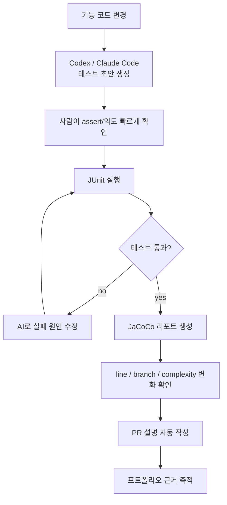

# Codex/Claude Code 테스트 생성 및 JaCoCo 검증 계획

작성일: 2026-06-25  
브랜치: `feature/ai-test-automation-research`  
전제: `feature/jacoco-research`의 JaCoCo 설정을 테스트 효과 측정 기준으로 사용한다.

## 1. 결론

이번 팀 프로젝트에서는 **Codex 또는 Claude Code로 테스트 코드를 생성하고, JUnit과 JaCoCo로 검증하는 Flow**가 가장 현실적이다.

처음에는 CodeRabbit, Qodo Gen, JaCoCo를 함께 검토했지만, 공식 문서와 가격 정책을 확인하면 다음 결론이 나온다.

- CodeRabbit의 unit test generation은 공식 문서상 Pro+/Enterprise 기능이며, Free plan으로 지속 사용하기 어렵다.
- Qodo는 현재 Qodo IDE Plugin/Qodo Review 중심의 code review/governance 플랫폼이며, 영구 무료 tier가 없다.
- 두 도구 모두 trial 또는 open source 프로그램으로 실험할 수는 있지만, 팀 프로젝트의 지속 가능한 기본 Flow로 삼기에는 플랜 리스크가 있다.
- Codex/Claude Code는 지금 바로 코드베이스를 읽고 테스트를 생성할 수 있으며, JaCoCo로 결과를 검증할 수 있다.

따라서 메인 Flow는 다음과 같다.

```text
Codex / Claude Code = 테스트 코드 생성
JUnit                = 테스트 성공/실패 검증
JaCoCo              = 코드 커버리지 변화 측정
PR 자동화            = 테스트 근거와 coverage 결과 정리
```



## 2. 왜 CodeRabbit을 메인으로 쓰지 않는가

CodeRabbit은 PR 기반 자동화에는 매력적이다. 특히 문서상 다음 기능이 있다.

- PR summary / walkthrough
- PR 자동 리뷰
- CI/CD pipeline failure analysis
- `@coderabbitai generate unit tests` 기반 unit test generation

하지만 공식 pricing 문서 기준으로 Free plan은 **PR summarization only**에 가깝고, unit test generation은 **Pro+ / Enterprise 기능**으로 표시되어 있다. Open source 프로젝트는 Pro+ 기능을 무료로 받을 수 있는 가능성이 있지만, "qualified open source"에 해당해야 하며 지속 가능성이 팀 상황에 따라 달라진다.

따라서 CodeRabbit은 다음처럼 분류한다.

| 용도 | 판단 |
|---|---|
| Free plan으로 PR 요약 | 가능성 있음 |
| Free plan으로 지속적인 테스트 생성 | 어렵다고 보는 것이 안전 |
| 14일 Pro+ trial로 실험 | 가능성 있음 |
| 공개 OSS 혜택으로 실험 | 신청/자격 확인 필요 |
| 팀의 메인 테스트 생성 도구 | 부적합 |

CodeRabbit은 나중에 trial 또는 OSS 혜택이 확인되면 보조 실험 후보로 둔다. 지금 당장 팀 Flow의 중심에 놓지는 않는다.

참고 자료:

- [CodeRabbit Plans and pricing](https://docs.coderabbit.ai/management/plans.md)
- [CodeRabbit Generate unit tests](https://docs.coderabbit.ai/finishing-touches/unit-test-generation.md)

## 3. Qodo Gen/Qodo Review는 무료로 쓸 수 있는가

Qodo도 무료 지속 사용 도구로 보기 어렵다.

Qodo pricing 페이지 기준:

- 14일 무료 trial이 있다.
- trial은 credit 기반으로 리뷰를 실행한다.
- trial 종료 후에는 paid plan을 선택해야 리뷰가 계속된다.
- permanent free tier는 제공하지 않는다고 명시되어 있다.
- qualified open source project는 Qodo for Open Source 프로그램에 신청해 무료 access를 받을 수 있다.

또한 현재 공식 문서 기준으로 Qodo는 예전 `Qodo Gen`처럼 테스트 코드 생성 도구라기보다, `Qodo IDE Plugin`과 `Qodo Review v2` 중심의 code review/governance 플랫폼이다.

따라서 Qodo의 위치는 다음과 같다.

| 용도 | 판단 |
|---|---|
| 무료 영구 리뷰 보조 | 어려움 |
| 14일 trial로 리뷰 품질 실험 | 가능 |
| 오픈소스 무료 프로그램 | 신청/자격 확인 필요 |
| 테스트 코드 생성 메인 도구 | 부적합 |
| AI 생성 테스트 품질 보조 리뷰 | trial/유료라면 가능 |

정리하면, Qodo도 "있으면 좋은 리뷰 보조 도구"이지, 지금 팀의 무료 기반 테스트 자동화 핵심 도구로 잡기에는 리스크가 있다.

참고 자료:

- [Qodo pricing](https://www.qodo.ai/pricing/)
- [Qodo documentation index](https://docs.qodo.ai/llms.txt)
- [Qodo IDE plugin overview](https://docs.qodo.ai/qodo-ide)
- [Qodo Code Review](https://docs.qodo.ai/code-review.md)

## 4. 메인 Flow: Codex/Claude Code + JaCoCo

현실적인 자동화 Flow는 다음과 같다.

1. 기능 코드 또는 기존 클래스의 테스트 대상 선정
2. Codex/Claude Code에게 테스트 생성 요청
3. 생성된 테스트에서 assert와 테스트 의도만 사람이 빠르게 확인
4. JUnit 실행
5. 실패하면 AI에게 실패 로그와 함께 수정 요청
6. 테스트 통과 후 JaCoCo 리포트 생성
7. line/branch/complexity 변화량 확인
8. PR 설명에 테스트 생성 방식과 검증 결과 기록

이 방식의 장점:

- 별도 유료 플랜이 필요 없다.
- PR 생성 전 로컬에서 바로 테스트를 만들고 검증할 수 있다.
- 실패 로그를 AI에게 다시 주고 빠르게 수정할 수 있다.
- JaCoCo로 결과를 객관적으로 확인할 수 있다.
- 팀원이 새로운 SaaS 계정/권한 설정을 하지 않아도 된다.

## 5. 테스트 생성 프롬프트 기준

Codex/Claude Code로 테스트를 만들 때는 "테스트 만들어줘"처럼 넓게 요청하면 품질이 흔들릴 수 있다. 다음 기준을 명시한다.

좋은 요청 예시:

```text
이 클래스의 JUnit 5 테스트를 작성해줘.
AssertJ를 사용하고, Spring context를 띄우지 않는 단위 테스트로 작성해줘.
분기가 있으면 null, empty, boundary, error case를 포함해줘.
assert 없는 테스트는 만들지 말고, 테스트 이름은 기대 동작이 드러나게 작성해줘.
작성 후 JaCoCo branch coverage가 개선될 만한 케이스를 설명해줘.
```

Spring MVC Controller라면:

```text
이 Controller의 요청/응답 검증 테스트를 작성해줘.
@WebMvcTest와 MockMvc를 사용하고, 정상 요청, validation 실패, service 예외 케이스를 포함해줘.
HTTP status와 response body를 assert해줘.
```

Service라면:

```text
이 Service의 단위 테스트를 작성해줘.
Mockito로 repository dependency를 mock하고, 성공 케이스와 예외 케이스를 나눠줘.
분기마다 verify와 assert를 명확히 넣어줘.
```

## 6. JaCoCo로 검증할 지표

AI가 테스트를 생성해도, 그 테스트가 좋은지는 별도로 확인해야 한다. 이때 JaCoCo가 기준 지표가 된다.

| 지표 | 의미 | 판단 기준 |
|---|---|---|
| Line coverage | 실행된 source line | 안 지나간 코드가 줄었는가 |
| Branch coverage | 조건문의 true/false 경로 실행 여부 | 분기 누락이 줄었는가 |
| Missed complexity | 테스트되지 않은 복잡한 경로 | 위험한 미검증 흐름이 줄었는가 |
| Method/Class coverage | 실행된 메서드/클래스 | 실제 대상 코드가 실행되었는가 |

커버리지 외에 사람이 함께 봐야 할 기준:

| 항목 | 질문 |
|---|---|
| Assertion quality | 결과를 제대로 검증하는 assert가 있는가? |
| Test intent | 테스트 이름과 내용이 요구사항을 설명하는가? |
| Maintainability | 기존 테스트 스타일과 맞고 읽기 쉬운가? |
| Stability | CI에서 안정적으로 반복 실행되는가? |
| Scope | 불필요하게 Spring context를 띄우지 않는가? |

## 7. 우리 프로젝트 실험 설계

### 7.1 1차 실험 대상

현재 프로젝트는 아직 코드가 크지 않다. 따라서 작은 단위부터 시작한다.

- `CorsProperties`
- `WebConfig`

후속 대상:

- Service 비즈니스 로직
- Controller request validation
- 예외 처리 흐름
- Repository 또는 통합 테스트가 필요한 DB 흐름

### 7.2 실험 절차

1. JaCoCo baseline을 만든다.
2. 테스트 대상 클래스를 고른다.
3. Codex/Claude Code로 테스트 초안을 만든다.
4. 사람이 assert와 테스트 의도만 빠르게 확인한다.
5. JUnit을 실행한다.
6. 실패하면 AI에게 실패 로그와 함께 수정 요청한다.
7. JaCoCo 리포트를 생성한다.
8. 생성 전/후 coverage 변화를 기록한다.
9. 사람이 수정한 부분과 걸린 시간을 기록한다.
10. PR 설명에 결과를 남긴다.

명령 예시:

```bash
JAVA_HOME=/usr/local/opt/openjdk@21 ./gradlew test jacocoTestReport --no-daemon
```

특정 테스트만 볼 때:

```bash
JAVA_HOME=/usr/local/opt/openjdk@21 ./gradlew test --tests 'modi.backend.config.CorsPropertiesTest' jacocoTestReport --no-daemon
```

### 7.3 측정표

| 측정 항목 | 기록 방식 |
|---|---|
| 생성된 테스트 수 | 파일/메서드 개수 |
| 사람이 수정한 라인 수 | diff 기준 |
| 테스트 작성 시간 | AI 생성 전/후 체감 또는 분 단위 |
| JUnit 통과 여부 | pass/fail |
| Line coverage 변화 | JaCoCo report |
| Branch coverage 변화 | JaCoCo report |
| Missed complexity 변화 | JaCoCo report |
| assert 없는 테스트 여부 | 사람이 확인 |
| Spring context 남용 여부 | 사람이 확인 |

## 8. PR 자동 생성/설명 자동화

개발자가 PR 본문 작성에 많은 시간을 쓰지 않도록, PR 설명에는 아래 정보가 자동으로 들어가게 한다.

````markdown
## 변경 사항
- 

## 테스트 생성
- 사용 도구: Codex / Claude Code / 직접 작성
- 생성 방식:
- 사람이 수정한 부분:

## 검증
```bash
JAVA_HOME=/usr/local/opt/openjdk@21 ./gradlew test jacocoTestReport --no-daemon
```

## JaCoCo 결과
- Line coverage:
- Branch coverage:
- Missed complexity:
- 리포트 위치:

## 확인 필요
-
````

이 PR 설명은 긴 리뷰 문서를 만들기 위한 것이 아니다. 나중에 포트폴리오나 이력서에서 다음 문장을 정직하게 증명하기 위한 자료다.

> Codex/Claude Code로 테스트 초안을 생성하고, JUnit과 JaCoCo로 테스트 통과 여부 및 branch coverage 개선을 검증했다.

## 9. CodeRabbit/Qodo의 위치

CodeRabbit과 Qodo를 완전히 버릴 필요는 없다. 다만 메인 Flow에서 제외하고, 조건이 맞을 때만 실험 후보로 둔다.

| 도구 | 현재 위치 |
|---|---|
| CodeRabbit | Pro+ trial 또는 OSS 혜택이 가능하면 unit test generation 실험 |
| Qodo | 14일 trial 또는 OSS 프로그램 가능 시 AI 생성 테스트 보조 리뷰 실험 |

우선순위:

1. Codex/Claude Code 테스트 생성
2. JUnit 실행
3. JaCoCo 검증
4. PR 설명 자동화
5. CodeRabbit/Qodo는 trial/OSS 조건 확인 후 선택 실험

## 10. 성공/실패 판단 기준

성공으로 볼 수 있는 경우:

- AI가 프로젝트 스타일에 맞는 JUnit 테스트를 생성한다.
- 생성된 테스트가 assert를 포함한다.
- 사람이 수정해야 하는 양이 적다.
- JaCoCo branch coverage 또는 missed complexity가 개선된다.
- PR 설명에 테스트 생성 방식과 coverage 변화가 명확히 남는다.
- 테스트 작성 시간이 줄어든다.

보류 또는 실패로 볼 수 있는 경우:

- 생성된 테스트가 대부분 compile fail이다.
- assert 없는 테스트가 많다.
- Spring context를 남용해 테스트가 무거워진다.
- 커버리지 숫자만 올리고 요구사항 검증이 약하다.
- 사람이 수정하는 시간이 직접 작성보다 더 오래 걸린다.

## 11. 다음 액션

1. JaCoCo PR 머지 후 baseline coverage 기록
2. `CorsProperties`, `WebConfig`를 대상으로 Codex/Claude Code 테스트 생성 실험
3. JUnit + JaCoCo 결과 기록
4. PR 본문 템플릿에 테스트 생성 방식과 coverage 변화량 기록
5. CodeRabbit/Qodo는 trial 또는 OSS 혜택 가능 여부만 별도 확인
