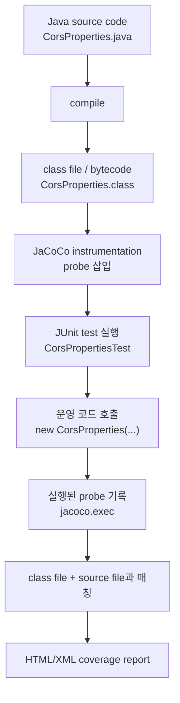
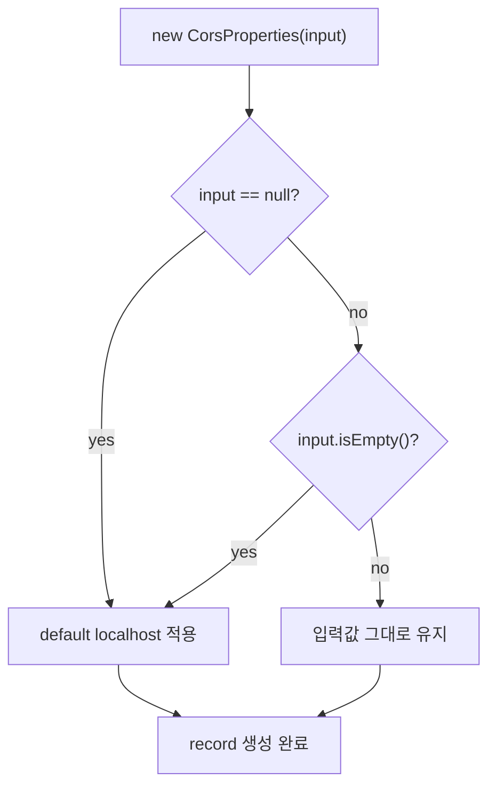
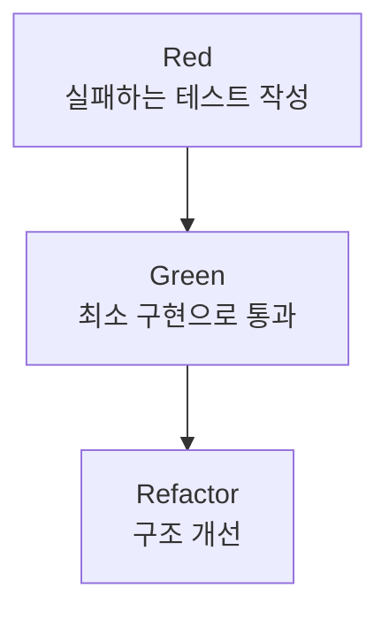
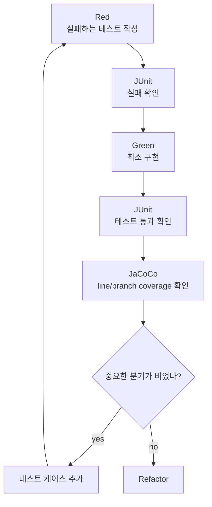
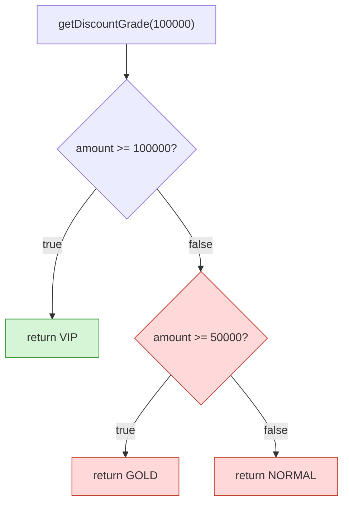

# JaCoCo 리서치 및 도입 실험 계획

작성일: 2026-06-25  
대상 프로젝트: modi-backend (Spring Boot, Java 21, Gradle)

## 1. 왜 이 문서가 필요한가

팀 프로젝트에서 AI로 테스트를 생성하거나 코드 리뷰를 보조하려면, AI가 만든 결과를 검증할 수 있는 객관적인 품질 지표가 필요하다. JaCoCo는 Java/JVM 프로젝트에서 테스트가 실제로 어떤 코드를 실행했는지 측정해 주는 코드 커버리지 도구다.

JUnit 테스트가 모두 통과했다는 사실은 "작성된 테스트의 기대 결과가 맞았다"는 뜻이다. 하지만 그것만으로 중요한 분기와 예외 흐름이 모두 테스트되었다고 말할 수는 없다. JaCoCo는 이 빈틈을 보완한다. 테스트 실행 중 실제 운영 코드의 어느 line, branch, method, class가 지나갔는지 보여주기 때문에, 테스트가 닿지 않은 위험 영역을 찾는 지도 역할을 한다.

따라서 JaCoCo의 가치는 단순히 커버리지 퍼센트를 높이는 데 있지 않다. 더 중요한 가치는 다음과 같다.

- 테스트가 전혀 닿지 않은 코드 경로를 찾는다.
- PR 리뷰에서 "이 분기는 테스트됐는가?"를 객관적으로 확인한다.
- AI가 생성한 테스트가 실제로 의미 있는 경로를 지나갔는지 확인한다.
- TDD의 Green 이후에도 빠진 분기와 edge case를 발견한다.
- 배포 전 자동화 파이프라인에서 테스트 공백을 줄인다.

이번 브랜치의 목표는 JaCoCo를 바로 머지하는 것이 아니라, 먼저 다음 질문에 답하는 것이다.

- JaCoCo가 정확히 무엇을 측정하는가?
- Spring Boot + Gradle 프로젝트에서 어떤 리포트를 얻을 수 있는가?
- 우리 프로젝트에서 AI 테스트 생성 실험의 기준 지표로 쓸 수 있는가?
- 커버리지 게이트를 걸면 도움이 되는가, 아니면 아직 이른가?

## 2. JaCoCo란?

JaCoCo(Java Code Coverage)는 JVM 기반 환경에서 코드 커버리지 분석을 제공하는 오픈소스 도구다. 공식 Mission 문서에 따르면 JaCoCo의 목표는 Java VM 기반 환경에서 표준적인 코드 커버리지 기술을 제공하는 것이고, 빌드 도구나 개발 도구에 쉽게 통합할 수 있도록 가볍고 유연한 라이브러리를 제공하는 데 초점을 둔다.

공식 문서 기준으로 JaCoCo는 다음 항목을 측정할 수 있다.

- Instruction coverage (C0)
- Branch coverage (C1)
- Line coverage
- Method coverage
- Class/type coverage
- Cyclomatic complexity

또한 리포트는 HTML, XML, CSV 형식으로 만들 수 있다. HTML은 사람이 직접 보는 데 좋고, XML은 Codecov 같은 외부 서비스나 CI 분석 도구와 연동할 때 유용하다.

참고 자료:

- [JaCoCo Documentation](https://www.jacoco.org/jacoco/trunk/doc/)
- [JaCoCo Mission](https://www.jacoco.org/jacoco/trunk/doc/mission.html)

## 3. 코드 커버리지란?

코드 커버리지는 테스트 실행 중 어떤 코드가 실제로 실행되었는지 보여주는 지표다. 예를 들어 테스트가 `UserService.signup()`을 호출했다면 해당 메서드의 일부 라인이 실행되었다고 기록된다.

조금 더 정확히 나누면 다음과 같다.

| 도구 | 답하는 질문 |
|---|---|
| JUnit assertion | 실행 결과가 기대값과 같은가? |
| JaCoCo line coverage | 테스트 중 어떤 소스 라인이 실행되었는가? |
| JaCoCo branch coverage | 조건문의 true/false 경로가 실행되었는가? |
| JaCoCo complexity | 복잡한 흐름 중 아직 테스트되지 않은 경로가 얼마나 남았는가? |
| 사람 리뷰 | 이 테스트가 요구사항을 제대로 검증하는가? |

단, 커버리지가 높다고 해서 테스트 품질이 반드시 높다는 뜻은 아니다. 아래 테스트는 커버리지를 올릴 수 있지만 좋은 테스트는 아니다.

```java
@Test
void badTest() {
    userService.signup("a@a.com", "password");
}
```

이 테스트는 메서드를 실행하지만 결과를 검증하지 않는다. 즉, assert가 없어서 로직이 틀려도 통과할 가능성이 높다.

좋은 테스트는 다음처럼 기대 결과를 확인해야 한다.

```java
@Test
void signup_returnsCreatedUser() {
    User user = userService.signup("a@a.com", "password");

    assertThat(user.getEmail()).isEqualTo("a@a.com");
}
```

따라서 JaCoCo는 "테스트가 충분히 좋은가"를 직접 증명하는 도구라기보다, "어떤 코드가 아직 테스트로 실행되지 않았는가"를 찾는 탐색 도구로 봐야 한다.

낮은 커버리지는 위험 신호다. 테스트가 닿지 않은 코드가 많다는 뜻이기 때문이다. 반대로 높은 커버리지는 안심할 근거 중 하나가 될 수 있지만, 버그가 없다는 보장은 아니다. 그래서 커버리지는 단독 목표가 아니라 테스트 리뷰, 요구사항 검증, 코드 리뷰와 함께 봐야 한다.

## 4. JaCoCo가 측정하는 주요 지표

공식 Coverage Counters 문서 기준으로 JaCoCo는 Java class file, 즉 bytecode와 debug information을 바탕으로 커버리지를 계산한다.

핵심은 JaCoCo가 "테스트가 좋은지"를 직접 판단하지 않는다는 점이다. JaCoCo가 보는 것은 테스트 실행 중 어떤 bytecode instruction, branch, line, method, class가 실제로 실행되었는지다. 따라서 좋은 테스트인지 판단하려면 JaCoCo 수치와 함께 assert 품질, 테스트 이름, 실패 가능성, 요구사항 반영 여부를 사람이 봐야 한다.

### 4.1 Instruction coverage

Instruction은 Java bytecode의 가장 작은 실행 단위다. Instruction coverage는 실행된 bytecode 명령과 실행되지 않은 bytecode 명령의 비율을 보여준다.

특징:

- 소스 코드 포맷과 무관하다.
- debug information이 없어도 계산할 수 있다.
- 가장 낮은 수준의 실행 여부를 보여준다.

팀 프로젝트에서 직접 해석하기에는 다소 세밀하므로, 보통은 line/branch coverage를 먼저 본다.

### 4.2 Line coverage

Line coverage는 소스 코드 라인 중 테스트 실행 중 실제로 실행된 라인의 비율이다.

특징:

- 가장 직관적이다.
- HTML 리포트에서 빨강/노랑/초록으로 쉽게 볼 수 있다.
- class file에 line number debug information이 있어야 한다.

주의할 점:

- 한 줄에 여러 분기가 있으면 라인 하나가 부분 커버로 표시될 수 있다.
- 라인이 실행되었다고 해서 그 결과를 검증했다는 뜻은 아니다.

### 4.3 Branch coverage

Branch coverage는 `if`, `switch` 같은 분기에서 각 경로가 실행되었는지 측정한다.

예를 들어 아래 코드는 두 개의 흐름이 있다.

```java
if (user.isActive()) {
    return "active";
}
return "inactive";
```

`active` 케이스만 테스트하면 line coverage는 꽤 높아 보일 수 있지만, `inactive` 경로는 검증되지 않았다. Branch coverage는 이런 누락을 보여준다.

팀 프로젝트에서는 line coverage보다 branch coverage가 더 실용적인 경우가 많다. 특히 인증, 권한, 예외, 유효성 검증처럼 분기 로직이 많은 코드에서 유용하다.

현재 프로젝트의 `CorsProperties`는 branch coverage를 이해하기 좋은 예시다.

```java
if (allowedOriginPatterns == null || allowedOriginPatterns.isEmpty()) {
    allowedOriginPatterns = List.of("http://localhost:3000");
}
```

이 코드는 최소 세 가지 케이스를 나눠 테스트해야 분기를 제대로 확인할 수 있다.

- `allowedOriginPatterns == null`
- `allowedOriginPatterns.isEmpty()`
- 이미 값이 들어 있는 정상 설정

셋 중 하나만 테스트하면 line coverage는 어느 정도 올라갈 수 있지만, branch coverage는 일부만 채워진다. 그래서 AI로 테스트를 만들 때도 "이 클래스 테스트 만들어줘"보다 "null, empty, configured 케이스로 생성자 분기 테스트 만들어줘"처럼 분기를 명시하는 편이 좋다.

이번 브랜치에는 이 기준을 적용한 자동 생성 테스트 예시로 `CorsPropertiesTest`를 추가했다.

### 4.4 Method/Class coverage

Method coverage는 각 메서드가 한 번이라도 실행되었는지, Class coverage는 각 클래스가 한 번이라도 실행되었는지를 본다.

특징:

- 큰 그림을 볼 때 좋다.
- 실제 품질 판단에는 line/branch보다 약하다.
- 생성자, static initializer도 method로 계산될 수 있다.

### 4.5 Cyclomatic complexity

Cyclomatic complexity는 코드의 가능한 실행 경로가 얼마나 복잡한지 보여주는 지표다. JaCoCo 공식 문서는 complexity 값을 특정 코드 조각을 완전히 커버하기 위해 필요한 테스트 케이스 수의 힌트로 볼 수 있다고 설명한다.

예를 들어 분기가 많고 조건이 복잡한 메서드는 complexity가 높다. 이 경우 단순히 line coverage만 높이는 것보다, missed complexity를 줄이는 테스트를 추가하는 것이 더 의미 있다.

참고 자료:

- [JaCoCo Coverage Counters](https://www.jacoco.org/jacoco/trunk/doc/counters.html)

## 5. JaCoCo는 어떻게 동작하나?

JaCoCo는 class file instrumentation을 사용한다. 쉽게 말하면 테스트 실행 중 JVM이 class를 로딩할 때, JaCoCo가 실행 여부를 기록하기 위한 작은 probe를 bytecode에 삽입한다.

공식 Java Agent 문서에 따르면 JaCoCo agent는 실행 정보를 수집하고, JVM 종료 시점이나 요청 시점에 execution data를 dump한다. Gradle이나 Maven 플러그인을 쓰면 대부분의 agent 설정은 빌드 도구가 대신 처리한다.

공식 Control Flow Analysis 문서에 따르면 probe는 원래 애플리케이션 동작을 바꾸지 않고, "이 지점이 실행되었는가"만 기록하는 역할을 한다. JaCoCo 문서는 instrumented class의 크기가 증가하고 실행 오버헤드가 생길 수 있지만, 일반적으로 실행 시간 오버헤드는 10% 미만이라고 설명한다.

주의할 점:

- JaCoCo는 성능 분석 도구가 아니다.
- 몇 번 실행되었는지, 얼마나 오래 걸렸는지는 측정하지 않는다.
- 테스트 시점의 실행 여부를 측정하는 도구다.
- 원격 agent 제어를 production에 열면 인증이 없으므로 보안 위험이 있다.

참고 자료:

- [JaCoCo Java Agent](https://www.jacoco.org/jacoco/trunk/doc/agent.html)
- [JaCoCo Control Flow Analysis](https://www.jacoco.org/jacoco/trunk/doc/flow.html)

## 5-1. 실행 Flow로 이해하기

JaCoCo를 이해할 때 가장 헷갈리는 부분은 "테스트 실행 여부를 판단하는 것이 왜 커버리지인가"이다. 핵심은 커버리지가 테스트의 성공/실패를 보는 지표가 아니라, 테스트가 실행되는 동안 운영 코드의 어느 부분을 지나갔는지 보는 지표라는 점이다.

흐름은 다음과 같다.



즉, JaCoCo는 테스트 코드 자체를 평가하지 않는다. 테스트가 운영 코드를 호출했을 때 운영 코드의 어떤 bytecode 지점이 실제로 실행되었는지를 기록한다.

예를 들어 `CorsProperties`의 핵심 로직은 다음과 같다.

```java
if (allowedOriginPatterns == null || allowedOriginPatterns.isEmpty()) {
    allowedOriginPatterns = List.of("http://localhost:3000");
}
```

이 코드는 사람이 보기에는 한 줄짜리 조건문이지만, JVM이 실행하는 bytecode 관점에서는 여러 실행 지점과 분기로 나뉜다.



테스트가 `new CorsProperties(null)`만 실행하면 `input == null` 경로는 지나간다. 하지만 `input.isEmpty()` 경로와 "입력값 그대로 유지" 경로는 지나가지 않는다. 이때 JaCoCo는 일부 branch가 아직 실행되지 않았다고 표시한다.

반대로 아래 세 테스트를 모두 실행하면 세 경로가 모두 지나간다.

- `new CorsProperties(null)`
- `new CorsProperties(List.of())`
- `new CorsProperties(List.of("https://mmodi.vercel.app"))`

이것이 branch coverage가 올라가는 이유다.

## 5-2. 왜 bytecode 기반이 도움이 되나?

Java 코드는 JVM에서 source code 그대로 실행되지 않는다. `.java` 파일은 먼저 `.class` 파일로 컴파일되고, JVM은 이 bytecode를 실행한다.

JaCoCo가 bytecode 기준으로 측정하면 다음 장점이 있다.

- 실제 JVM이 실행한 코드를 기준으로 측정한다.
- source formatting, 줄바꿈, 주석에 덜 영향을 받는다.
- Java뿐 아니라 Kotlin, Scala처럼 JVM bytecode로 컴파일되는 언어에도 적용할 수 있다.
- Spring, JUnit, Mockito 같은 도구와 함께 실행되는 실제 런타임 흐름을 관찰할 수 있다.
- source code가 없어도 class file만 있으면 instruction/branch 같은 일부 지표를 계산할 수 있다.

다만 사람이 읽기 쉬운 리포트를 만들려면 source file과 debug information이 필요하다. 그래서 HTML 리포트에서는 bytecode 실행 정보를 다시 source line에 매핑해서 초록/노랑/빨강으로 보여준다.

정리하면:

- JaCoCo가 실제로 수집하는 것: bytecode 실행 여부
- 사람이 보고 해석하는 것: source line/branch 기준 리포트
- 테스트 품질 판단: JaCoCo 수치 + 사람이 테스트 의도를 함께 확인

## 5-3. 커버리지와 테스트 성공은 다르다

테스트 성공과 커버리지는 다른 질문에 답한다.

| 질문 | 답하는 도구 |
|---|---|
| 코드가 기대한 결과를 냈는가? | JUnit assertion |
| 테스트 중 어떤 코드가 실행되었는가? | JaCoCo |
| 빠진 분기나 안 지나간 코드가 있는가? | JaCoCo branch/line report |
| 테스트가 의미 있는가? | 사람 리뷰 |

예를 들어 아래 테스트는 커버리지는 올릴 수 있다.

```java
@Test
void weak_test() {
    new CorsProperties(null);
}
```

하지만 결과를 검증하지 않으므로 좋은 테스트는 아니다.

아래 테스트는 커버리지와 테스트 품질이 함께 좋아진다.

```java
@Test
void uses_localhost_default_when_allowed_origin_patterns_are_null() {
    CorsProperties properties = new CorsProperties(null);

    assertThat(properties.allowedOriginPatterns()).containsExactly("http://localhost:3000");
}
```

이 테스트는 두 가지를 동시에 만족한다.

- JaCoCo 관점: `null` 분기 경로가 실행되었다.
- JUnit 관점: 결과가 기대값과 일치하는지 검증했다.

그래서 AI로 테스트를 자동 생성할 때도 "커버리지를 올리는 테스트"만 요구하면 부족하다. "어떤 분기를 실행하고, 어떤 결과를 assert해야 하는지"까지 함께 요구해야 한다.

## 5-4. TDD에서 JaCoCo가 어디에 들어가는가

TDD는 보통 Red, Green, Refactor 흐름으로 설명한다.



이 흐름에 JaCoCo를 넣으면 Green 이후에 "정말 중요한 경로가 테스트되었는가"를 확인할 수 있다.



예를 들어 할인 등급을 계산하는 코드가 있다고 하자.

```java
String getDiscountGrade(int amount) {
    if (amount >= 100_000) {
        return "VIP";
    }

    if (amount >= 50_000) {
        return "GOLD";
    }

    return "NORMAL";
}
```

아래 테스트 하나만 있으면 JUnit은 Green이 될 수 있다.

```java
@Test
void amount_100000_returns_vip() {
    assertThat(getDiscountGrade(100_000)).isEqualTo("VIP");
}
```

하지만 이 테스트는 `VIP` 경로만 지나간다. `GOLD`, `NORMAL` 경로는 아직 테스트되지 않았다.



이때 JaCoCo는 Green인 테스트 뒤에 숨어 있는 공백을 보여준다. 그래서 다음 테스트를 추가할 수 있다.

```java
@Test
void amount_50000_returns_gold() {
    assertThat(getDiscountGrade(50_000)).isEqualTo("GOLD");
}

@Test
void amount_under_50000_returns_normal() {
    assertThat(getDiscountGrade(10_000)).isEqualTo("NORMAL");
}
```

이렇게 되면 JUnit은 결과가 맞는지 확인하고, JaCoCo는 세 분기 경로가 실제로 실행되었는지 보여준다. 둘을 같이 써야 안정적인 소프트웨어 개발에 가까워진다.

## 6. Gradle에서 할 수 있는 것

Gradle 공식 JaCoCo Plugin 문서에 따르면, Gradle 프로젝트에서는 `jacoco` 플러그인을 적용해 JaCoCo를 사용할 수 있다.

```groovy
plugins {
    id 'jacoco'
}
```

Java plugin이 함께 적용된 프로젝트에서는 다음 task가 추가된다.

- `jacocoTestReport`: `test` task의 커버리지 리포트를 생성한다.
- `jacocoTestCoverageVerification`: 설정한 커버리지 기준을 만족하는지 검증한다.

중요한 점은 `jacocoTestReport`가 자동으로 `test`에 의존하지 않는다는 것이다. 즉, 리포트를 만들기 전에 테스트가 실행되도록 명시하는 편이 좋다.

```groovy
test {
    finalizedBy jacocoTestReport
}

jacocoTestReport {
    dependsOn test
}
```

리포트 형식도 설정할 수 있다.

```groovy
jacocoTestReport {
    reports {
        html.required = true
        xml.required = true
        csv.required = false
    }
}
```

커버리지 기준을 걸 수도 있다.

```groovy
jacocoTestCoverageVerification {
    violationRules {
        rule {
            limit {
                minimum = 0.60
            }
        }
    }
}
```

하지만 Gradle 문서에서도 `jacocoTestCoverageVerification`이 기본 `check` task의 의존성이 아니라고 설명한다. 커버리지 미달 시 빌드를 실패시키는 동작이 모든 프로젝트에 항상 바람직하지 않을 수 있기 때문이다.

우리 프로젝트에서도 처음부터 gate를 걸기보다, 1차 실험에서는 리포트만 생성하고 추이를 보는 편이 안전하다.

참고 자료:

- [Gradle JaCoCo Plugin](https://docs.gradle.org/current/userguide/jacoco_plugin.html)

## 7. 우리 프로젝트에서 JaCoCo로 할 수 있는 것

현재 modi-backend는 루트 Gradle 단일 프로젝트이고, Spring Boot 4.1.0, Java 21을 사용한다. 이미 GitHub Actions CI에서 PR마다 `./gradlew test --no-daemon`을 실행하고 있다.

따라서 JaCoCo 도입은 비교적 작게 시작할 수 있다.

### 7.1 로컬에서 HTML 리포트 확인

목표:

- 테스트 실행 후 `build/reports/jacoco/test/html/index.html`을 열어 어떤 코드가 테스트되었는지 확인한다.

예상 명령:

```bash
./gradlew test jacocoTestReport
open build/reports/jacoco/test/html/index.html
```

확인할 것:

- `WebConfig`의 CORS 테스트가 어느 라인을 커버하는지
- `CorsProperties`의 기본값 분기가 테스트되는지
- `BackendApplication` 같은 부트스트랩 코드는 커버리지 판단에서 중요한지

### 7.2 CI artifact로 리포트 저장

목표:

- PR마다 JaCoCo HTML/XML 리포트를 artifact로 업로드한다.
- 팀원이 GitHub Actions에서 커버리지 결과를 내려받아 확인할 수 있게 한다.

예상 변경:

- `.github/workflows/ci.yml`에서 `./gradlew test jacocoTestReport --no-daemon` 실행
- `actions/upload-artifact`로 `build/reports/jacoco/**` 업로드

### 7.3 AI 테스트 생성 실험의 기준 지표로 사용

목표:

- Qodo Gen, Copilot, Cursor 등으로 생성한 테스트가 실제로 커버리지를 올리는지 확인한다.
- 단순히 테스트 파일 수가 늘었는지가 아니라 branch/line coverage와 missed complexity가 줄었는지를 본다.

실험 예시:

1. JaCoCo baseline 측정
2. 사람이 직접 테스트 1개 작성
3. AI로 테스트 초안 1개 생성
4. 두 방식의 결과 비교

비교 지표:

- 테스트 작성 시간
- line coverage 증가량
- branch coverage 증가량
- missed complexity 감소량
- 사람이 수정한 코드량
- assert 없는 의미 없는 테스트 발생 여부

### 7.4 커버리지 게이트

목표:

- 팀이 익숙해진 뒤 특정 기준 미달 시 CI를 실패시킨다.

추천 순서:

1. 전체 프로젝트 gate는 보류
2. HTML/XML 리포트만 생성
3. 핵심 Service/Controller가 생긴 뒤 기준 논의
4. 처음에는 낮은 기준으로 시작

예상 기준:

- 전체 line coverage 50~60%
- 핵심 service package branch coverage 50% 이상
- DTO, configuration, generated code는 report exclude 검토

## 8. 무엇을 제외할지

커버리지 수치를 무작정 높이려 하면 중요하지 않은 코드까지 테스트하게 된다. 우리 프로젝트에서는 다음 코드는 신중하게 판단한다.

제외 후보:

- Spring Boot main class
- 단순 configuration class
- DTO, request/response record
- generated code
- Lombok으로 생성되는 코드

단, configuration class도 실제 정책을 담고 있으면 테스트 가치가 있다. 현재 `WebConfig`와 `CorsProperties`는 CORS 보안 정책을 담고 있으므로 테스트 대상이 맞다.

중요한 구분:

- agent exclude: 실행 데이터 수집 대상에서 제외
- report exclude: 리포트 계산 대상에서 제외

JaCoCo FAQ는 report 생성 단계에서 어떤 class file을 리포트에 포함하느냐가 별도 문제라고 설명한다. 실무에서는 보통 report exclude를 먼저 고려한다.

참고 자료:

- [JaCoCo FAQ](https://www.jacoco.org/jacoco/trunk/doc/faq.html)

## 9. 실험 성공 기준

이번 실험은 "커버리지 숫자를 높였다"가 아니라 "품질 판단에 도움이 되는 정보를 얻었다"가 성공 기준이다.

성공으로 볼 수 있는 경우:

- 로컬과 CI에서 JaCoCo 리포트가 안정적으로 생성된다.
- HTML 리포트로 테스트가 비어 있는 코드를 쉽게 찾을 수 있다.
- AI가 생성한 테스트가 line/branch coverage를 실제로 개선한다.
- 커버리지 리포트가 PR 리뷰 대화에 도움이 된다.
- 팀원이 리포트를 보고 다음 테스트 대상을 고를 수 있다.

실패 또는 보류로 볼 수 있는 경우:

- 리포트 생성이 CI 시간을 과하게 늘린다.
- 커버리지 숫자만 올리는 의미 없는 테스트가 늘어난다.
- Spring context 테스트가 무거워져 개발 피드백이 느려진다.
- 팀원이 리포트를 해석하지 못해 실제 리뷰에 쓰이지 않는다.

## 10. 추천 도입 단계

### Step 1. 리포트만 생성

- `build.gradle`에 `jacoco` 플러그인 추가
- `jacocoTestReport` 설정
- 로컬에서 HTML 리포트 확인
- CI artifact 업로드

이 단계에서는 커버리지 기준 미달로 빌드를 실패시키지 않는다.

### Step 2. baseline 기록

기록할 값:

- 전체 line coverage
- 전체 branch coverage
- package별 coverage
- missed complexity가 큰 class
- CI 실행 시간

### Step 3. AI 테스트 생성 실험

작은 기능 하나를 대상으로 테스트를 추가한다.

추천 대상:

- CORS 설정처럼 이미 있는 정책 코드
- 추후 추가될 Service 비즈니스 로직
- Controller request validation

AI 테스트 생성 후 확인할 것:

- 테스트가 실제 요구사항을 검증하는가?
- assert가 충분한가?
- 단순히 Spring context만 띄우는 테스트는 아닌가?
- branch coverage를 올리는가?

### Step 4. gate 도입 여부 결정

gate는 팀이 리포트에 익숙해진 뒤 도입한다.

처음부터 강한 기준을 걸면 테스트 작성 문화가 생기기 전에 CI가 방해물처럼 느껴질 수 있다. 이번 프로젝트에서는 "리포트 생성 -> AI 테스트 실험 -> 낮은 기준 gate" 순서가 적절하다.

## 11. 이번 브랜치에서 다음으로 할 일

이 문서 다음 PR 또는 같은 브랜치의 후속 커밋에서 아래를 진행한다.

- `build.gradle`에 JaCoCo 플러그인 및 리포트 설정 추가
- `CorsProperties`의 null/empty/configured 분기 테스트 추가
- Java 21 toolchain이 있는 환경에서 `./gradlew test jacocoTestReport` 로컬 실행
- 생성된 HTML 리포트에서 baseline 수치 기록
- `.github/workflows/ci.yml`에 JaCoCo 리포트 artifact 업로드 추가
- 커버리지 gate는 아직 적용하지 않고 보류

## 12. 실제 설정 및 검증 결과

이번 브랜치에서 JaCoCo를 실제로 설정했다.

설정한 내용:

- `build.gradle`에 `jacoco` 플러그인 추가
- `test` 실행 후 `jacocoTestReport`가 생성되도록 연결
- HTML/XML 리포트 생성 활성화
- GitHub Actions CI에서 `./gradlew test jacocoTestReport --no-daemon` 실행
- CI artifact로 `build/reports/jacoco/test/html/**`, `jacocoTestReport.xml` 업로드
- Gradle wrapper 다운로드 안정성을 위해 timeout/retry 값 조정

로컬 검증 환경:

- 프로젝트는 Java 21 toolchain을 요구한다.
- 기존 로컬 환경에는 Java 17, Java 23만 있어 테스트 실행이 실패했다.
- Homebrew로 `openjdk@21`을 설치한 뒤 아래 명령으로 검증했다.

```bash
JAVA_HOME=/usr/local/opt/openjdk@21 ./gradlew test --tests 'modi.backend.config.CorsPropertiesTest' jacocoTestReport --no-daemon
```

검증 결과:

- `CorsPropertiesTest` 단독 실행 성공
- JaCoCo HTML/XML 리포트 생성 성공
- 리포트 위치: `build/reports/jacoco/test/html/index.html`
- XML 위치: `build/reports/jacoco/test/jacocoTestReport.xml`

`CorsProperties` 클래스 기준 커버리지:

| 지표 | Missed | Covered | 해석 |
|---|---:|---:|---|
| Instruction | 0 | 14 | 실행 가능한 bytecode instruction을 모두 통과 |
| Branch | 0 | 4 | null/empty/configured 분기 흐름이 모두 통과 |
| Line | 0 | 4 | 해당 클래스의 실행 라인을 모두 통과 |
| Complexity | 0 | 3 | 남은 미검증 복잡도 없음 |
| Method | 0 | 1 | 생성자 로직 실행 |
| Class | 0 | 1 | 클래스 실행 확인 |

전체 프로젝트 기준 커버리지는 낮게 나온다. 이번 검증은 `CorsPropertiesTest`만 골라 실행했기 때문에 `WebConfig`, `BackendApplication` 같은 다른 클래스는 커버되지 않은 것으로 표시된다. 이 결과는 JaCoCo가 실제로 "실행된 코드"와 "실행되지 않은 코드"를 구분해 보여준다는 증거다.

전체 테스트 실행 결과:

```bash
JAVA_HOME=/usr/local/opt/openjdk@21 ./gradlew test jacocoTestReport --no-daemon
```

위 명령은 로컬에서 실패했다. 원인은 JaCoCo 설정 문제가 아니라 기존 `@SpringBootTest` 테스트들이 Testcontainers를 사용하고, 현재 로컬 Docker 환경을 찾지 못했기 때문이다. GitHub Actions 환경에서는 `setup-java@v4`로 Java 21을 설치하고 Docker가 제공되므로 CI에서 전체 테스트와 JaCoCo 리포트 artifact를 확인하는 것이 다음 검증 단계다.

## 13. 요약

JaCoCo는 테스트가 실제로 실행한 Java bytecode를 바탕으로 coverage를 계산하는 도구다. line coverage는 직관적이고, branch coverage는 분기 테스트 누락을 찾는 데 좋으며, complexity는 테스트가 더 필요한 복잡한 코드를 찾는 힌트가 된다.

우리 프로젝트에서는 JaCoCo를 AI 테스트 생성 실험의 객관적 지표로 사용할 수 있다. 다만 첫 단계에서는 커버리지 기준으로 CI를 실패시키지 말고, HTML/XML 리포트를 생성해 팀이 해석하는 연습부터 하는 것이 좋다.
