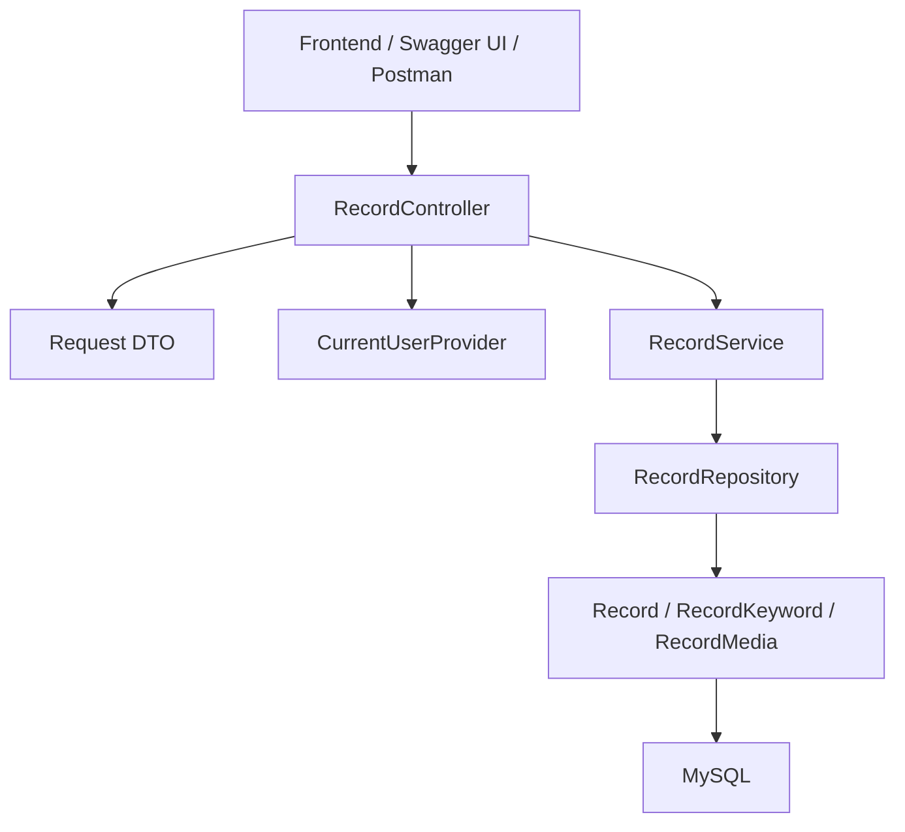
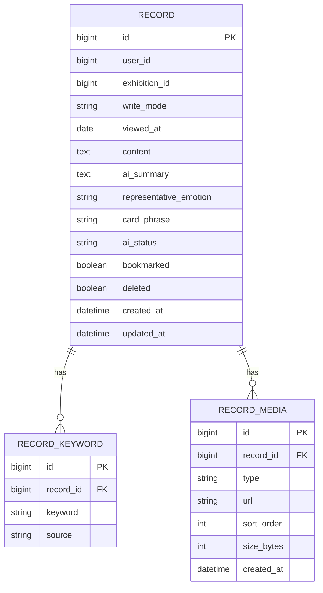
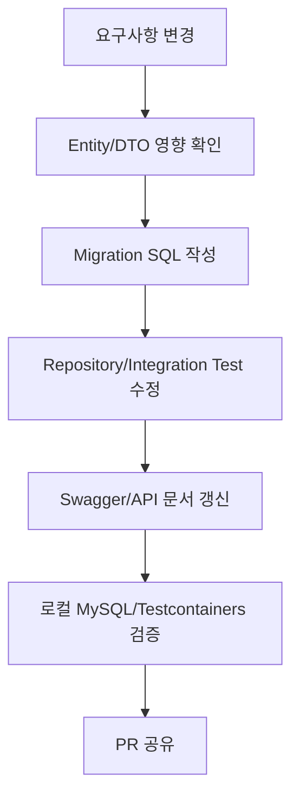
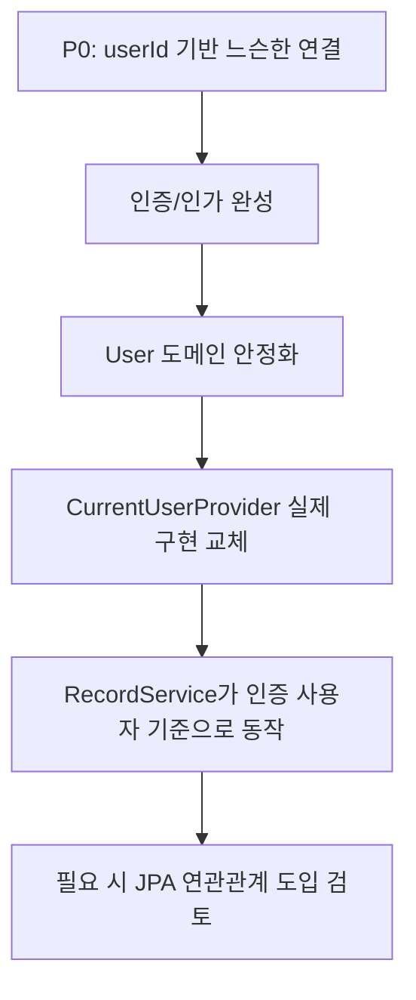

# 기록/아카이브 도메인 개발 계획

이 문서는 여운 백엔드에서 기록/아카이브 도메인을 Spring Boot 기반으로 구현하기 위한 작업 방향과 코드 작성 기준을 정리한다. 목표는 이번 주 안에 프론트엔드가 사용할 수 있는 MVP API를 안정적으로 제공하는 것이다.

## 1. 개발 전제

- 현재 프로젝트는 Java 21, Spring Boot 4.1, Spring Data JPA, Validation, MySQL, Testcontainers 기반이다.
- 인증/인가, 유저, 전시 도메인은 김진수님이 주로 개발할 가능성이 높다.
- 기록/아카이브 도메인은 서병필이 주로 개발한다.
- 기능 요구사항 문서는 AI가 만든 초안이므로 그대로 전체 구현하지 않는다.
- MVP에서는 기록 생성, 목록, 상세, 수정, 삭제를 먼저 구현한다.
- 북마크, 미디어 선업로드, AI 비동기 처리, 리마인드 트리거는 일정에 따라 2차 구현으로 분리할 수 있다.
- 미디어 용량은 MVP 기준 사진 10MB, 영상 100MB를 우선 정책으로 둔다.

## 2. 목표 API

### 1차 MVP

```http
POST   /api/v1/records
GET    /api/v1/records
GET    /api/v1/records/{recordId}
PUT    /api/v1/records/{recordId}
DELETE /api/v1/records/{recordId}
```

### 2차 후보

```http
POST   /api/v1/records/{recordId}/bookmark
DELETE /api/v1/records/{recordId}/bookmark
POST   /api/v1/records/media
```

1차 목표는 프론트가 아카이브 화면과 기록 상세 화면을 연결할 수 있는 API를 먼저 제공하는 것이다.

## 3. 아키텍처 흐름



### 계층별 책임

| 계층 | 책임 |
| --- | --- |
| Controller | HTTP 요청/응답, validation, 인증 사용자 식별, Swagger 문서화 |
| DTO | API 요청/응답 스펙 표현 |
| Service | 유스케이스 처리, 트랜잭션, 도메인 규칙 검증 |
| Repository | JPA 기반 데이터 조회/저장 |
| Domain Entity | DB 매핑, 최소한의 상태 변경 메서드 |
| CurrentUserProvider | 인증 도메인 완성 전까지 현재 사용자 식별을 감싸는 얇은 추상화 |

Controller에서 Entity를 직접 반환하지 않는다. API 응답은 항상 Response DTO로 변환한다.

## 4. 패키지 구조

```text
src/main/java/modi/backend
├── common
│   ├── exception
│   └── response
├── record
│   ├── controller
│   ├── service
│   ├── repository
│   ├── domain
│   └── dto
│       ├── request
│       └── response
└── security
    └── CurrentUserProvider.java
```

`security.CurrentUserProvider`는 실제 인증 구현이 완성되기 전까지 임시 또는 어댑터 역할을 한다. 이후 JWT 인증이 붙으면 내부 구현만 교체한다.

## 5. 도메인 모델 방향

P0에서는 인증/유저/전시 도메인과의 충돌을 줄이기 위해 `Record`가 `User`, `Exhibition` 객체를 직접 강하게 참조하지 않고 `userId`, `exhibitionId`를 가진다.

이 방식은 최종 구조가 아니라 병렬 개발을 위한 임시 결합 방식이다. 유저 도메인과 인증/인가 구현이 안정되면 기록 도메인은 반드시 인증된 사용자 정보와 유저 도메인 모델을 기준으로 동작하도록 전환한다.



감정 코드는 검색/필터에 쓰일 가능성이 높으므로 별도 테이블을 둘 수 있다.

```text
RecordEmotion
- id
- recordId
- emotionCode
```

초안 ERD에는 `RecordEmotion`이 없지만, 요구사항에는 `emotionCodes`가 명확히 있고 아카이브 검색/필터에서도 사용된다. 구현 시 `RecordKeyword`로 감정을 함께 처리할지, `RecordEmotion`을 분리할지는 API 구현 전에 최종 결정한다. 추천은 `RecordEmotion` 분리다.

## 6. 핵심 도메인 규칙

- 기록은 로그인한 사용자 본인의 기록만 생성/조회/수정/삭제할 수 있다.
- 기록은 하나의 전시에 연결된다.
- `writeMode`는 `AI` 또는 `DIRECT`다.
- `content`는 필수다.
- `viewedAt`은 실제 관람일이며 미래 날짜는 허용하지 않는다.
- `viewedAt`이 없으면 서버 기준 오늘 날짜를 기본값으로 사용한다.
- 감정 코드는 1개 이상 필요하다.
- 미디어는 기록당 최대 3개까지 허용한다.
- 사진은 파일 1개당 최대 10MB까지 허용한다.
- 영상은 파일 1개당 최대 100MB까지 허용한다.
- 허용 타입은 사진 `image/jpeg`, `image/png`, `image/webp`, 영상 `video/mp4`를 우선한다.
- 삭제는 우선 소프트 삭제(`deleted=true`)를 권장한다.
- 삭제된 기록은 목록/상세 조회에서 제외한다.
- 타인 기록 접근은 차단한다.

## 6.1 미디어 처리 방향

MVP에서는 사진과 영상을 모두 데이터 모델에는 포함하되, 구현은 두 단계로 나눈다.

### 1차 구현

프론트가 이미 업로드된 URL을 기록 생성 요청에 포함해 보내는 방식으로 시작한다.

```json
{
  "media": [
    {
      "type": "PHOTO",
      "url": "https://example.com/image.jpg",
      "sortOrder": 0,
      "sizeBytes": 1048576
    },
    {
      "type": "VIDEO",
      "url": "https://example.com/video.mp4",
      "sortOrder": 1,
      "sizeBytes": 52428800
    }
  ]
}
```

이 단계에서 백엔드는 다음을 검증한다.

- 미디어 개수 최대 3개
- `type`은 `PHOTO` 또는 `VIDEO`
- `url` 필수
- `sizeBytes` 기준 사진 10MB 이하
- `sizeBytes` 기준 영상 100MB 이하
- `sortOrder` 중복 방지

### 2차 구현

스토리지 정책이 확정되면 미디어 선업로드 API를 추가한다.

```http
POST /api/v1/records/media
Content-Type: multipart/form-data
```

이 API는 파일을 직접 받아 타입과 용량을 검증한 뒤 S3 같은 오브젝트 스토리지에 업로드하고, `mediaId`, `url`, `type`, `sizeBytes`를 반환한다. 이후 기록 생성 API는 `mediaIds`를 받아 기록과 연결한다.

### 영상 처리 원칙

- 영상은 MVP에서 서버가 인코딩, 썸네일 생성, 스트리밍 변환을 직접 하지 않는다.
- 영상 원본 파일을 저장하고 URL만 기록에 연결한다.
- 영상 썸네일이 필요하면 프론트에서 첫 프레임 또는 별도 썸네일 URL을 보내는 방식을 2차로 검토한다.
- 100MB를 초과하면 `400 / INVALID_MEDIA`로 응답한다.
- 모바일 네트워크를 고려해 프론트에는 업로드 진행률 표시와 실패 재시도를 권장한다.

## 7. API 요청/응답 초안

### 기록 생성

```http
POST /api/v1/records
```

```json
{
  "exhibitionId": 51,
  "writeMode": "AI",
  "viewedAt": "2026-06-28",
  "content": "색이 따뜻해서 한참 서 있었다.",
  "emotionCodes": ["MOVED", "CALM"],
  "userKeywords": ["색감"],
  "aiKeywords": ["따뜻한 색감", "위로"],
  "aiSummary": "평온하고 뭉클한 관람.",
  "representativeEmotion": "MOVED",
  "cardPhrase": "그날, 색이 나를 붙잡았다",
  "media": [
    {
      "type": "PHOTO",
      "url": "https://example.com/image.jpg",
      "sortOrder": 0,
      "sizeBytes": 12345
    }
  ]
}
```

```json
{
  "meta": { "result": "SUCCESS" },
  "data": {
    "recordId": 30481,
    "exhibitionId": 51,
    "writeMode": "AI",
    "viewedAt": "2026-06-28",
    "aiStatus": "READY",
    "createdAt": "2026-06-30T12:00:00Z"
  }
}
```

### 기록 목록

```http
GET /api/v1/records?keyword=모네&emotion=MOVED&bookmarked=true&page=0&size=20
```

```json
{
  "meta": { "result": "SUCCESS" },
  "data": {
    "content": [
      {
        "recordId": 30481,
        "exhibitionId": 51,
        "exhibitionTitle": "모네: 빛의 정원",
        "thumbnailUrl": "https://example.com/image.jpg",
        "aiSummary": "평온하고 뭉클한 관람.",
        "representativeEmotion": "MOVED",
        "bookmarked": true,
        "viewedAt": "2026-06-28",
        "createdAt": "2026-06-30T12:00:00Z"
      }
    ],
    "page": 0,
    "size": 20,
    "totalElements": 1,
    "totalPages": 1,
    "hasNext": false
  }
}
```

전시명은 전시 도메인 연동 전까지 `exhibitionId`만 반환하거나, 임시 조회 어댑터를 둔다. 프론트 협업상 목록 카드에 전시명이 꼭 필요하면 전시 도메인 API 또는 최소 전시 테이블과 먼저 맞춘다.

## 8. Swagger 공유 계획

API 공유는 Swagger/OpenAPI를 기준으로 한다. Postman은 수동 확인용이고 공식 계약은 Swagger다.

추가 후보 의존성:

```gradle
implementation 'org.springdoc:springdoc-openapi-starter-webmvc-ui:2.8.17'
```

확인 URL:

```http
GET /v3/api-docs
GET /swagger-ui.html
```

Controller에는 다음 정보를 Swagger annotation으로 명확히 남긴다.

- API 목적
- 인증 필요 여부
- 요청 필드 설명
- 성공 응답 예시
- 실패 응답 코드
- 목록 API query parameter

Spring Boot 4.1과 springdoc 버전 호환성은 의존성 추가 후 실제 실행으로 검증한다.

## 9. Postman 사용 계획

Postman은 다음 용도로 사용한다.

- 개발 중 API 수동 호출
- 프론트와 요청/응답 예시 확인
- 로그인 토큰이 붙은 실제 플로우 확인
- 배포 후 smoke test

Postman만으로 테스트를 끝내지 않는다. 핵심 도메인 규칙은 반드시 JUnit 테스트로 남긴다.

Postman 수동 확인 시나리오:

1. 기록 생성
2. 기록 목록 조회
3. 기록 상세 조회
4. 기록 수정
5. 기록 삭제
6. 삭제 후 목록/상세 비노출 확인
7. validation 실패 확인
8. 타인 기록 접근 차단 확인

## 10. 자동 테스트 계획

### Controller Test

- 필수 필드 누락 시 400
- 미래 `viewedAt` 요청 시 400
- 정상 생성 시 201
- 목록 조회 시 페이지 응답 형태 검증
- 상세 조회 시 응답 필드 검증
- 수정/삭제 요청 status 검증

### Service Test

- 기록 생성 규칙 검증
- 감정 코드 1개 이상 검증
- 미디어 최대 3개 검증
- 본인 기록만 접근 가능
- 삭제된 기록은 조회 불가
- 북마크 멱등 처리

### Repository / Integration Test

Testcontainers MySQL 기반으로 검증한다.

- 사용자별 기록 목록 분리
- keyword 검색
- emotion 필터
- bookmarked 필터
- viewedAt 기간 필터
- soft delete 제외
- pagination 및 sort

## 11. 구현 순서

1. Swagger 의존성 추가 및 Swagger UI 동작 확인
2. 공통 응답 wrapper 작성
3. 공통 예외 및 `@RestControllerAdvice` 작성
4. `CurrentUserProvider` 임시 구현
5. 기록 도메인 Entity 작성
6. Repository 작성
7. DTO 작성
8. Service 작성
9. Controller 작성
10. Controller/Service/Repository 테스트 작성
11. Postman으로 수동 smoke test
12. Swagger 문서 확인 후 프론트와 API 스펙 공유

## 12. ORM / DB 변경 대응 전략

JPA ORM을 사용하더라도 운영/협업 환경에서는 Entity 변경만으로 DB 스키마 변경을 방치하지 않는다. Entity는 애플리케이션 모델이고, DB 스키마 변경은 별도 변경 이력으로 관리한다.

### 기본 원칙

- 로컬 초기 개발에서는 `ddl-auto`를 활용할 수 있다.
- 공유 개발 DB, staging, production에서는 `ddl-auto: create`, `create-drop`, `update`를 사용하지 않는다.
- 배포 가능한 환경에서는 Flyway 또는 Liquibase 같은 마이그레이션 도구를 사용한다.
- Entity 변경과 DB migration SQL은 같은 PR 또는 같은 작업 단위에 포함한다.
- DB 변경이 API 응답/요청에 영향을 주면 Swagger 문서도 함께 갱신한다.
- 데이터 손실 가능성이 있는 변경은 바로 적용하지 않고 단계적으로 진행한다.

### 권장 설정

현재 `application.yaml`은 로컬 개발 편의를 위해 다음 설정을 사용하고 있다.

```yaml
spring:
  jpa:
    hibernate:
      ddl-auto: create-drop
```

MVP API가 프론트와 공유되기 시작하면 아래처럼 전환하는 것을 권장한다.

```yaml
spring:
  jpa:
    hibernate:
      ddl-auto: validate
```

`validate`는 Entity와 DB 스키마가 맞는지 확인만 하고 DB를 자동 변경하지 않는다. 스키마 변경은 migration 파일로만 수행한다.

### Flyway 도입 후보

의존성 후보:

```gradle
implementation 'org.flywaydb:flyway-core'
implementation 'org.flywaydb:flyway-mysql'
```

마이그레이션 파일 위치:

```text
src/main/resources/db/migration
```

파일명 규칙:

```text
V1__create_records.sql
V2__add_record_bookmark.sql
V3__add_record_media_size_bytes.sql
```

초기 기록 도메인 테이블은 예를 들어 아래 순서로 만든다.

```text
V1__create_record_tables.sql
```

포함 테이블:

- `records`
- `record_keywords`
- `record_media`
- `record_emotions` 사용 시 함께 포함

### DB 변경 작업 흐름



### 변경 유형별 대응

| 변경 유형 | 대응 |
| --- | --- |
| 새 컬럼 추가 | nullable로 먼저 추가하거나 기본값을 명확히 둔다 |
| 필수 컬럼 추가 | 1단계 nullable 추가, 2단계 백필, 3단계 not null 전환 |
| 컬럼명 변경 | 새 컬럼 추가 후 데이터 복사, 코드 전환, 기존 컬럼 제거 순서로 진행 |
| enum 값 추가 | DB check constraint를 쓰는 경우 migration에 enum 허용값 반영 |
| enum 값 삭제/변경 | 기존 데이터 영향 확인 후 별도 데이터 migration 필요 |
| 테이블 분리 | 새 테이블 생성, 기존 데이터 이관, 코드 전환, 기존 컬럼 제거 |
| 인덱스 추가 | 검색 조건과 정렬 조건 기준으로 추가하고 성능 테스트 후 반영 |
| 컬럼 삭제 | 즉시 삭제하지 않고 코드에서 미사용 전환 후 다음 migration에서 제거 |

### 기록/아카이브에서 예상되는 DB 변경

- `RecordEmotion` 분리 여부 결정
- `RecordMedia` 선업로드 도입 시 임시 업로드 상태 컬럼 추가
- 영상 썸네일 URL 추가
- 북마크를 `records.bookmarked` boolean으로 둘지 별도 테이블로 뺄지 결정
- AI 비동기 처리 도입 시 `ai_status`, `ai_error_message`, `ai_completed_at` 추가 가능
- 소프트 삭제 확정 시 `deleted`, `deleted_at` 추가 가능
- 검색 성능 개선 시 `user_id`, `created_at`, `viewed_at`, `bookmarked`, `emotion_code` 인덱스 추가

### 테스트 기준

DB 변경이 있으면 최소한 아래를 확인한다.

```bash
./gradlew test
```

추가로 로컬 앱 실행 후 Swagger와 Postman으로 smoke test를 수행한다.

```bash
./gradlew bootRun
```

확인 대상:

- 애플리케이션이 DB migration 후 정상 기동하는지
- `/actuator/health`가 `UP`인지
- `/v3/api-docs`가 정상 응답하는지
- 기록 생성/목록/상세/수정/삭제가 정상 동작하는지

### 주의사항

- `ddl-auto: update`는 편해 보이지만 실제 SQL 변경 이력이 남지 않아 협업 환경에서는 피한다.
- 운영 데이터가 있는 환경에서는 컬럼 삭제, 타입 변경, not null 전환을 바로 하지 않는다.
- Entity 필드명 변경만으로 DB 컬럼명이 자동으로 안전하게 바뀐다고 가정하지 않는다.
- migration 실패 시 원인을 파악할 수 있도록 파일명을 명확히 쓰고 한 파일에 너무 많은 변경을 넣지 않는다.

## 13. 유저 도메인 연동 전환 계획

초기 구현은 기록/아카이브 API를 빠르게 제공하기 위해 `CurrentUserProvider`가 `userId`를 넘겨주는 형태로 시작한다. 하지만 유저 정보 도메인이 완성되면 기록 도메인의 기준은 단순 숫자 ID가 아니라 인증된 사용자 정보가 되어야 한다.

### 단계별 전환



### P0 임시 구조

```java
Long currentUserId = currentUserProvider.getCurrentUserId();
recordService.create(currentUserId, request);
```

이 단계에서는 기록 도메인이 유저 도메인의 세부 필드에 의존하지 않는다. 사용자 존재 여부와 권한 검증은 최소화하고, 본인 기록 접근 제어를 우선 구현한다.

### 유저 도메인 완성 후 목표 구조

```java
CurrentUser currentUser = currentUserProvider.getCurrentUser();
recordService.create(currentUser, request);
```

`CurrentUser`에는 최소한 아래 정보가 포함된다.

- `userId`
- `nickname`
- `profileCompleted`
- 인증 provider 또는 role이 필요하면 추가

기록 생성/조회/수정/삭제는 항상 `CurrentUser.userId()`를 기준으로 본인 리소스인지 검증한다. 프로필 완료 여부가 기록 작성 조건이 되면 `profileCompleted`도 Service 진입 전에 검증한다.

### Entity 연관관계 전환 기준

유저 도메인이 완성되어도 무조건 `Record -> User` JPA 연관관계를 바로 도입하지 않는다. 아래 기준을 보고 결정한다.

| 선택지 | 사용 기준 |
| --- | --- |
| `record.userId` 유지 | 기록 도메인이 사용자 ID 외 유저 정보를 거의 사용하지 않을 때 |
| `@ManyToOne(fetch = LAZY) User user` 도입 | 기록 조회에서 사용자 정보가 자주 필요하고 도메인 경계가 안정되었을 때 |

MVP에서는 `userId` 유지가 더 단순하다. 이후 유저 정보가 기록 응답에 자주 필요해지거나, 유저 삭제/탈퇴 정책과 강하게 연결되면 JPA 연관관계를 검토한다.

### 전환 시 수정 대상

- `CurrentUserProvider`
- `RecordController`
- `RecordService`
- 기록 생성/조회/수정/삭제 테스트
- Swagger 인증 설명
- Postman 환경 변수 및 Authorization 헤더

### 전환 시 지켜야 할 규칙

- 기록 API는 클라이언트가 보낸 `userId`를 신뢰하지 않는다.
- `userId`는 요청 body/query/path로 받지 않는다.
- 사용자 식별은 항상 인증 토큰에서 얻는다.
- 타인 기록 접근 검증은 `record.userId == currentUser.userId` 기준으로 한다.
- 유저 도메인 변경 때문에 기록 도메인 API 스펙이 불필요하게 흔들리지 않도록 `CurrentUserProvider`를 완충 계층으로 유지한다.

## 14. 개발 중 결정이 필요한 항목

- 목록 카드에서 전시명을 기록 API가 직접 내려줄지, 프론트가 전시 API로 조합할지
- 개인 전시를 독립 엔티티로 둘지, 기록 내부 값으로 둘지
- 감정 코드를 `RecordEmotion`으로 분리할지, `RecordKeyword`에 함께 둘지
- 미디어를 P0에서 URL 입력 방식으로 받을지, 선업로드 API부터 만들지
- 삭제를 소프트 삭제로 확정할지
- 북마크를 1차 MVP에 포함할지
- AI 비동기 생성 상태(`PENDING`)를 P0에 포함할지

## 15. 최종 방향

기록/아카이브 도메인은 MVP 일정상 아래 원칙으로 구현한다.

- API 먼저 작게 연다.
- 도메인 규칙은 Service에 둔다.
- Entity는 API에 직접 노출하지 않는다.
- 인증/유저/전시 도메인과는 느슨하게 연결한다.
- Swagger로 프론트와 공식 스펙을 공유한다.
- Postman으로 수동 확인하되, 핵심 로직은 자동 테스트로 보장한다.
