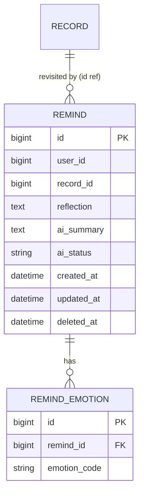

# 리마인드(회고) 기능 개발 플랜

> 상태: 계획(검토 중) · 작성 2026-07-07
> 근거: `[07] 리마인드` / `03_전시 기록 선택_B` 와이어프레임 (Flow는 와이어프레임 기반)
> 관련: [record-writing-redesign-plan.md](record-writing-redesign-plan.md) · [record-archive-development-plan.md](record-archive-development-plan.md)
> 비고: 아카이브 계획서에서 "리마인드 트리거는 2차 구현으로 분리"로 예고된 항목의 본 구현 플랜.

## 1. 배경 / 목표

과거에 남긴 전시 기록을 일정 시간이 지난 뒤 다시 꺼내어, **"지금 다시 보니 어떤가"**를 새 감정과 한 줄 소감으로 남기는 회고 기능. 결과는 아카이브의 **'리마인드'** 섹션에 **감정 변화 요약**으로 축적된다.

- 핵심 가치: 같은 전시/기록에 대한 감정이 **시간에 따라 어떻게 변하는지**를 사용자가 체감.
- 한 기록에 대해 시간차로 여러 번 회고할 수 있다(1주일 후 → 한 달 후 …). → `Record 1 : N Remind`.
- **AI 없음(P0)**: 저장·조회는 순수 데이터. "감정 변화 요약"은 원본 vs 회고를 **나란히 보여주는 데이터**이며, AI 요약문은 P1 후보.

## 2. 와이어프레임 요약 (`[07] 리마인드`)

6개 화면, 하나의 세로 플로우:

| # | 화면 | 내용 | 액션 |
|---|---|---|---|
| 1 | 소환 카드 | "**N주일 전**, 이 전시를 기록했어요" + 당시 기록 카드(포스터·제목·작가·날짜·장소) | (다음) |
| 2 | 그 장면 | "전시 속, 그 장면" — 대표 이미지 크게 | (다음) |
| 3 | 그때의 여운 | "그때 내가 기록한 여운이에요" — **그날의 감상(원본 content)** + **당시 감정 태그** | 나가기 / **감정 다시 남기기** |
| 4 | 지금 다시 보니 | "지금 다시 보니 어떤가요?" — **감정 다시 남기기(+)** + **한 줄로 남기고 싶은 문장** 입력 | **오늘의 여운 저장** |
| 5 | (입력됨) | 새 감정 태그 선택 + 소감 작성 예시 | **오늘의 여운 저장** |
| 6 | 감정 변화 요약 | "오늘의 여운이 저장되었어요 / 아카이브의 '리마인드'에서 확인해 보세요" | **아카이브 보러가기** |

- 화면 1~3은 **읽기(원본 기록 회고)**, 4~5는 **쓰기(새 회고 입력)**, 6은 **저장 완료 + 아카이브 유도**.
- 화면 1의 "N주일 전"은 **서버가 소환 대상을 고르고 경과 라벨을 계산**해야 한다(트리거).

## 3. 결정사항 (확정 · 2026-07-07)

| 주제 | 결정 |
|---|---|
| 회고 횟수 | **여러 번 허용**(시간차 감정 변화 축적). `Record 1:N Remind`. 소환은 "마지막 회고 이후 재경과" 기준 |
| 감정 변화 요약 | **AI 서술 요약 포함**. 원본(감정/감상) ↔ 회고(감정/소감)를 LLM이 한 문단으로 서술. **저장 시 생성(동기, best-effort)** — AI 실패/비활성/rate-limit이어도 **리마인드 저장 자체는 성공**, 요약만 null. `before/after` 원자료도 항상 제공 |
| 소환 정책 | createdAt 기준 **7일 이상 경과 + 아직 회고 안 한** 내 기록 중 **가장 최근 1건**. 없으면 빈 응답 |
| 경과 라벨 | 서버가 `daysAgo`(int) + `elapsedLabel`(예 "1주일 전"/"3주일 전"/"2개월 전") 함께 제공 → FE는 택일 |
| 저장 필수값 | **소감(reflection) 필수(≤300자)**, **감정(emotionCodes) 선택**(0개 이상, 각 ≤10자) |
| 원본 스냅샷 | P0는 원본 감정/감상을 **라이브 조회**(record 조인). 원본 편집 시 "그때" 값도 따라감. 시점 고정은 오픈이슈 |
| 권한 | **본인 기록만** 회고. `record.userId == loginUser`, `Remind.userId=loginUser` |
| 삭제된 기록 | 원본 soft-delete 시 소환 제외. 기존 리마인드 상세는 `before:null` 최소 표기 |
| 감정 저장 형태 | `RecordEmotion`과 동일 패턴의 `RemindEmotion`(문자열 code) |
| AI 인프라 재사용 | `domain/ai/AiChatClient`(포트) + `AiRateLimiter` + `AiProperties` 그대로. `RemindAiSummarizer`(application/remind)가 조립·호출 |
| Rate limiting | 저장 시 AI 요약 호출에 **`AiRateLimiter` 적용**(유저별 쿨다운). rate-limit이면 저장은 성공하되 `aiStatus=SKIPPED`, 요약 null |

> 감정 코드는 기존 기록과 동일하게 **프리셋+커스텀 통합 한글 라벨**(FE 소유 프리셋), 항목당 ≤10자.

### AI 요약 상태(`aiStatus`)
- `READY`: 요약 생성 완료(`aiSummary` 존재).
- `SKIPPED`: AI 비활성(키 없음) 또는 rate-limit으로 생성 안 함. 저장은 성공.
- `FAILED`: 생성 시도 중 오류. 저장은 성공, 요약 null.
- (P1 후보) 실패/스킵 건 재생성용 `POST /reminds/{id}/summary`.

## 4. 도메인 모델

새 애그리거트 `Remind`(회고). 다른 애그리거트(`Record`)는 **ID로만** 참조(경계 넘는 @ManyToOne 금지).



- `Remind`(Entity, `BaseEntity` 상속): `userId`, `recordId`, `reflection`, `emotions:List<RemindEmotion>`(cascade/orphanRemoval). 정적 팩토리 `Remind.create(...)`, 상태변경은 엔티티 메서드.
- `RemindEmotion`(Entity): `emotionCode`(String, ≤50) + `Remind`로의 `@ManyToOne`(같은 애그리거트 내부이므로 허용). `attach()` 패턴은 `RecordEmotion` 그대로.
- `RemindRepository`(포트, domain) / `RemindJpaRepository`(infra) / `RemindRepositoryImpl`(infra, QueryDSL) — 3-클래스. soft-delete 필터(`...AndDeletedAtIsNull`).

## 5. API 계약

컨트롤러 1개 `RemindV1Controller` (`/api/v1/reminds`), 페이사드 `RemindFacade`. 성공 전부 200, 인증 필수(`@Authentication`).

```http
GET  /api/v1/reminds/candidate         # 오늘의 소환 대상(회고할 과거 기록) 1건
POST /api/v1/reminds                    # 리마인드 저장 (body: recordId + 새 감정 + 소감)
GET  /api/v1/reminds                    # 아카이브 '리마인드' 목록(내 회고, 페이지)
GET  /api/v1/reminds/{remindId}         # 리마인드 상세 = 감정 변화 요약
```

### 5.1 소환 대상 조회 — `GET /reminds/candidate`
화면 1~3 렌더용. 소환 대상이 없으면 `data: null`.
```json
{
  "recordId": 128,
  "daysAgo": 8,
  "elapsedLabel": "1주일 전",
  "exhibitionId": 51,
  "exhibitionTitle": "조용한 호숫가",
  "artist": "김미경 외 10인",          // 전시(exhibitionId)에서 라이브 조회, 없으면 null
  "posterUrl": "https://.../p.jpg",
  "place": "동작아트갤러리",
  "region": "SEOUL",
  "viewedAt": "2026-07-03",
  "originalContent": "빛이 천천히 번지는 전시실을 지나며 …",   // 그날의 감상
  "originalEmotionCodes": ["평화로운", "차분한", "고요한"]
}
```

### 5.2 리마인드 저장 — `POST /reminds`
```json
// 요청
{
  "recordId": 128,
  "emotionCodes": ["슬픔", "서정적인", "아름다운"],   // 선택(0개 이상, 각 ≤10자)
  "reflection": "당시에는 강렬한 색채가 생생했는데 다시 보니 슬픈 분위기가 더 다가온다"  // 필수 ≤300
}
// 응답 = 감정 변화 요약(5.4와 동일 스키마)
```
- 검증: recordId 본인 기록 · reflection 필수/≤300 · emotion 각 ≤10자·dedup.

### 5.3 리마인드 목록 — `GET /reminds`
아카이브 '리마인드' 탭. `page/size` 오프셋. 항목: remindId · recordId · 전시 카드 요약(제목·포스터·장소) · createdAt · reflection(미리보기) · 대표 감정 변화(원본 n개 → 회고 n개).

### 5.4 리마인드 상세(감정 변화 요약) — `GET /reminds/{remindId}`
```json
{
  "remindId": 9,
  "recordId": 128,
  "createdAt": "2026-07-11T09:00:00+09:00",
  "exhibition": { "exhibitionId": 51, "title": "조용한 호숫가", "posterUrl": "…", "place": "동작아트갤러리", "viewedAt": "2026-07-03" },
  "before": { "content": "빛이 천천히 번지는 …", "emotionCodes": ["평화로운", "차분한", "고요한"] },
  "after":  { "reflection": "당시에는 …", "emotionCodes": ["슬픔", "서정적인", "아름다운"] },
  "aiStatus": "READY",
  "aiSummary": "처음엔 평화롭고 고요했던 감상이, 다시 마주하니 슬픔과 서정으로 무게중심이 옮겨갔다 …"
}
```
> `before`는 원본 기록에서 라이브 조회. 원본 삭제 시 `before: null`(오픈이슈). `aiSummary`는 저장 시 best-effort 생성 — `aiStatus`가 `SKIPPED`/`FAILED`면 null.

## 6. 계층 / 패키지 구조

```text
domain/remind
├── Remind.java              # Entity(BaseEntity), 정적팩토리 create, 상태변경 메서드
├── RemindEmotion.java       # Entity, emotionCode + @ManyToOne Remind(같은 애그리거트)
├── RemindRepository.java    # 포트(I/F)
└── RemindErrorCode.java     # REMIND_NOT_FOUND / FORBIDDEN_REMIND / NO_REMIND_CANDIDATE …
application/remind
├── RemindFacade.java        # RemindRepository + Record 조회(RecordJpaRepository) + Exhibition(작가) 조합
├── RemindCriteria.java      # 중첩 record: Save, CandidateQuery …
└── RemindResult.java        # 중첩 record: Candidate, Summary, ListItem
infra/remind
├── RemindJpaRepository.java
└── RemindRepositoryImpl.java
interfaces/remind
├── RemindV1Controller.java
├── RemindV1ApiSpec.java     # Swagger
└── dto/RemindDto.java       # 중첩 record: SaveRequest, CandidateResponse, SummaryResponse, ListItemResponse
resources/db/migration
└── V10__create_remind_tables.sql
```

- **상태변경은 Entity 메서드에서만**, Facade는 load·조율·save. (CLAUDE.md 핵심)
- **여러 도메인 Repo 조합은 Facade에서만** — RemindFacade가 Remind + Record(+ Exhibition 작가)를 조합.
- 변환: `Request →[Controller] Criteria → Facade → Result →[Controller] Response`.

## 7. 검증 · 권한 · 소환 로직

- **권한**: 저장/조회 모두 본인 스코프. 저장 시 대상 record가 본인 것이 아니면 `FORBIDDEN_REMIND`.
- **저장 검증**: reflection 필수(공백만 불가)·≤300 / emotionCodes 각 ≤10자·중복 제거 / record 존재(soft-delete 제외).
- **소환 로직(candidate)**:
  1. 내 기록 중 `createdAt <= now(KST) - 7일` 필터(soft-delete 제외).
  2. 그중 **아직 리마인드가 없는**(또는 마지막 리마인드로부터 재경과) 기록.
  3. `createdAt DESC`로 1건. 없으면 null.
  4. `daysAgo = KST 오늘 - createdAt.toLocalDate`, `elapsedLabel`는 주/개월/년 버킷.
- **KST 기준 "오늘"**: `AppTime.KST` 사용(JVM 기본 UTC — [record-writing 타임존 수정] 참조).

## 8. 마이그레이션 `V10__create_remind_tables.sql`
- `reminds`(id, user_id, record_id, reflection TEXT, ai_summary TEXT null, ai_status varchar(20) not null, created_at/updated_at/deleted_at datetime(6)) + 인덱스(`user_id`, `record_id`).
- `remind_emotions`(id, remind_id, emotion_code varchar(50)) + FK/인덱스.
- 파괴적 변경 없음(신규 테이블만).

## 9. 테스트 계획
| 대상 | 방식 |
|---|---|
| `Remind`/`RemindEmotion` 도메인 | 순수 단위(감정 dedup·소감 검증) |
| `RemindV1Controller` | @WebMvcTest(요청 검증·인증 가드) |
| `RemindRepositoryImpl` | @DataJpaTest(소환 쿼리: 7일 경과·미회고·본인) |
| `RemindFacade` 유스케이스 | @SpringBootTest(저장→요약, 소환 선택, 권한) |
- 인증 가드: 미인증/무효 토큰 → 401. 타인 기록 회고 → 403.

## 10. 단계별 체크리스트
- [x] 본 기획서 검토·[확인 필요] 항목 확정(2026-07-07: 회고 1:N · AI 서술요약 포함 · 7일 소환 · 소감 필수)
- [x] 도메인(Remind/RemindEmotion/RemindAiStatus/에러코드/스냅샷) + V10 마이그레이션
- [x] infra(RemindJpaRepository — 소환 쿼리 JPQL, record fetch-join 추가)
- [x] application(RemindFacade/Criteria/Result/RemindAiSummarizer) — 저장·소환·목록·상세 + AI best-effort
- [x] interfaces(RemindV1Controller/ApiSpec/RemindDto)
- [x] 테스트(RemindFacadeTest 단위 6 · RemindV1ControllerTest 통합 7: 저장·상세·목록·소환·권한·검증) — 전체 128 tests 통과(실패 0)
- [x] 더미 클라이언트(client-demo)에 리마인드 플로우 추가 → Preview 왕복 검증(소환→입력→저장(AI READY)→요약→아카이브, 콘솔 에러 0)
- [x] 라이브 검증: V10 마이그레이션 적용, candidate/save/get/list end-to-end, AI 감정변화 요약 실제 생성(READY), 이미 회고한 기록 소환 제외
- [ ] Postman 컬렉션 Remind 폴더
- [ ] (허락 후) 커밋/PR

> 구현 노트: Repository는 기록 도메인과 동일하게 `JpaRepository` 직접 사용(포트/QueryDSL 미도입 — 코드베이스 현행 패턴). 소환 쿼리는 remind 인프라에 두어 record→remind 단방향 결합 유지. AI 요약은 저장 트랜잭션 밖에서 생성, 실패/미설정/rate-limit은 `aiStatus`로만 표기하고 저장은 항상 성공.

## 11. 오픈 이슈 / P1 후보
- **AI 감정 변화 요약**: before/after를 LLM이 서술로 요약("강렬함 → 슬픔으로 무게중심 이동" 등). `AiChatClient` 재사용, `AiRateLimiter` 적용. 화면 6 "감정 변화 요약"의 서술화.
- **시점 고정 스냅샷**: 원본 편집/삭제와 무관하게 "그때" 값을 보존할지(현재 라이브 조회).
- **소환 다양성/주기**: 1주일 외 1개월·1년 재소환, 하루 1건 제한, 알림(푸시) 연동 여부.
- **작가(artist) 출처**: record 스냅샷엔 작가가 없어 exhibition에서 라이브 조회. 전시 삭제 시 null.
- **아카이브 통합**: 기존 기록 아카이브와 '리마인드' 탭의 목록 응답 정합성.
