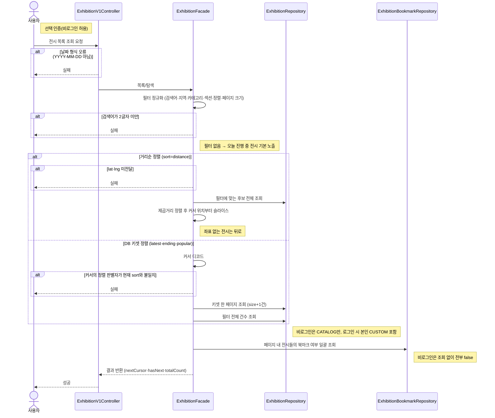

# 전시 목록/탐색

> 시나리오 2.3 — 누구나 로그인 없이 전시 목록을 탐색한다. 필터가 없으면 오늘 진행 중인 전시를 기본 노출하고, 로그인 시 본인의 CUSTOM 전시와 북마크 여부가 함께 반영된다.

**다이어그램이 필요한 이유**
- 조건 분기: 검색어 최소 2글자, 커서-정렬 판별자 일치, 거리순의 lat·lng 필수
- 정렬 경로 이원화: latest·ending·popular은 DB 키셋 페이지네이션, distance는 앱 레이어 정렬(best-effort)
- 도메인 간 협력: 목록 개인화를 위해 bookmark 도메인(ExhibitionBookmarkRepository)을 함께 조회

