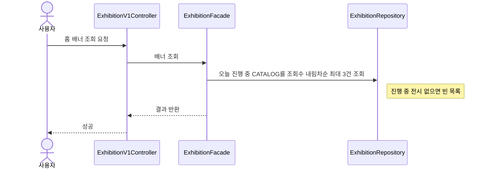

# 홈 배너 조회

> 시나리오 2.3 — 사용자가 홈 배너(오늘 진행 중인 인기 전시 최대 3개)를 조회한다.

> 분기 없는 단순 조회 흐름. 진행 중 전시가 없으면 빈 배열을 반환한다(실패 아님 — 홈은 배너 부재 시 섹션만 노출).

```mermaid
sequenceDiagram
    actor 사용자
    participant ExhibitionV1Controller
    participant ExhibitionFacade
    participant ExhibitionRepository

    사용자->>ExhibitionV1Controller: 홈 배너 조회 요청
    ExhibitionV1Controller->>ExhibitionFacade: 배너 조회

    ExhibitionFacade->>ExhibitionRepository: 오늘 진행 중 CATALOG를 조회수 내림차순 최대 3건 조회
    Note right of ExhibitionRepository: 진행 중 전시 없으면 빈 목록

    ExhibitionFacade-->>ExhibitionV1Controller: 결과 반환
    ExhibitionV1Controller-->>사용자: 성공
```
