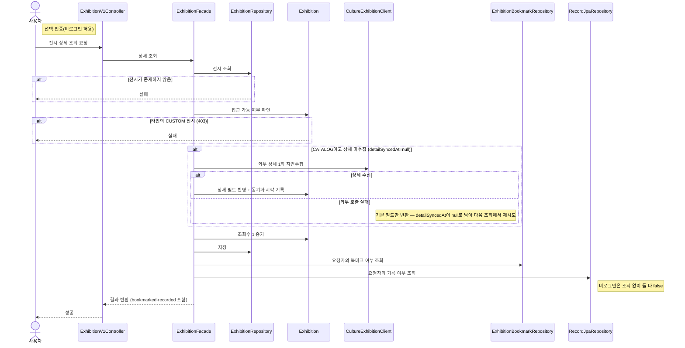

# 전시 상세 조회

> 시나리오 2.3 — 사용자가 특정 전시의 상세 정보를 조회한다. 상세 진입 시 조회수가 1 증가하고, CATALOG 전시는 최초 진입 때 외부 상세를 1회 지연수집해 캐시한다.

**다이어그램이 필요한 이유**
- 조건 분기: 전시 없음(404), 타인의 CUSTOM 접근(403), CATALOG 최초 진입 시에만 외부 상세 수집
- 외부 실패 허용: 상세 수집 실패 시 기본 필드만 반환하고 다음 조회에서 재시도
- 도메인 간 협력: bookmarked는 bookmark 도메인, recorded는 record 도메인을 조회해 채운다

