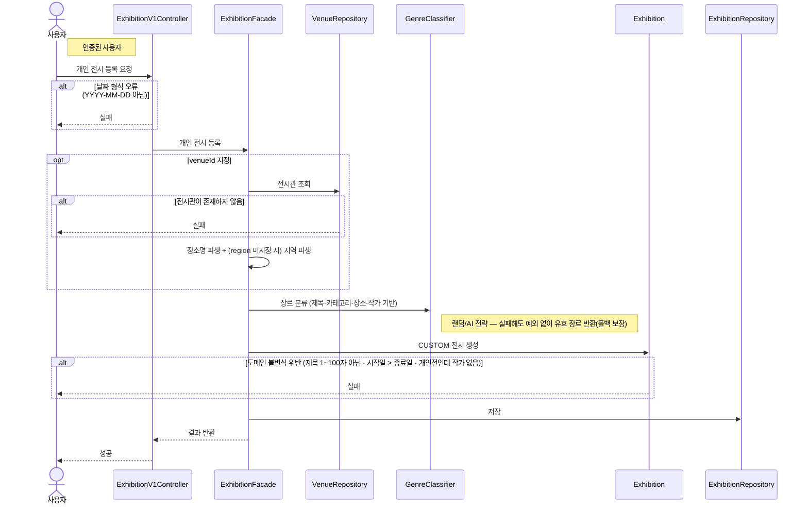

# 개인 전시 등록

> 시나리오 2.4 — 사용자가 목록에 없는 전시를 직접 등록해 기록의 대상으로 삼는다. 등록된 CUSTOM 전시는 등록자 본인에게만 노출된다.

**다이어그램이 필요한 이유**
- 도메인 간 협력: venueId 지정 시 venue 도메인에서 장소명·지역을 파생
- 조건 분기: 없는 venueId(404), 도메인 불변식 위반(제목·기간·개인전 작가)
- 부가 기능 격리: 장르 분류기는 실패해도 예외를 던지지 않아 등록 흐름을 깨지 않는다

