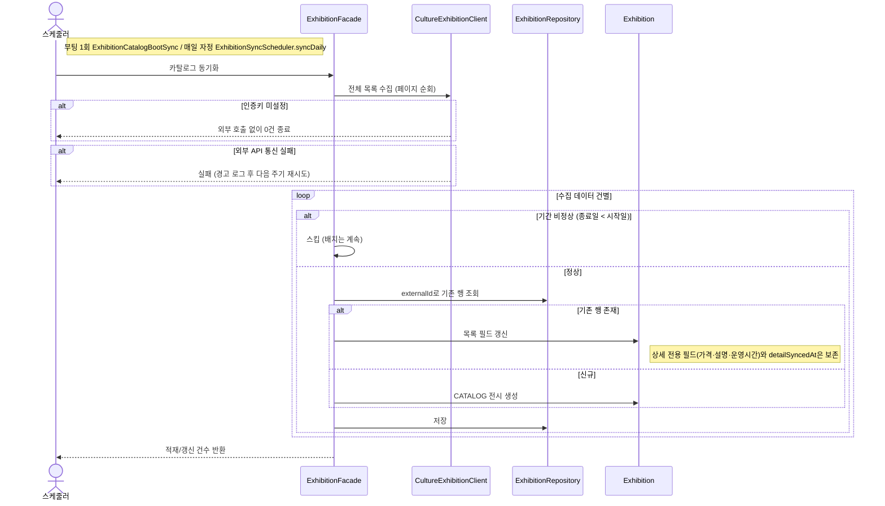

# (시스템) 카탈로그 동기화

> 시나리오 2.10 — 시스템이 외부 공공데이터 전시 API를 수집해 DB에 적재한다. 부팅 직후 1회(cold start 방지), 이후 매일 자정에 재동기화하며 상세 보강도 이때 함께 수행한다.

**다이어그램이 필요한 이유**
- 조건 분기: 인증키 미설정 스킵, 기간 비정상 레코드 스킵, externalId 기준 upsert(갱신/신규)
- 데이터 보존 규칙: 재적재 시 상세 전용 필드(가격·설명·운영시간)는 건드리지 않는다 — 백필로 채운 값을 정기 동기화가 덮지 않게
- 실패 격리: 부적합 단건이 배치 전체를 중단시키지 않는다

