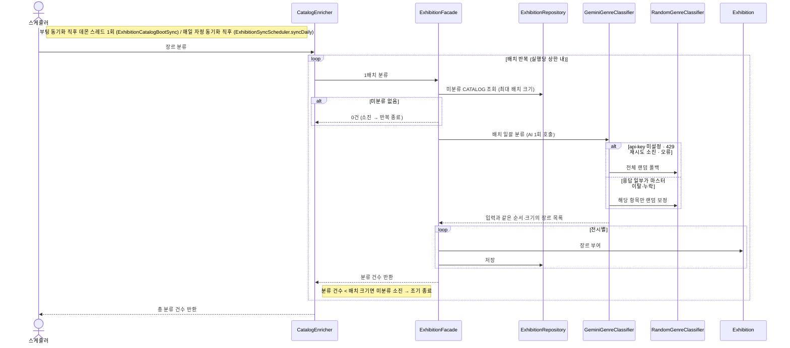

# (시스템) 장르 분류 — 동기화 직후 (구명: 장르 백필)

> 시나리오 2.10 — 시스템이 아직 장르가 없는 CATALOG 전시를 배치당 1회 호출로 일괄 분류한다. 별도 주기 없이 **동기화 직후에만** 실행된다 — 부팅 동기화 후 데몬 스레드 1회(기동 비차단) + 매일 자정 동기화 직후. 대상이 미분류 행이라 방금 동기화로 적재된 신규분만 분류한다. 분류기는 환경별로 다르다 — 운영(prod)은 AI(gemini), 개발·로컬은 랜덤(무비용).

**다이어그램이 필요한 이유**
- 배치 설계: 전시마다 호출하지 않고 배치당 1회 호출 — (AI 사용 시) 무료 한도 429 폭주·부팅 지연 방지
- 조건 분기: 미분류 소진 시 조기 종료, AI 실패(미설정·429·오류) 시 랜덤 폴백, 응답 일부 이탈 시 항목 단위 보정
- 멱등성: 장르가 채워진 행은 대상에서 빠져 반복 실행돼도 신규 행만 처리한다

