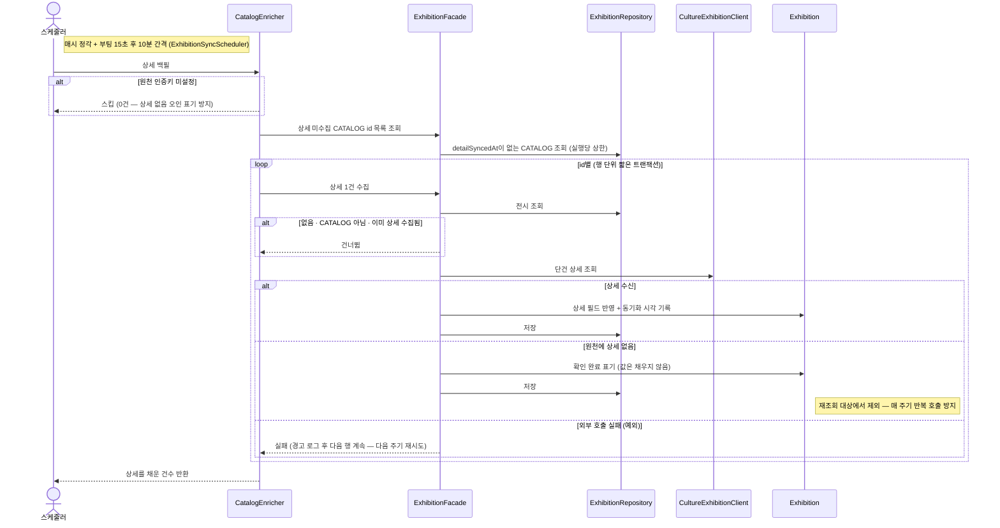

# (시스템) 상세 백필

> 시나리오 2.10 — 시스템이 상세(가격·설명 등)를 아직 채우지 않은 CATALOG 전시를 행 단위로 수집해 보강한다. 상세 진입 없이도 무료 판정 등이 동작하게 하는 선반영 경로다.

**다이어그램이 필요한 이유**
- 트랜잭션 설계: 대상 조회와 행 단위 수집을 분리 — 다건 외부 호출을 한 트랜잭션에 오래 물지 않는다
- 조건 분기: 인증키 미설정 스킵, 원천에 상세 없음(확인 완료 표기 — 값은 안 채우고 재조회만 차단), 외부 실패(다음 주기 재시도)
- 실패 격리: 한 행이 실패해도 나머지 행은 계속 처리한다

