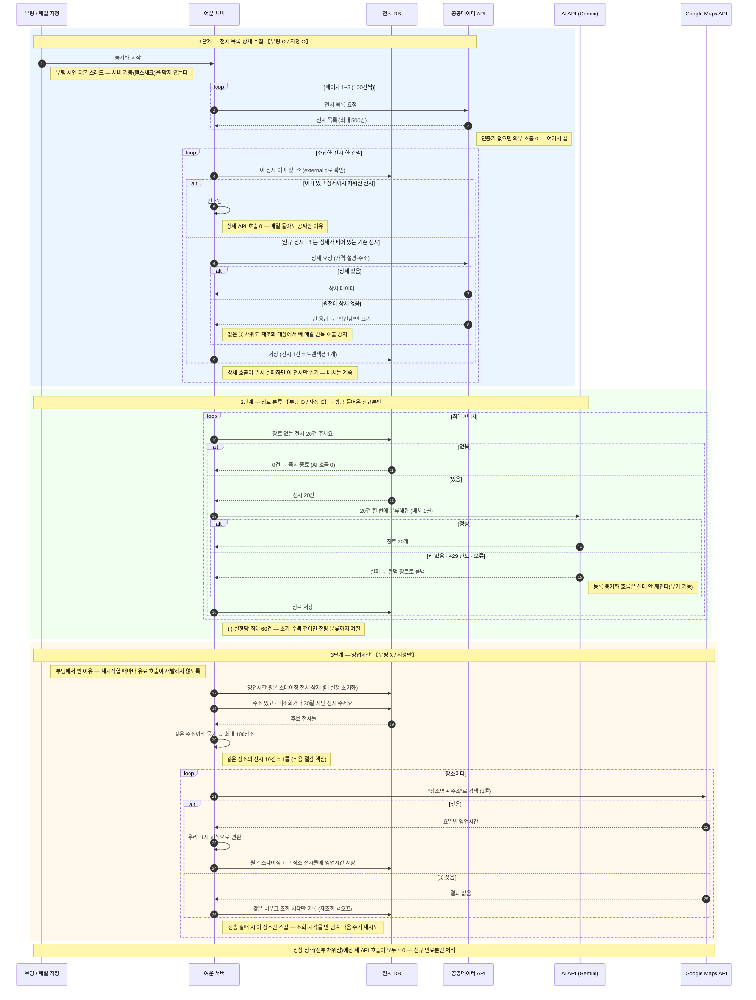

# (조망) 전시 초기화 전체 흐름 — 세 외부 API가 전시 한 건을 완성하기까지

> 개별 기능 문서(06 동기화 · 07 장르 분류)를 **하나의 타임라인으로 합친 조망도**다. "전시 데이터는 어디서 오고, 언제, 몇 번 불러서 채워지는가"를 한 장으로 보기 위한 문서 — 리팩터링·개선 논의의 출발점.
>
> 📌 **기준**: `develop`(= `main`, 2026-07-15 역머지 완료 시점) 코드 기준이다. 3단계(영업시간·Google Maps)는 한때 main에만 있었으나(PR #114가 main에 직접 머지) 지금은 develop에도 반영돼 있다.

## 세 외부 API의 역할

| API | 채우는 값 | 호출 단위 | 실행당 상한 | 환경별 |
|---|---|---|---|---|
| 📋 공공데이터 (한눈에보는문화정보) | 전시 목록(제목·기간·장소·좌표) + 상세(가격·설명·주소) | 목록 = 페이지당 1콜 / 상세 = **전시당 1콜** | 목록 5페이지 × 100건 = 최대 500건 | 키(`CULTURE_API_KEY`) 없으면 0콜 스킵 |
| ✨ AI (Gemini) | 장르 키워드(마스터 10종 중 1개) | **배치당 1콜** (20건 묶음) | 3배치 = **최대 60건** | 운영=gemini / develop·로컬=random(무비용) |
| 📍 Google Maps (Places New) | 영업시간(운영시간) | **장소당 1콜** (같은 주소 전시는 묶어서) | 최대 100장소 | 운영=google / 그 외=mock(0콜) |

## 전체 흐름

## 읽는 법 — 설계의 핵심 3가지

1. **"이미 채워진 건 안 건드린다"가 전 구간 원칙.** 상세는 `detailSyncedAt`, 장르는 `genreKeyword IS NULL`, 영업시간은 `synced_at + 30일`로 각각 대상을 거른다. 그래서 매일 자정에 돌아도 스테디 상태에선 외부 호출이 거의 0이고, 재실행해도 안전하다(멱등).
2. **보강은 전부 부가 기능 — 실패해도 본류를 안 깨뜨린다.** AI가 죽으면 랜덤 장르로, 구글이 죽으면 그 장소만 스킵, 상세가 실패하면 그 전시만 연기. 대신 **조용히 비어 있을 수 있다**는 뜻이기도 하다.
3. **호출 단위가 곧 비용 설계.** 상세만 전시당 1콜(무료라 가능)이고, 유료·한도 있는 AI와 구글은 각각 배치당·장소당 1콜로 묶었다.

## 개선 후보 (이 흐름에서 눈에 띄는 것)

| # | 논점 | 근거 |
|---|---|---|
| 1 | **장르 백필이 느리다** — 실행당 60건(20×3), 자정 하루 1회 → 초기 수백 건이면 전량 분류에 며칠 | `enrich.genre-max-batches-per-run: 3`. 설정 주석은 "소량씩 **주기(interval-ms)**에 나눠 드레인"이라 하지만 **그 주기 스케줄러는 이미 없다**(동기화 직후에만 실행) — 주석이 스테일이고, 드레인을 책임지던 경로가 사라진 상태 |
| 2 | **영업시간 원본을 매 실행 전부 지운다** | `resetPlaceHoursSnapshots()`가 `google_place_hours`를 통째로 delete 후 시작 — 이력이 안 남고, 그 실행이 실패하면 직전 원본도 이미 사라진 뒤 |
| 3 | **수집 상한 500건** (100×5페이지) | `max-pages: 5` — 원천에 더 있어도 못 가져온다. 의도된 캡인지 확인 필요 |
| 4 | **재배포마다 목록 5콜 재수집** | 부팅 동기화가 항상 전체 목록을 다시 훑는다(상세는 미완성분만이라 저렴하지만, 목록은 매번) |
| 5 | ~~**브랜치 분기** — 영업시간이 main에만 있음~~ → **해소됨(2026-07-15 역머지)** | 재발 방지: main에 직접 머지한 뒤 develop 역머지를 빼먹으면 같은 일이 반복된다 |
