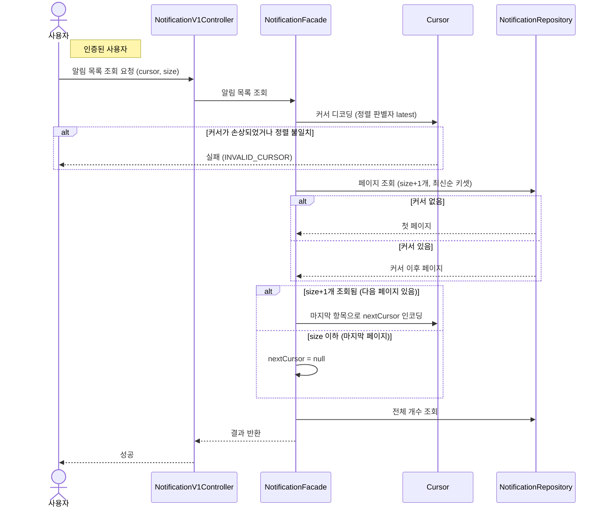

# 알림 목록 조회

> 시나리오 2.9 — 사용자가 자신의 알림 목록을 최신순으로 조회한다.

**다이어그램이 필요한 이유**
- 조건 분기: 커서 유무에 따른 첫 페이지/이후 페이지 분기 + 손상된 커서 검증(INVALID_CURSOR)
- 협력: Cursor가 opaque 토큰의 디코딩·정렬 일치 검증을 담당한다
- hasNext 판별: size+1개를 조회해 다음 페이지 존재 여부와 nextCursor를 계산한다

