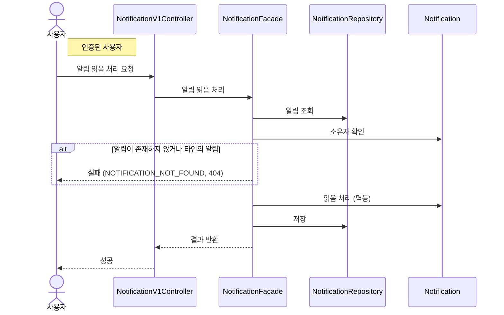

# 알림 읽음 처리

> 시나리오 2.9 — 사용자가 알림을 읽음 처리한다. 이미 읽은 알림을 다시 읽어도 결과는 동일하다(멱등).

**다이어그램이 필요한 이유**
- 조건 분기: 알림 존재 + 소유자 검증 — 없거나 타인 알림이면 404(존재를 노출하지 않음)
- 도메인 책임: 소유자 판정(isOwnedBy)과 읽음 상태 변경(markRead)은 Notification의 책임
- 멱등: 이미 읽음이어도 같은 결과로 성공한다

