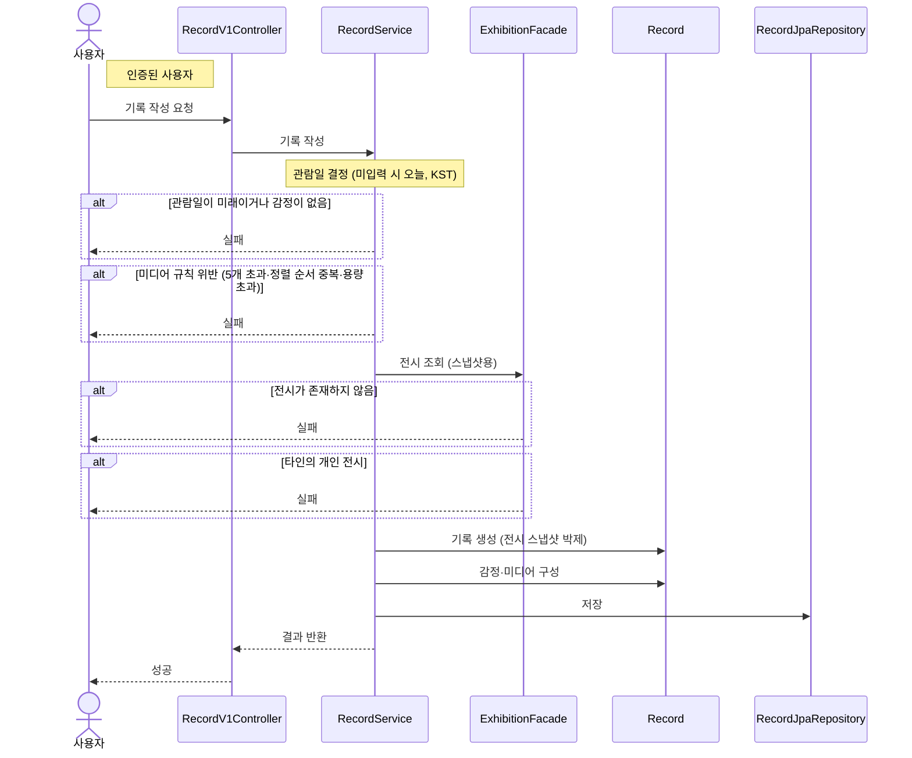

# 기록 작성

> 시나리오 2.6 — 사용자가 전시를 선택해 감상(직접 작성 또는 AI 도움)·감정·관람일·사진/영상을 기록한다.

**다이어그램이 필요한 이유**
- 조건 분기: 관람일(미래 불가, 미입력 시 오늘 KST)·감정(1개 이상 필수)·미디어(최대 5개, 정렬 순서 중복 불가, 사진 10MB·영상 100MB) 검증
- 도메인 간 협력: Record가 Exhibition의 접근 가능 여부를 확인하고 스냅샷을 받아 박제한다
- 스냅샷 박제: 생성 시점의 전시 정보를 기록에 복사해, 이후 전시가 변경·삭제되어도 기록은 영향받지 않는다

