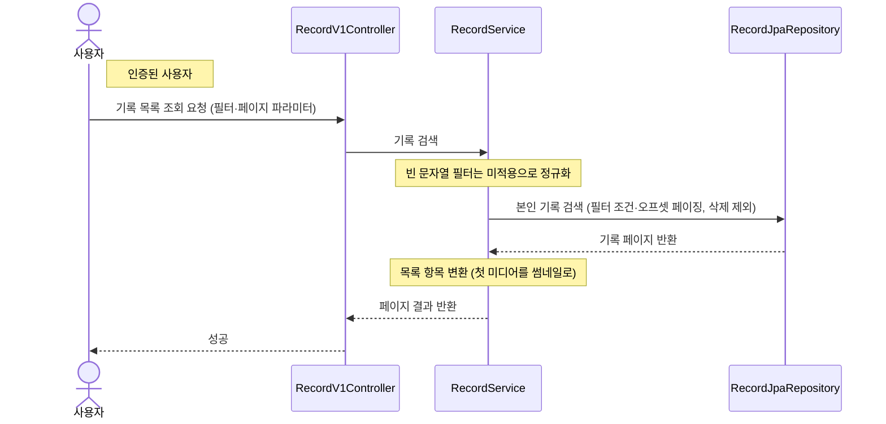

# 내 기록 목록 조회

> 시나리오 2.6 — 사용자가 아카이브에서 자신의 기록 목록을 조회한다. 검색어·감정·전시·북마크 여부·작성 방식·관람일 범위로 필터링한다.

```mermaid
sequenceDiagram
    actor 사용자
    participant RecordV1Controller
    participant RecordService
    participant RecordJpaRepository

    Note right of 사용자: 인증된 사용자

    사용자->>RecordV1Controller: 기록 목록 조회 요청 (필터·페이지 파라미터)
    RecordV1Controller->>RecordService: 기록 검색

    Note over RecordService: 빈 문자열 필터는 미적용으로 정규화
    RecordService->>RecordJpaRepository: 본인 기록 검색 (필터 조건·오프셋 페이징, 삭제 제외)
    RecordJpaRepository-->>RecordService: 기록 페이지 반환

    Note over RecordService: 목록 항목 변환 (첫 미디어를 썸네일로)
    RecordService-->>RecordV1Controller: 페이지 결과 반환
    RecordV1Controller-->>사용자: 성공
```
