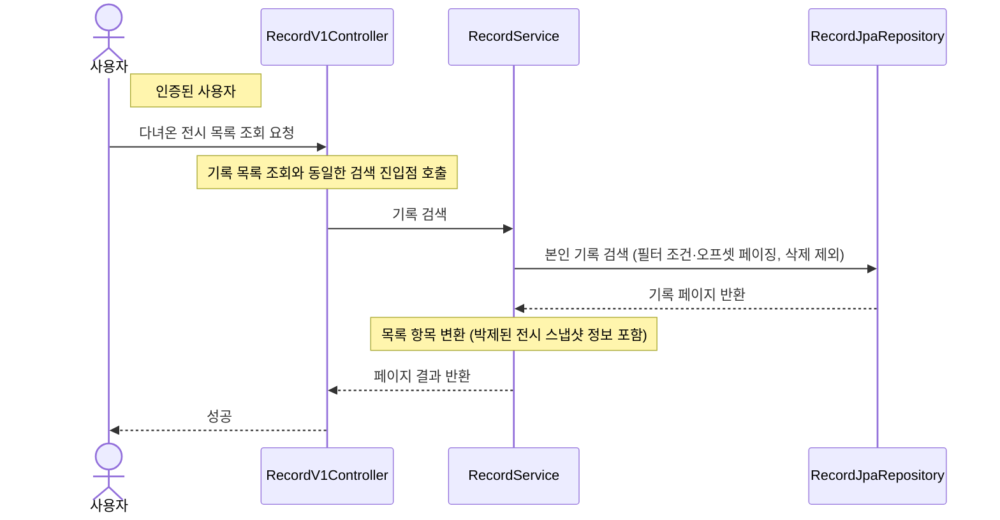

# 내가 다녀온 전시 목록

> 시나리오 2.6 — 사용자가 자신이 다녀온(기록을 남긴) 전시 목록을 조회한다. 기록 목록 조회와 동일한 파라미터·응답을 사용하며, 같은 검색 구현을 재사용한다.

```mermaid
sequenceDiagram
    actor 사용자
    participant RecordV1Controller
    participant RecordService
    participant RecordJpaRepository

    Note right of 사용자: 인증된 사용자

    사용자->>RecordV1Controller: 다녀온 전시 목록 조회 요청
    Note over RecordV1Controller: 기록 목록 조회와 동일한 검색 진입점 호출
    RecordV1Controller->>RecordService: 기록 검색

    RecordService->>RecordJpaRepository: 본인 기록 검색 (필터 조건·오프셋 페이징, 삭제 제외)
    RecordJpaRepository-->>RecordService: 기록 페이지 반환

    Note over RecordService: 목록 항목 변환 (박제된 전시 스냅샷 정보 포함)
    RecordService-->>RecordV1Controller: 페이지 결과 반환
    RecordV1Controller-->>사용자: 성공
```
