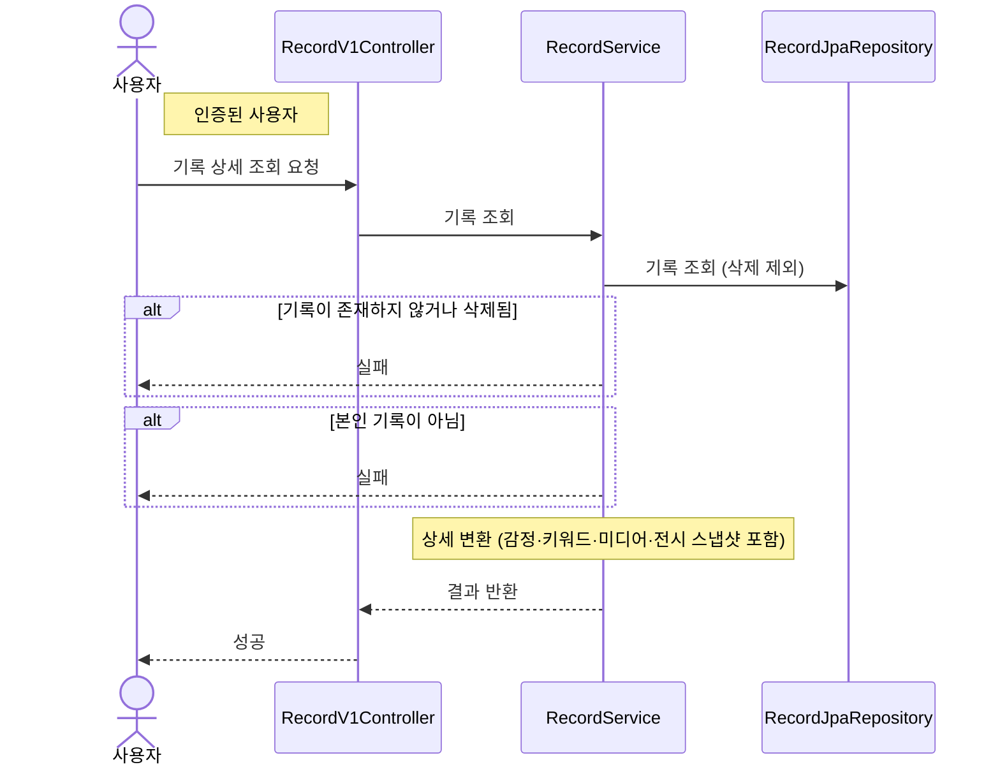

# 기록 상세 조회

> 시나리오 2.6 — 사용자가 자신의 기록 상세를 조회한다. 본인 것만 조회할 수 있다.

**다이어그램이 필요한 이유**
- 조건 분기: 기록 존재 여부(삭제 제외) + 소유자 검증(타인 기록은 403)

```mermaid
sequenceDiagram
    actor 사용자
    participant RecordV1Controller
    participant RecordService
    participant RecordJpaRepository

    Note right of 사용자: 인증된 사용자

    사용자->>RecordV1Controller: 기록 상세 조회 요청
    RecordV1Controller->>RecordService: 기록 조회

    RecordService->>RecordJpaRepository: 기록 조회 (삭제 제외)
    alt 기록이 존재하지 않거나 삭제됨
        RecordService-->>사용자: 실패
    end
    alt 본인 기록이 아님
        RecordService-->>사용자: 실패
    end

    Note over RecordService: 상세 변환 (감정·키워드·미디어·전시 스냅샷 포함)
    RecordService-->>RecordV1Controller: 결과 반환
    RecordV1Controller-->>사용자: 성공
```
