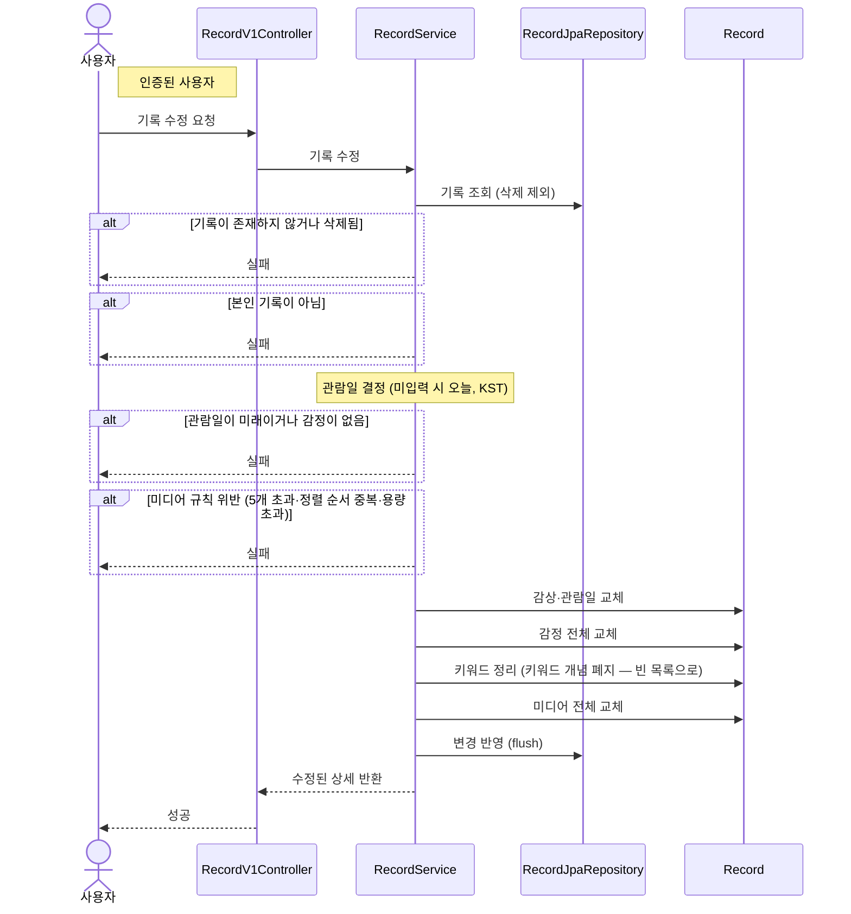

# 기록 수정

> 시나리오 2.6 — 사용자가 자신의 기록을 수정한다. 감상·감정·미디어의 전체 교체 방식이다.

**다이어그램이 필요한 이유**
- 조건 분기: 기록 존재·소유자 검증 + 작성과 동일한 콘텐츠 규칙(관람일·감정·미디어) 검증
- 전체 교체: 부분 수정이 아니라 감상·감정·미디어를 통째로 갈아끼우고, 폐지된 키워드는 빈 목록으로 정리한다

