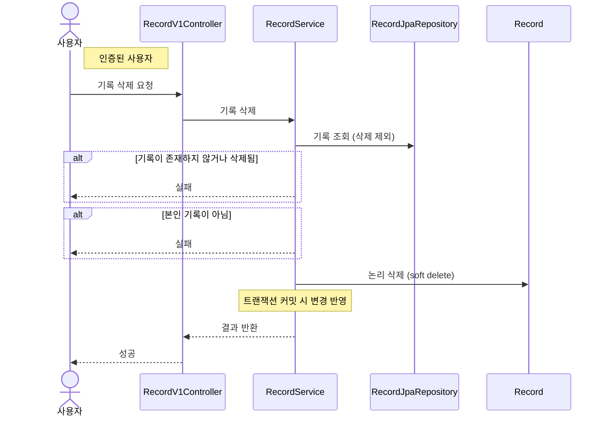

# 기록 삭제

> 시나리오 2.6 — 사용자가 자신의 기록을 삭제한다. 논리 삭제(soft delete)로 처리한다.

**다이어그램이 필요한 이유**
- 조건 분기: 기록 존재·소유자 검증
- 논리 삭제: 행을 지우지 않고 삭제 시각만 기록하며, 이후 조회에서 제외된다

```mermaid
sequenceDiagram
    actor 사용자
    participant RecordV1Controller
    participant RecordService
    participant RecordJpaRepository
    participant Record

    Note right of 사용자: 인증된 사용자

    사용자->>RecordV1Controller: 기록 삭제 요청
    RecordV1Controller->>RecordService: 기록 삭제

    RecordService->>RecordJpaRepository: 기록 조회 (삭제 제외)
    alt 기록이 존재하지 않거나 삭제됨
        RecordService-->>사용자: 실패
    end
    alt 본인 기록이 아님
        RecordService-->>사용자: 실패
    end

    RecordService->>Record: 논리 삭제 (soft delete)
    Note over RecordService: 트랜잭션 커밋 시 변경 반영

    RecordService-->>RecordV1Controller: 결과 반환
    RecordV1Controller-->>사용자: 성공
```
