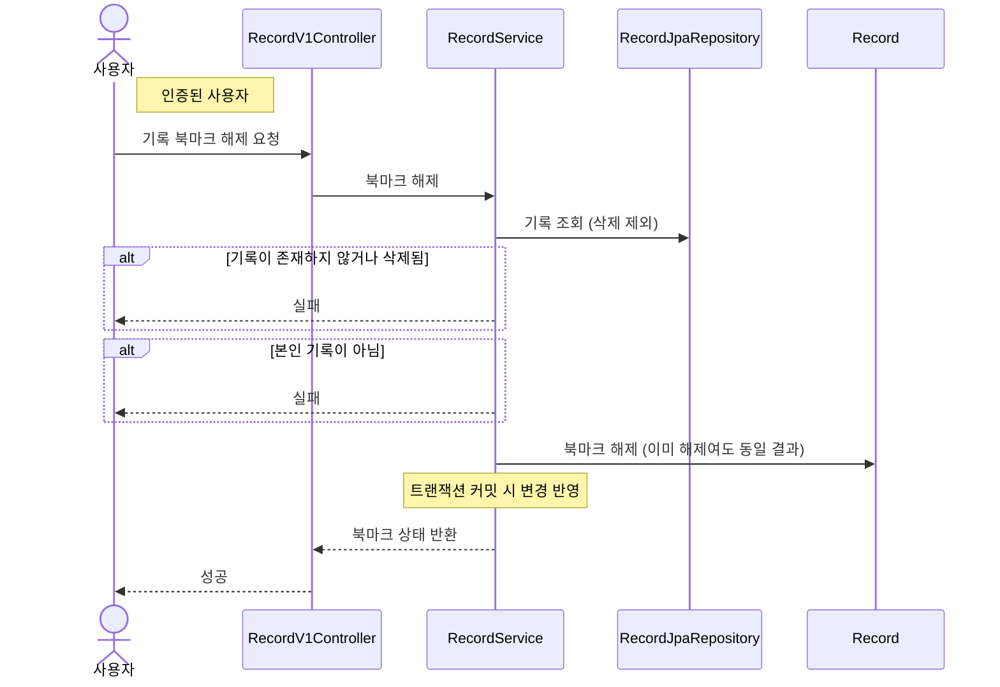

# 기록 북마크 해제

> 시나리오 2.6 — 사용자가 자신의 기록 북마크를 해제한다. 이미 해제된 기록을 다시 해제해도 성공한다(멱등).

**다이어그램이 필요한 이유**
- 조건 분기: 기록 존재·소유자 검증
- 멱등성: 중복 확인 없이 북마크 상태를 false로 두므로 반복 호출에도 결과가 같다

```mermaid
sequenceDiagram
    actor 사용자
    participant RecordV1Controller
    participant RecordService
    participant RecordJpaRepository
    participant Record

    Note right of 사용자: 인증된 사용자

    사용자->>RecordV1Controller: 기록 북마크 해제 요청
    RecordV1Controller->>RecordService: 북마크 해제

    RecordService->>RecordJpaRepository: 기록 조회 (삭제 제외)
    alt 기록이 존재하지 않거나 삭제됨
        RecordService-->>사용자: 실패
    end
    alt 본인 기록이 아님
        RecordService-->>사용자: 실패
    end

    RecordService->>Record: 북마크 해제 (이미 해제여도 동일 결과)
    Note over RecordService: 트랜잭션 커밋 시 변경 반영

    RecordService-->>RecordV1Controller: 북마크 상태 반환
    RecordV1Controller-->>사용자: 성공
```
