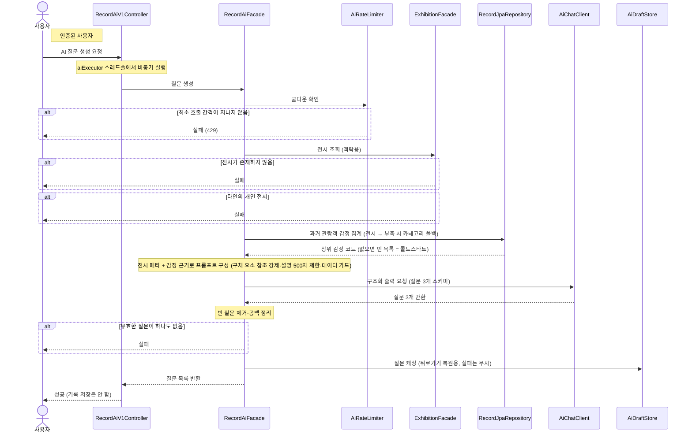

# AI 질문 생성

> 시나리오 2.7 — 사용자가 전시를 지정하면 AI가 그 전시 맥락에 맞는 질문 3개를 생성한다. "다른 질문 보기"는 같은 호출의 반복이다.

**다이어그램이 필요한 이유**
- 조건 분기: 사용자당 쿨다운(간격 내 재호출은 429) + 전시 접근 검증 + 생성 결과 검증
- 도메인 간 협력: 전시 상세를 도구처럼 조회해 프롬프트 맥락으로 만들고, LLM은 AiChatClient 포트로만 의존한다
- **그라운딩(이슈①)**: 전시 메타데이터(장르·형태·작가·시기·지역)를 모두 넣고, 과거 기록에서 **관람객 감정을 집계**(같은 전시→부족하면 카테고리 폴백)해 근거로 주입한다. 프롬프트가 "이 전시만의 구체 요소 참조·일반 질문 금지"를 강제한다(타인 감상문 원문은 미포함 — 비공개 보호)
- **캐싱(이슈②)**: 생성한 질문을 AiDraftStore(Redis)에 저장해 뒤로가기 후 복원 가능하게 한다
- 비동기 실행: AI 호출은 전용 스레드풀(aiExecutor)에서 수행해 서블릿 워커 스레드를 빨리 반환한다
- 구조화 출력: 질문 3개 필드를 스키마로 강제해 자연어 JSON 파싱 없이 개수를 보장한다

