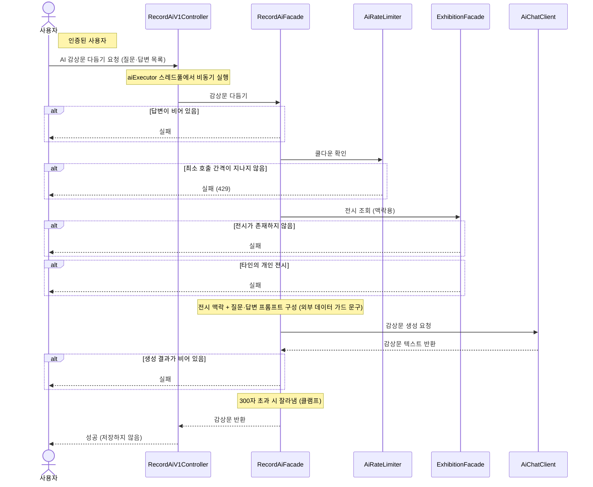

# AI 감상문 다듬기

> 시나리오 2.7 — 사용자가 질문에 답하면 AI가 답변을 1인칭 감상문(300자 이내)으로 다듬는다. "다시 다듬기"는 같은 호출의 반복이며, 최종 저장은 기록 작성 API가 담당한다.

**다이어그램이 필요한 이유**
- 조건 분기: 빈 답변 검증 + 사용자당 쿨다운(간격 내 재호출은 429) + 전시 접근 검증 + 생성 결과 검증
- 도메인 간 협력: 전시 맥락과 질문·답변을 프롬프트로 만들고, LLM은 AiChatClient 포트로만 의존한다
- 비동기 실행: AI 호출은 전용 스레드풀(aiExecutor)에서 수행해 서블릿 워커 스레드를 빨리 반환한다
- 후처리: 생성 결과가 비면 실패, 300자를 넘으면 잘라낸다(클램프)

