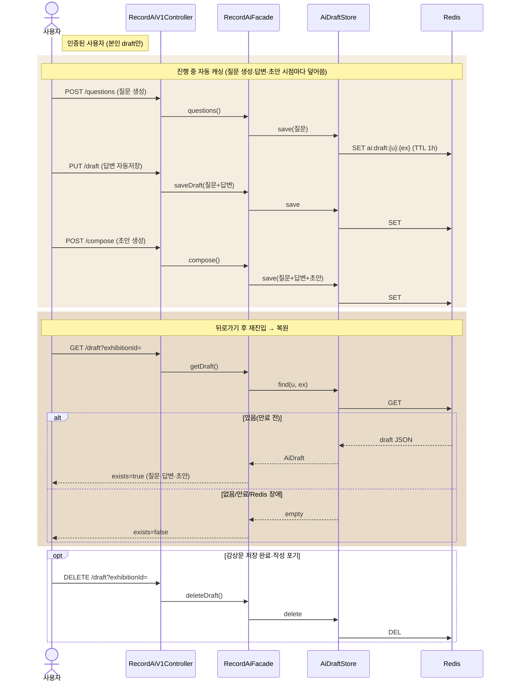

# AI 임시저장(draft) — 캐싱·복원

> 이슈② — '질문으로 작성' 진행 상태(질문+답변+초안)를 Redis에 캐싱해 두고, 뒤로가기 후 재진입 시 복원한다.

**다이어그램이 필요한 이유**
- 상태 없는 AI 플로우 보완: `/questions`는 매 호출 질문을 **재생성(비결정적)**하므로, 캐싱 없이는 뒤로가기 후 같은 질문·답변을 되살릴 수 없다(→ 답변 유실을 "되돌아간다"로 체감).
- 캐시 포트/어댑터: 애플리케이션은 `AiDraftStore` 포트만 의존하고 Redis는 어댑터 세부(DIP). **Redis 장애 시 degrade**(save=no-op·find=empty) — 질문/감상문 생성·저장은 정상.
- 키·TTL: `ai:draft:{userId}:{exhibitionId}`, TTL 1h — 본인 draft만 접근, 방치 draft는 자동 만료.
- 프론트 연동: 뒤로가기 후 재진입 시 `GET /draft`로 상태를 채운다(UX 완성은 프론트 몫 — 별도 티켓).

