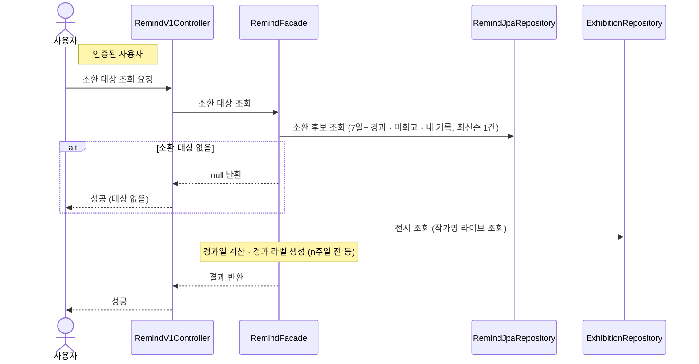

# 오늘의 소환 대상 조회

> 시나리오 2.8-1 — 사용자가 오늘의 소환 대상(작성 후 7일 이상 지났고 아직 회고하지 않은 내 기록) 1건을 확인한다.

**다이어그램이 필요한 이유**
- 조건 분기: 소환 대상이 없으면 **null을 반환**한다(에러 아님)
- 도메인 간 협력: 후보는 Record에서 조회하되(record↔remind 결합은 remind 인프라에만), 전시 작가명은 Exhibition을 라이브 조회

