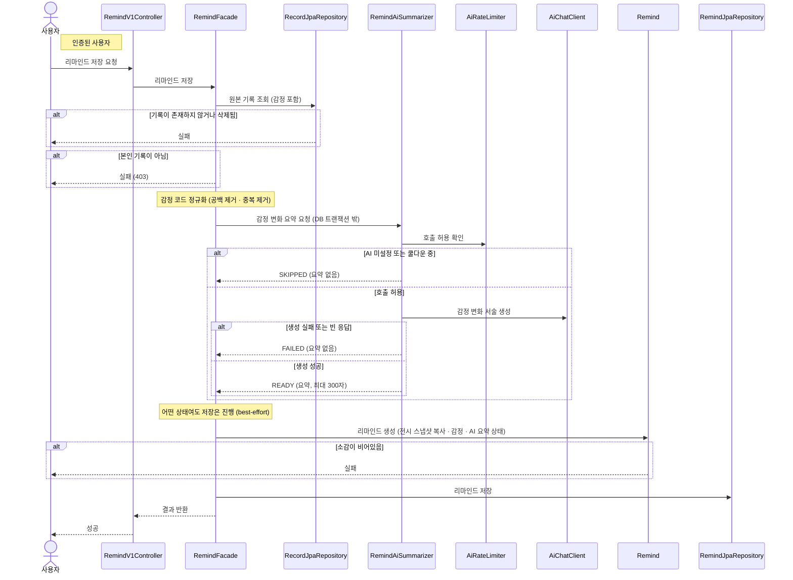

# 리마인드 저장

> 시나리오 2.8-2 — 사용자가 지금의 감정과 소감(오늘의 여운)을 남겨 리마인드를 저장한다. AI가 그때/지금의 감정 변화를 요약해 준다.

**다이어그램이 필요한 이유**
- 조건 분기: 원본 기록 존재 검증, 소유자 검증(403), AI 요약 SKIPPED/FAILED 분기
- 도메인 간 협력: Record 원본 조회 → AI 요약(AiChatClient) → Remind 생성·저장
- AI 요약은 **best-effort** — 미설정·쿨다운(SKIPPED)·오류(FAILED) 어떤 경우에도 저장 자체는 성공하며, AI 호출은 DB 트랜잭션 밖에서 수행한다
- 저장 시점에 원본 기록의 전시 카드 정보를 **스냅샷으로 복사**한다 — 원본이 삭제돼도 리마인드 카드는 유지된다

