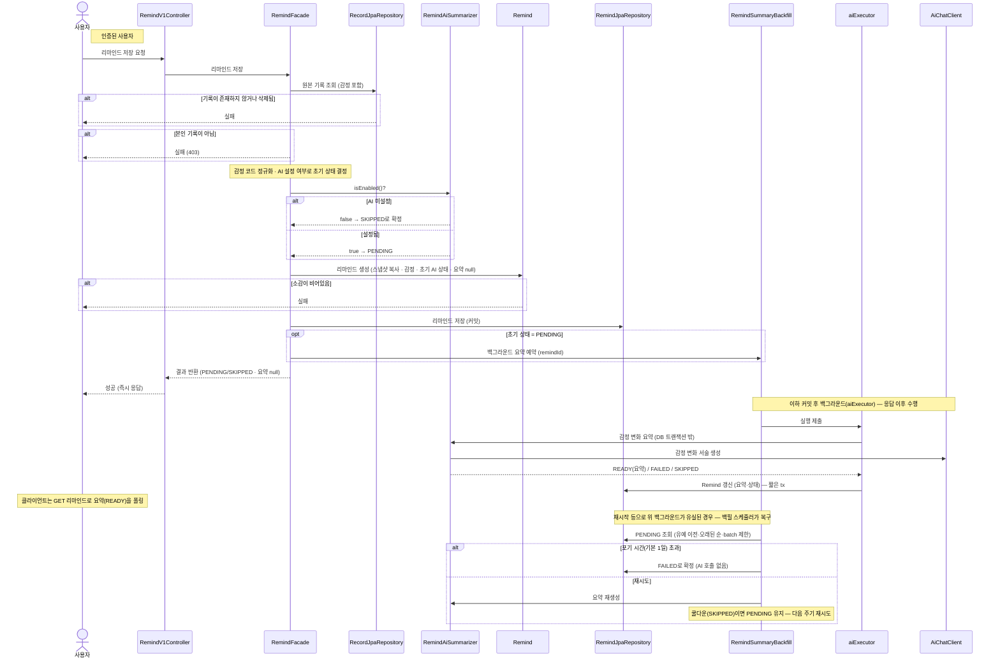

# 리마인드 저장

> 시나리오 2.8-2 — 사용자가 지금의 감정과 소감(오늘의 여운)을 남겨 리마인드를 저장한다. AI가 그때/지금의 감정 변화를 요약해 준다.

**다이어그램이 필요한 이유**
- 조건 분기: 원본 기록 존재 검증, 소유자 검증(403), AI 설정 여부(PENDING vs SKIPPED)
- 도메인 간 협력: Record 원본 조회 → Remind 생성·저장(즉시 응답) → **백그라운드 요약**(AiChatClient)
- AI 요약은 **응답을 막지 않는 백그라운드 best-effort**(M-2 — 지연 개선) — 저장 즉시 `PENDING`으로 응답하고, `aiExecutor`에서 요약을 만들어 Remind를 `READY`/`FAILED`로 갱신한다(미설정이면 `SKIPPED`로 즉시 확정). 이전에는 서블릿 스레드에서 동기 호출해 응답이 ~수 초 지연됐다.
- 저장 시점에 원본 기록의 전시 카드 정보를 **스냅샷으로 복사**한다 — 원본이 삭제돼도 리마인드 카드는 유지된다
- 백그라운드 작업은 **인메모리라 재시작·배포 시 유실**될 수 있다 → `RemindSummaryBackfillScheduler`가 주기적으로 PENDING을 훑어 복구하고, 포기 시간(기본 1일)을 넘긴 건은 FAILED로 확정해 **영구 PENDING을 없앤다**

