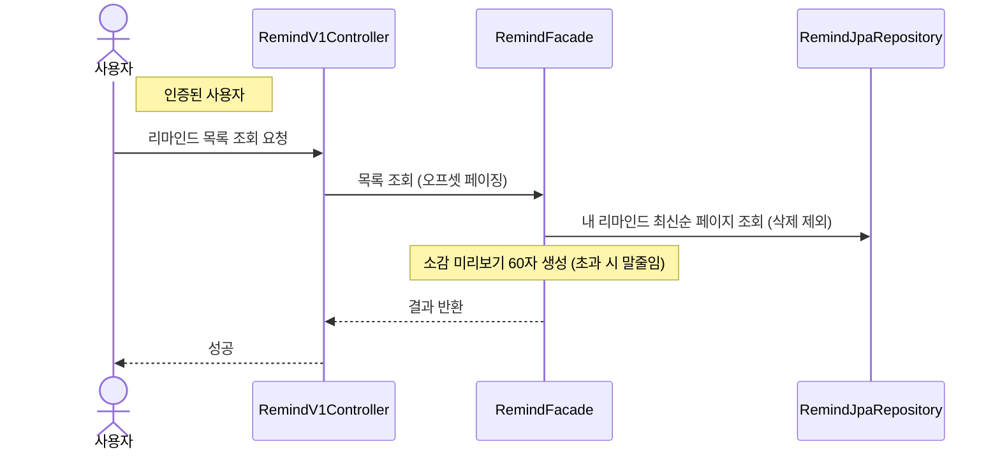

# 리마인드 목록 조회

> 시나리오 2.8-3 — 사용자가 아카이브에서 리마인드 목록을 조회한다.

```mermaid
sequenceDiagram
    actor 사용자
    participant RemindV1Controller
    participant RemindFacade
    participant RemindJpaRepository

    Note right of 사용자: 인증된 사용자

    사용자->>RemindV1Controller: 리마인드 목록 조회 요청
    RemindV1Controller->>RemindFacade: 목록 조회 (오프셋 페이징)

    RemindFacade->>RemindJpaRepository: 내 리마인드 최신순 페이지 조회 (삭제 제외)
    Note over RemindFacade: 소감 미리보기 60자 생성 (초과 시 말줄임)

    RemindFacade-->>RemindV1Controller: 결과 반환
    RemindV1Controller-->>사용자: 성공
```
