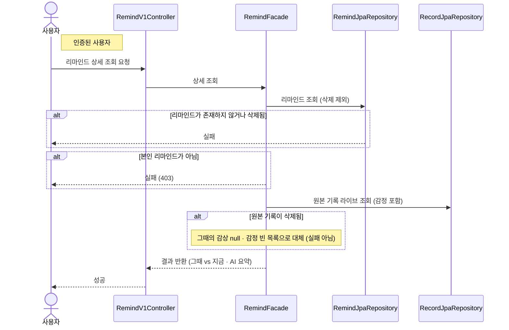

# 리마인드 상세 조회

> 시나리오 2.8-4 — 사용자가 리마인드 상세(그때의 감상 vs 지금의 소감, AI 요약)를 조회한다.

**다이어그램이 필요한 이유**
- 조건 분기: 리마인드 존재 검증, 소유자 검증(403)
- 도메인 간 협력: "그때"(원본 기록 내용·감정)는 Record를 **라이브 조회** — 원본이 삭제됐으면 null/빈 목록으로 대체(실패 아님)

