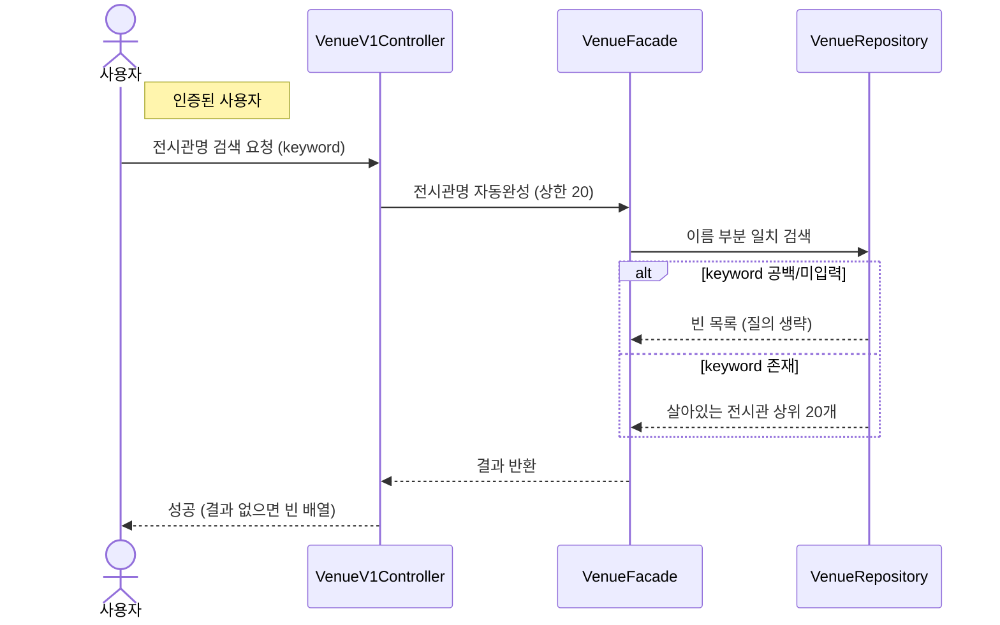

# 전시관명 자동완성 검색

> 시나리오 2.4 — 사용자가 전시관명을 입력하면 자동완성 목록(상위 20개)이 뜬다.

**다이어그램이 필요한 이유**
- 조건 분기: keyword 공백/미입력이면 질의 없이 빈 목록을 반환한다(에러 아님)
- 규칙 3.4: 상한은 상위 20개 고정(커서 미적용), 부분 일치는 대소문자 무시 + soft-delete 행 제외

