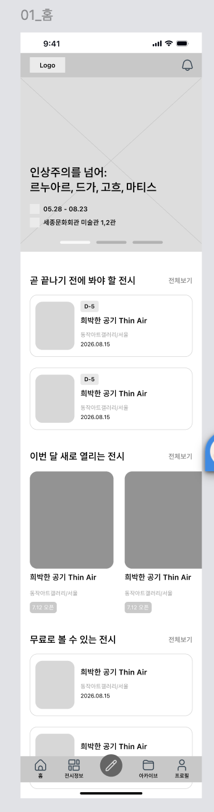
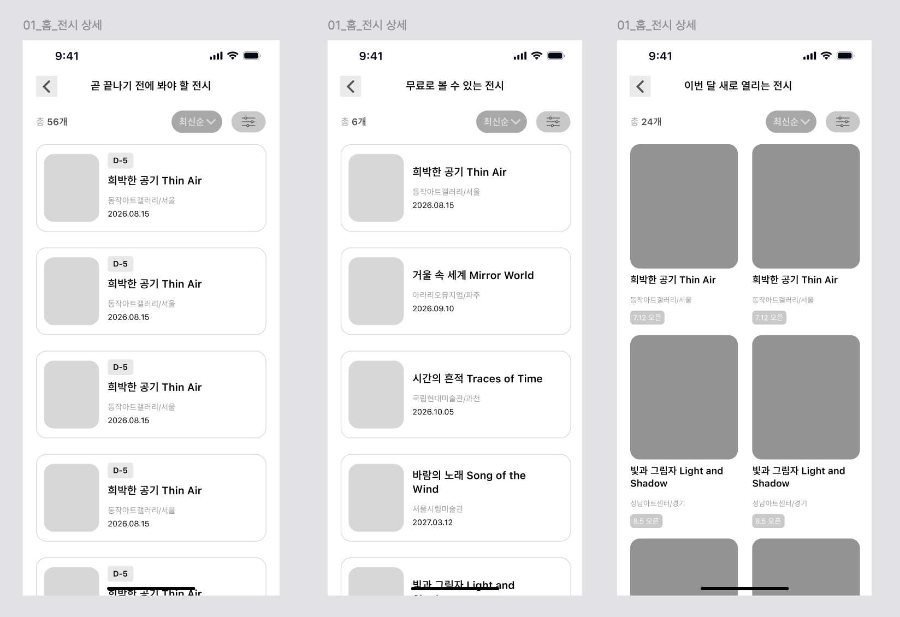
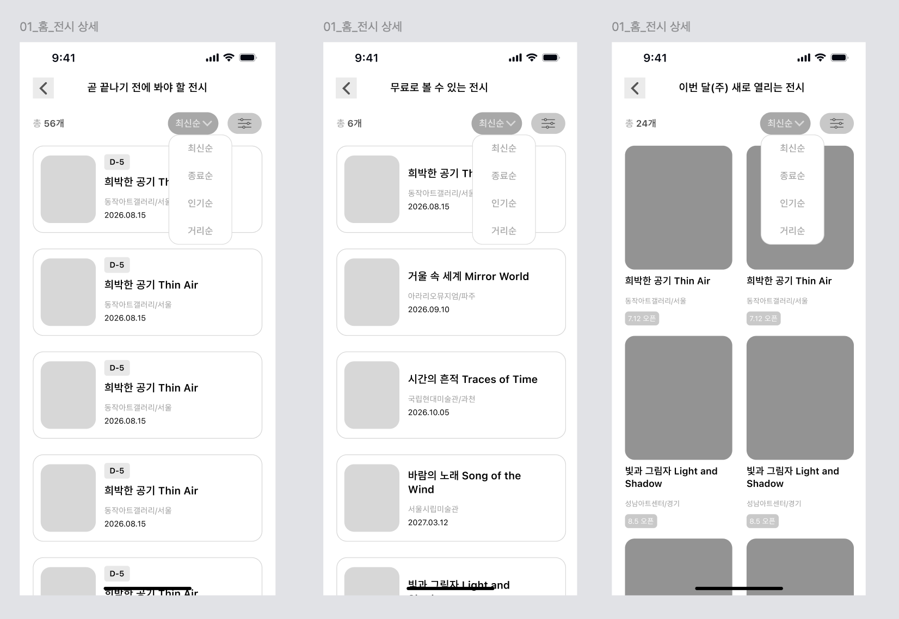

# [01] 홈 — 화면별 호출 API

> 이 폴더 이미지: `01-01`(홈), `01-02`(섹션 전체보기 3종), `01-03`(정렬 드롭다운).
> API 상세 스펙 → [전시](../../도메인별%20기능%20목록정리/전시/README.md) · [알림](../../도메인별%20기능%20목록정리/알림/README.md).
> 홈은 단일 집계가 아니라 **배너 1콜 + 섹션 3콜(목록 API 재사용) = 병렬 4콜**.

## 01-01 홈 (진입 화면)



화면 진입 시 아래 4개를 **병렬 호출**한다.

| 영역 | 시점 | API |
|---|---|---|
| 상단 배너 캐러셀(최대 3개, ─ ─ ─) | 진입 | `GET /api/v1/exhibitions/banners` |
| 곧 끝나기 전에 봐야 할 전시 (D-5 배지) | 진입 | `GET /api/v1/exhibitions?section=ending-soon&size=2` |
| 이번 달 새로 열리는 전시 (7.12 오픈) | 진입 | `GET /api/v1/exhibitions?section=opening-this-month&size=2` |
| 무료로 볼 수 있는 전시 | 진입 | `GET /api/v1/exhibitions?section=free&size=2` |

인터랙션:

| 동작 | API |
|---|---|
| 배너 클릭 | `GET /api/v1/exhibitions/{exhibitionId}` → [03] 상세 |
| 섹션 카드 클릭 | `GET /api/v1/exhibitions/{exhibitionId}` → [03] 상세 |
| "전체보기" 클릭 | `GET /api/v1/exhibitions?section=…&size=20` → 01-02 |
| 우측 상단 종 아이콘 | `GET /api/v1/notifications?size=20` → 알림 목록 |

**요청 예시 — 홈 진입(병렬 4콜)**
```http
GET /api/v1/exhibitions/banners HTTP/1.1
GET /api/v1/exhibitions?section=ending-soon&size=2 HTTP/1.1
GET /api/v1/exhibitions?section=opening-this-month&size=2 HTTP/1.1
GET /api/v1/exhibitions?section=free&size=2 HTTP/1.1
Host: api.modi.app
```

## 01-02 섹션 전체보기 (곧 끝나기 / 무료 / 이번 달 신규)



각 화면 상단 "총 56개 / 6개 / 24개" = 응답 `totalCount`.

| 화면 | 진입 API |
|---|---|
| 곧 끝나기 전에 봐야 할 전시 | `GET /api/v1/exhibitions?section=ending-soon&sort=latest&size=20` |
| 무료로 볼 수 있는 전시 | `GET /api/v1/exhibitions?section=free&sort=latest&size=20` |
| 이번 달 새로 열리는 전시 | `GET /api/v1/exhibitions?section=opening-this-month&period=month&sort=latest&size=20` |

| 동작 | API |
|---|---|
| 무한 스크롤 | 동일 요청 + `cursor={nextCursor}` |
| 카드 클릭 | `GET /api/v1/exhibitions/{exhibitionId}` → [03] |

## 01-03 정렬 드롭다운 (최신순/종료순/인기순/거리순)



정렬 변경 시 **커서 초기화 후 재조회**.

| 선택 | API |
|---|---|
| 최신순 | `GET /api/v1/exhibitions?section=…&sort=latest&size=20` |
| 종료순 | `…&sort=ending&size=20` |
| 인기순 | `…&sort=popular&size=20` |
| 거리순 | `…&sort=distance&lat={위도}&lng={경도}&size=20` (좌표 프론트 제공, 없으면 400) |

**에러 응답 예시** (거리순인데 좌표 없음)
```json
{ "meta": { "result": "FAIL", "errorCode": "INVALID_INPUT", "message": "입력값이 올바르지 않습니다." }, "data": null }
```
