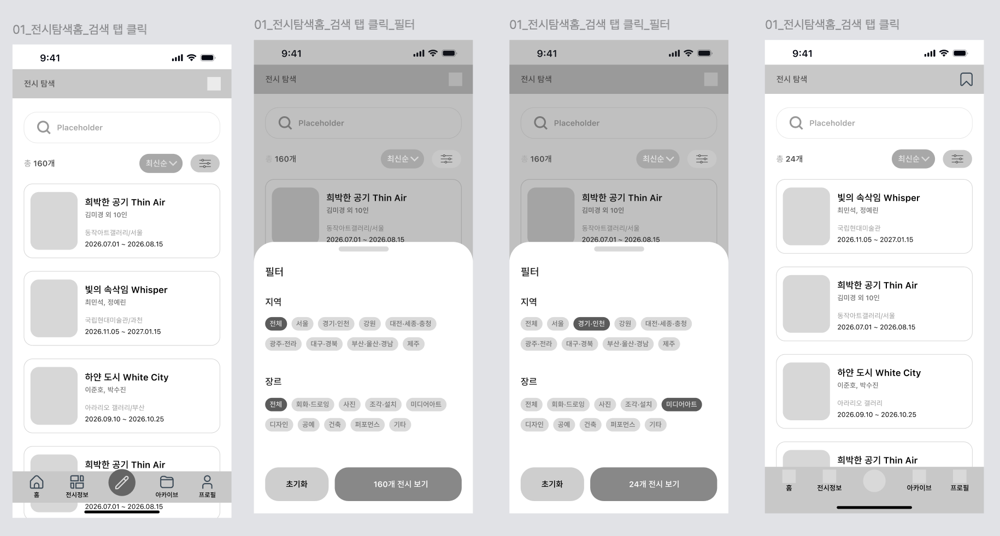

# [02] 전시 탐색 — 화면별 호출 API

> 이 폴더 이미지: `02-01`(전시 탐색: 검색·필터·정렬·북마크).
> API 상세 스펙 → [전시](../../도메인별%20기능%20목록정리/전시/README.md) · [관심 전시](../../도메인별%20기능%20목록정리/북마크/README.md).
> 하단 내비 "전시정보" 탭. 목록 조회는 커서 방식, 상단 "총 160개" = 응답 `totalCount`.

## 02-01 전시 탐색



| 시점 | API | 비고 |
|---|---|---|
| 탭 진입 | `GET /api/v1/exhibitions?sort=latest&size=20` | 전체 리스트, 기본 최신순 |
| 검색어 입력 후 검색 | `GET /api/v1/exhibitions?keyword={검색어}&…` | **2글자 이상**(1글자 400). 현재 필터 유지한 채 AND |
| 검색어 삭제/초기화 | `GET /api/v1/exhibitions?…`(keyword 제거) | 필터는 유지, 전체 리스트 복원 |
| 필터 바텀시트 열기 | (호출 없음) | 지역 15종·장르 9종 칩은 정적 코드 |
| 필터 "N개 전시 보기" 라벨 갱신 | `GET /api/v1/exhibitions?region=…&category=…&size=1` | `totalCount`만 사용 |
| 필터 확정 | `GET /api/v1/exhibitions?region=SEOUL,GYEONGGI&category=PHOTO,MEDIA&sort=latest&size=20` | 다중 값 콤마 구분 |
| 정렬 변경 | `…&sort=latest\|ending\|popular\|distance` | 커서 초기화 후 재조회 |
| 카드 🔖 토글 | `POST` / `DELETE /api/v1/exhibitions/{exhibitionId}/bookmark` | 멱등 |
| 카드 클릭 | `GET /api/v1/exhibitions/{exhibitionId}` | → [03] 상세 |
| 무한 스크롤 | 동일 요청 + `cursor={nextCursor}` | |

**요청 예시 — 검색 + 다중 필터**
```http
GET /api/v1/exhibitions?keyword=빛의&region=SEOUL,GYEONGGI&category=PHOTO,MEDIA&sort=latest&size=20 HTTP/1.1
Host: api.modi.app
Authorization: Bearer {accessToken}
```

**성공 응답 (200)** — `CursorResponse<ExhibitionListItem>`
```json
{
  "meta": { "result": "SUCCESS", "errorCode": null, "message": null },
  "data": {
    "content": [
      { "exhibitionId": 51, "type": "CATALOG", "title": "희박한 공기 Thin Air", "posterUrl": "…",
        "startDate": "2026-07-01", "endDate": "2026-08-15", "place": "동작아트갤러리/서울",
        "region": "SEOUL", "category": "PAINTING", "artistSummary": "김미경 외 10인",
        "dDay": 5, "free": true, "bookmarked": false }
    ],
    "nextCursor": "eyJ...", "hasNext": true, "totalCount": 160
  }
}
```

**에러 응답 예시** (검색어 1글자)
```json
{ "meta": { "result": "FAIL", "errorCode": "INVALID_INPUT", "message": "입력값이 올바르지 않습니다." }, "data": null }
```
