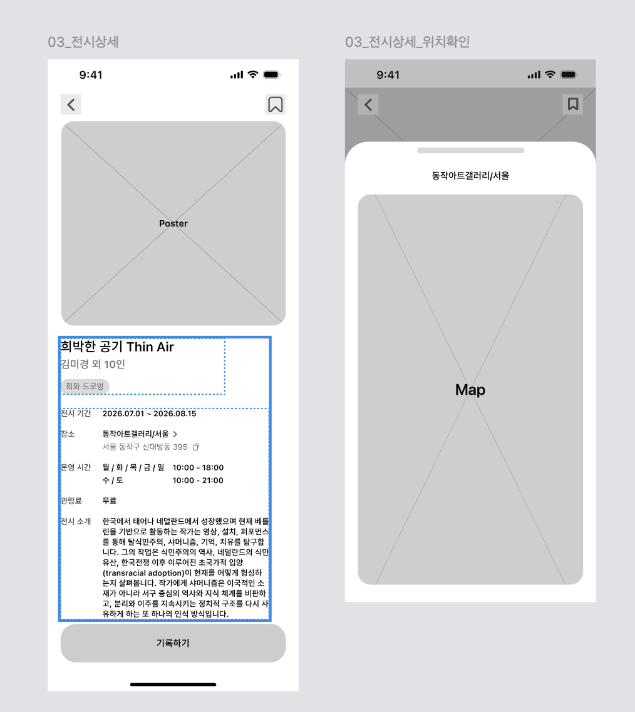

# [03] 전시 상세 정보 — 화면별 호출 API

> 이 폴더 이미지: `03-01`(전시 상세 + 위치확인).
> API 상세 스펙 → [전시](../../도메인별%20기능%20목록정리/전시/README.md) · [관심 전시](../../도메인별%20기능%20목록정리/북마크/README.md).

## 03-01 전시 상세



| 시점 | API | 렌더/비고 |
|---|---|---|
| 진입 | `GET /api/v1/exhibitions/{exhibitionId}` | Poster·제목·`artistSummary`(김미경 외 10인)·장르 태그·기간·장소·운영시간·관람료·소개·`bookmarked` |
| 우상단 🔖 토글 | `POST` / `DELETE /api/v1/exhibitions/{exhibitionId}/bookmark` | 멱등 |
| 장소 클릭 → 지도(위치확인) | (추가 호출 없음) | 상세 응답의 `gpsX/gpsY/place/address` 재사용, 지도는 클라 SDK |
| "기록하기" 버튼 | (호출 없음 — [04] 기록 플로우로 `exhibitionId` 전달) | `recorded=true`면 버튼 상태 분기 |

**요청 예시**
```http
GET /api/v1/exhibitions/51 HTTP/1.1
Host: api.modi.app
Authorization: Bearer {accessToken}
```

**성공 응답 (200)**
```json
{
  "meta": { "result": "SUCCESS", "errorCode": null, "message": null },
  "data": {
    "exhibitionId": 51, "type": "CATALOG", "title": "희박한 공기 Thin Air", "posterUrl": "…",
    "startDate": "2026-07-01", "endDate": "2026-08-15", "place": "동작아트갤러리/서울",
    "region": "SEOUL", "category": "PAINTING",
    "description": "한국에서 태어나 네덜란드에서 성장했으며…",
    "operatingHours": "월/화/목/금/일 10:00-18:00, 수/토 10:00-21:00",
    "price": "무료", "artists": ["김미경"], "artistSummary": "김미경 외 10인",
    "gpsX": 126.9575, "gpsY": 37.5033, "address": "서울 동작구 상도로 395",
    "viewCount": 1024, "free": true, "bookmarked": true, "recorded": false
  }
}
```

**에러 응답 예시** (없는 전시)
```json
{ "meta": { "result": "FAIL", "errorCode": "NOT_FOUND", "message": "요청한 전시를 찾을 수 없습니다." }, "data": null }
```

**에러 표**

| errorCode | HTTP | 발생 조건 |
|---|---|---|
| `NOT_FOUND` | 404 | 없는 전시 |
| `FORBIDDEN` | 403 | 타인의 CUSTOM 전시 접근 |
