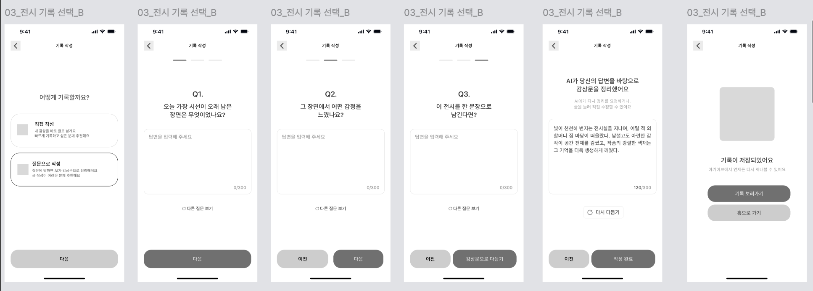

# [04] AI 기록 작성

> 이미지: `04-09`(작성 방식 선택 → Q1·Q2·Q3 → AI 정리 → 저장 완료).
> API 상세 → [기록·아카이브](../../../도메인별%20기능%20목록정리/기록/README.md).



## 화면 → API

| 시점 | API | 비고 |
|---|---|---|
| "질문으로 작성" 선택 | `POST /api/v1/records/ai/questions` | `{exhibitionId}` → `questions[3]`(Q1~Q3) |
| Q3 답변 후 "감상문으로 만들기" | `POST /api/v1/records/ai/compose` | 답변 3개 → AI 초안 `content`(수정 가능) |
| 확정 "작성 완료" | `POST /api/v1/records` | compose의 `content` + `writeMode: "AI"` |
| 완료 "기록 보러가기" | `GET /api/v1/records/{recordId}` | → [05] 아카이브 상세 |

**① 질문 생성**
```http
POST /api/v1/records/ai/questions HTTP/1.1
Host: api.modi.app
Authorization: Bearer {accessToken}
Content-Type: application/json

{ "exhibitionId": 51 }
```
```json
{ "meta": { "result": "SUCCESS", "errorCode": null, "message": null }, "data": { "questions": ["오늘 가장 오래 시선이 머문 장면은?", "그 장면에서 어떤 감정을 느꼈나요?", "이 전시를 한 문장으로 남긴다면?"] } }
```

**② 감상문 초안 생성**
```http
POST /api/v1/records/ai/compose HTTP/1.1
Host: api.modi.app
Authorization: Bearer {accessToken}
Content-Type: application/json

{
  "exhibitionId": 51,
  "answers": [
    { "question": "오늘 가장 오래 시선이 머문 장면은?", "answer": "빛이 천천히 번지는 전시실 복도" },
    { "question": "그 장면에서 어떤 감정을 느꼈나요?", "answer": "낯설고 궁금했다" },
    { "question": "이 전시를 한 문장으로 남긴다면?", "answer": "기억이 색으로 남는 전시" }
  ]
}
```
```json
{ "meta": { "result": "SUCCESS", "errorCode": null, "message": null }, "data": { "content": "빛이 천천히 번지는 전시실을 지나며, 어릴 적 외할머니 집 마당이 떠올랐다. …" } }
```

**③ 최종 저장** — [직접 기록 작성](../직접%20기록%20작성/README.md)의 `POST /api/v1/records`와 동일하되 `"writeMode": "AI"`.

**에러 응답 예시** (모델 응답 실패)
```json
{ "meta": { "result": "FAIL", "errorCode": "AI_GENERATION_FAILED", "message": "AI 응답 생성에 실패했습니다." }, "data": null }
```

**에러 표** (questions·compose 공통)

| errorCode | HTTP | 발생 조건 |
|---|---|---|
| `INVALID_INPUT` | 400 | answers 비었거나 형식 오류 |
| `NOT_FOUND` | 404 | 없는 전시 |
| `AI_DISABLED` | 503 | AI 기능 미설정 |
| `AI_GENERATION_FAILED` | 502 | 모델 응답 실패 |
| `AI_RATE_LIMITED` | 429 | 호출 제한 |
