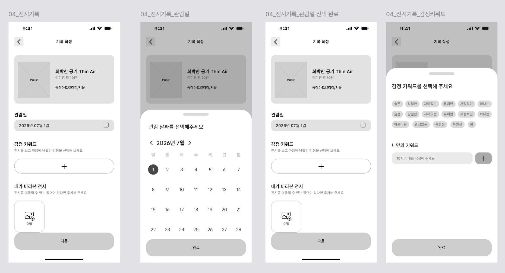
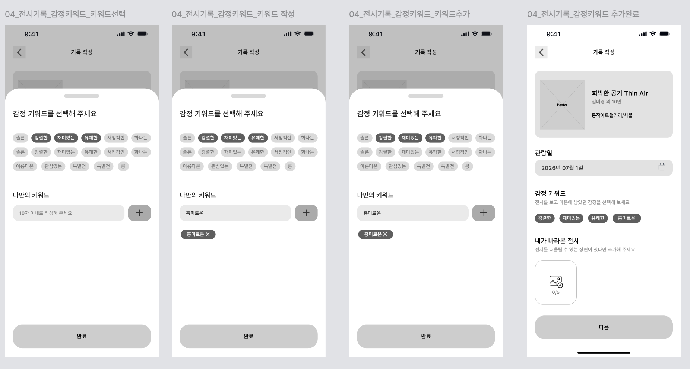
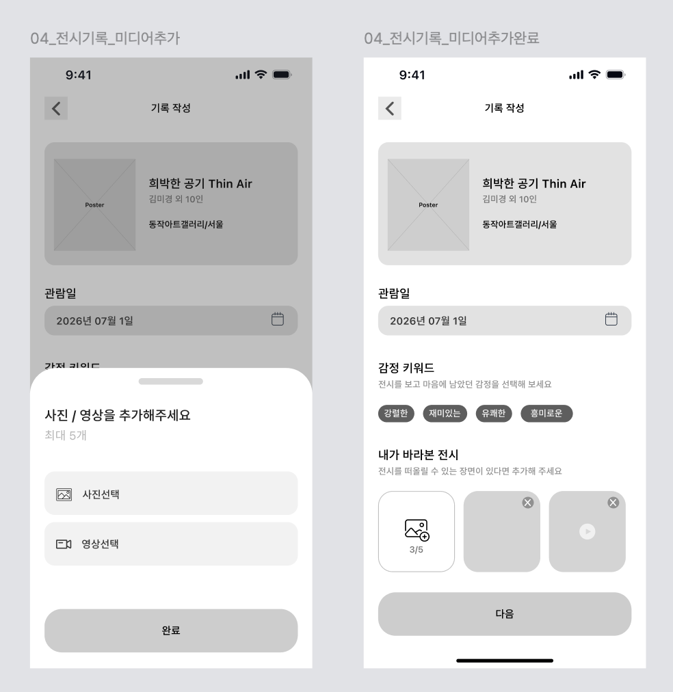

# [04] 전시 탐색 탭 → 전시상세 → 기록하기 (기록 작성 폼)

> 이미지: `04-05`(관람일·감정·미디어 폼), `04-06`(관람일 달력), `04-07`(관람일 선택 완료).
> API 상세 → [기록·아카이브](../../../도메인별%20기능%20목록정리/기록/README.md) · [파일 업로드](../../../도메인별%20기능%20목록정리/공통/파일%20업로드%20support.md).





## 화면 → API

상단 전시 카드는 앞서 선택/조회한 전시 응답을 재사용한다(추가 호출 없음).

| 시점 | API | 비고 |
|---|---|---|
| 기록 작성 화면 진입 | (호출 없음) | 전시 카드 = 선택 전시의 목록/상세 응답 재사용 |
| 관람일 달력(04-06/07) | (호출 없음) | `viewedAt` 로컬 상태 |
| 감정 키워드 `+` → 키워드 시트 | `GET /api/v1/emotion-keywords` | 프리셋 칩 렌더 |
| 프리셋 칩 선택 · "나만의 키워드" 입력 | (호출 없음) | 저장 시 `emotionCodes`로 통합(라벨 ≤10자) |
| "내가 바라본 전시" 사진/영상 추가(0/5) | `POST /api/v1/files` (`purpose=RECORD_MEDIA`) × 개수 | PHOTO ≤10MB·VIDEO ≤100MB, 최대 5개 |
| "다음" | (호출 없음 — 작성 방식 선택으로) | → [직접 기록 작성](../직접%20기록%20작성/README.md) 또는 [AI 기록 작성](../AI%20기록%20작성/README.md) |

**감정 키워드 요청 예시**
```http
GET /api/v1/emotion-keywords HTTP/1.1
Host: api.modi.app
```
```json
{
  "meta": { "result": "SUCCESS", "errorCode": null, "message": null },
  "data": { "keywords": ["슬픈", "강렬한", "재미있는", "유쾌한", "서정적인", "화나는", "아름다운", "관심있는"] }
}
```

**미디어 업로드 응답 예시**
```json
{
  "meta": { "result": "SUCCESS", "errorCode": null, "message": null },
  "data": { "url": "https://cdn.modi.app/records/tmp/1.jpg", "type": "PHOTO", "sizeBytes": 2048000 }
}
```
