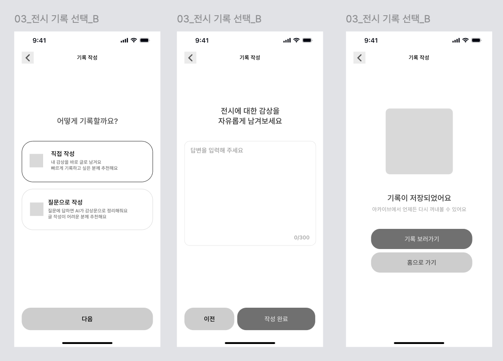

# [04] 직접 기록 작성

> 이미지: `04-08`(자유 감상 작성 0~300자 → 저장 완료).
> API 상세 → [기록·아카이브](../../../도메인별%20기능%20목록정리/기록/README.md).



## 화면 → API

| 시점 | API | 비고 |
|---|---|---|
| "직접 작성" 선택 → 감상 입력 | (호출 없음) | `content` 로컬 상태(≤300자) |
| "작성 완료" | `POST /api/v1/records` | `writeMode: "DIRECT"` |
| 완료 화면 "기록 보러가기" | `GET /api/v1/records/{recordId}` | → [05] 아카이브 상세 |
| 완료 화면 "홈으로 가기" | 홈 4콜 재호출(`banners` + `?section=X&size=2` ×3) | → [01] |

**기록 저장 요청 예시**
```http
POST /api/v1/records HTTP/1.1
Host: api.modi.app
Authorization: Bearer {accessToken}
Content-Type: application/json

{
  "exhibitionId": 51,
  "writeMode": "DIRECT",
  "viewedAt": "2026-07-01",
  "content": "마음에 잔잔한 호숫가에 돌이 하나 떨어지는 느낌이었다.",
  "emotionCodes": ["차분한", "고요한", "물비린내"],
  "media": [ { "type": "PHOTO", "url": "https://cdn.modi.app/records/tmp/1.jpg", "sortOrder": 0, "sizeBytes": 2048000 } ]
}
```

**성공 응답 (200)**
```json
{
  "meta": { "result": "SUCCESS", "errorCode": null, "message": null },
  "data": { "recordId": 31, "exhibitionId": 51, "writeMode": "DIRECT", "viewedAt": "2026-07-01", "aiStatus": "READY", "createdAt": "2026-07-01T14:20:00+09:00" }
}
```

**에러 응답 예시** (감상문 300자 초과)
```json
{ "meta": { "result": "FAIL", "errorCode": "INVALID_INPUT", "message": "기록 입력값이 올바르지 않습니다." }, "data": null }
```

**에러 표**

| errorCode | HTTP | 발생 조건 |
|---|---|---|
| `INVALID_INPUT` | 400 | content 공백/300자 초과, emotionCodes 오류 |
| `INVALID_MEDIA` | 400 | 미디어 5개 초과·용량 초과 |
| `NOT_FOUND` | 404 | 없는 exhibitionId |
| `UNAUTHORIZED` | 401 | 미인증 |
