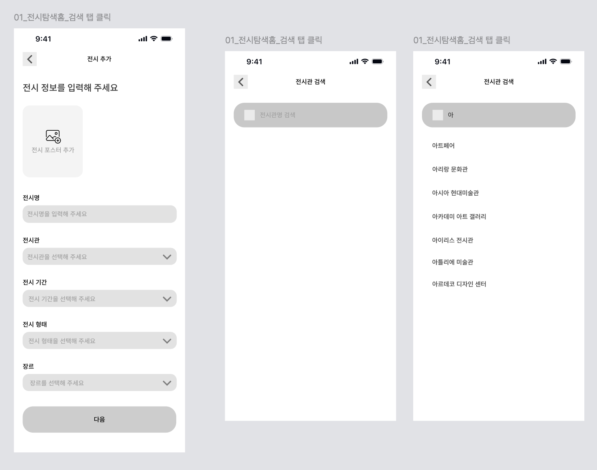
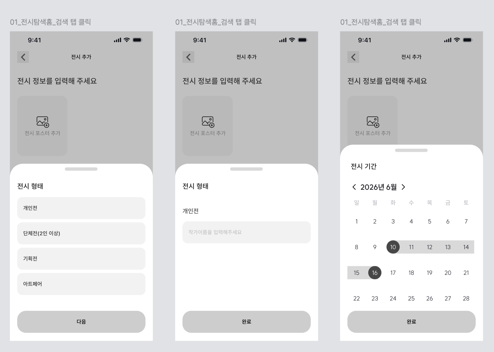
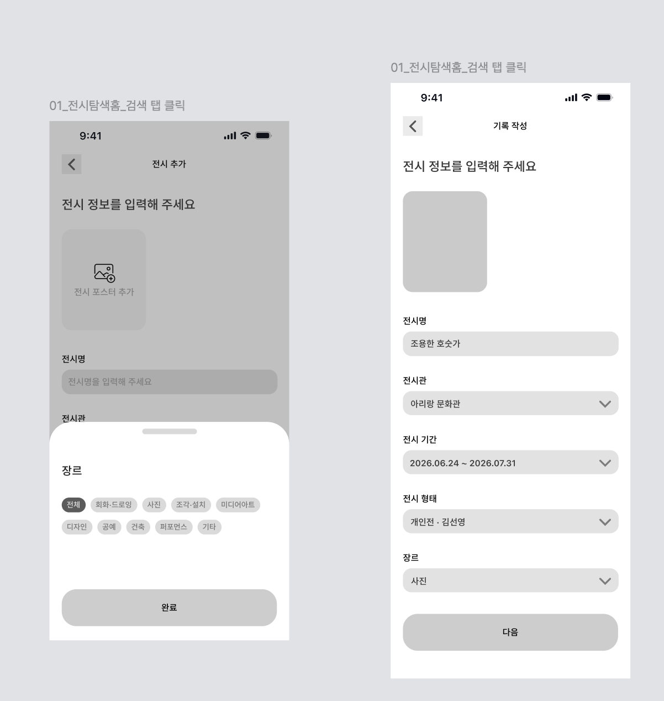

# [04] 직접 전시 추가

> 이미지: `04-02`(전시 정보 입력 폼·전시관 검색), `04-03`·`04-04`(전시 형태/기간/장르 시트).
> API 상세 → [전시](../../../도메인별%20기능%20목록정리/전시/README.md) · [파일 업로드](../../../도메인별%20기능%20목록정리/공통/파일%20업로드%20support.md).





## 화면 → API

| 시점 | API | 비고 |
|---|---|---|
| 전시 포스터 추가 | `POST /api/v1/files` (`purpose=EXHIBITION_POSTER`) | 반환 `url`을 등록 바디에 사용 |
| 전시관 입력창 타이핑 | `GET /api/v1/venues?keyword={입력}` | 자동완성(아트페어/아리랑 문화관/…) 상위 20 |
| 전시 형태 시트(개인전/단체전/기획전/아트페어) | (호출 없음) | `exhibitionForm` 4종 정적 |
| 개인전 → 작가 이름 입력 | (호출 없음) | `artistName`으로 전송 |
| 전시 기간 달력 | (호출 없음) | `startDate/endDate` |
| 장르 시트 | (호출 없음) | `category` 9종 정적 |
| "다음"(등록 확정) | `POST /api/v1/exhibitions/custom` | `exhibitionId` 반환 → 기록 작성 계속 |

**전시관 검색 요청 예시**
```http
GET /api/v1/venues?keyword=아 HTTP/1.1
Host: api.modi.app
Authorization: Bearer {accessToken}
```
```json
{
  "meta": { "result": "SUCCESS", "errorCode": null, "message": null },
  "data": { "venues": [ { "venueId": 7, "name": "아리랑 문화관", "address": "서울 성북구 …", "region": "SEOUL" } ] }
}
```

**전시 등록 요청 예시**
```http
POST /api/v1/exhibitions/custom HTTP/1.1
Host: api.modi.app
Authorization: Bearer {accessToken}
Content-Type: application/json

{
  "title": "조용한 호숫가",
  "posterUrl": "https://cdn.modi.app/exhibitions/tmp/abc.jpg",
  "venueId": 7,
  "startDate": "2026-06-24", "endDate": "2026-07-31",
  "exhibitionForm": "SOLO", "artistName": "김선명",
  "region": "SEOUL", "category": "PHOTO"
}
```

**성공 응답 (200)**
```json
{ "meta": { "result": "SUCCESS", "errorCode": null, "message": null }, "data": { "exhibitionId": 108 } }
```

**에러 응답 예시** (종료일 < 시작일)
```json
{ "meta": { "result": "FAIL", "errorCode": "INVALID_INPUT", "message": "입력값이 올바르지 않습니다." }, "data": null }
```

**에러 표**

| errorCode | HTTP | 발생 조건 |
|---|---|---|
| `INVALID_INPUT` | 400 | 제목 공백/초과, 날짜 오류, 미정의 코드 |
| `VENUE_NOT_FOUND` | 404 | 없는 venueId |
| `UNAUTHORIZED` | 401 | 미인증 |
