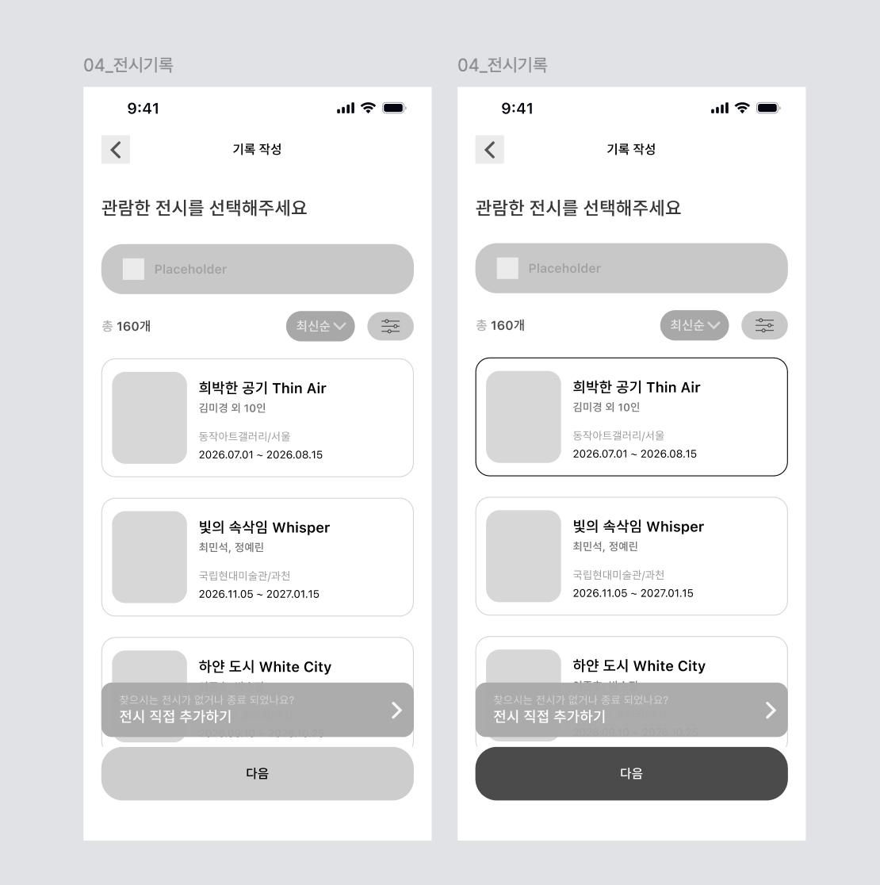

# [04] 하단 네비게이션 기록 버튼 → 전시 선택

> 이미지: `04-01`. API 상세 → [기록·아카이브](../../../도메인별%20기능%20목록정리/기록/README.md) · [전시](../../../도메인별%20기능%20목록정리/전시/README.md).

## 04-01 관람한 전시 선택



하단 내비 ✏️(기록) 버튼 진입 시, [02] 탐색과 **동일한 전시 목록 API**를 재사용한다.

| 시점 | API |
|---|---|
| 진입 | `GET /api/v1/exhibitions?sort=latest&size=20` (총 160개 = `totalCount`) |
| 검색/정렬/필터 | [02] 전시 탐색과 동일 파라미터 |
| 전시 카드 선택 → "다음" | (호출 없음 — 선택 `exhibitionId`를 기록 작성 화면으로 전달) |
| "전시 직접 추가하기" 배너 | (호출 없음 — [직접 전시 추가](../직접%20전시%20추가/README.md) 플로우로) |

**요청 예시**
```http
GET /api/v1/exhibitions?sort=latest&size=20 HTTP/1.1
Host: api.modi.app
Authorization: Bearer {accessToken}
```
