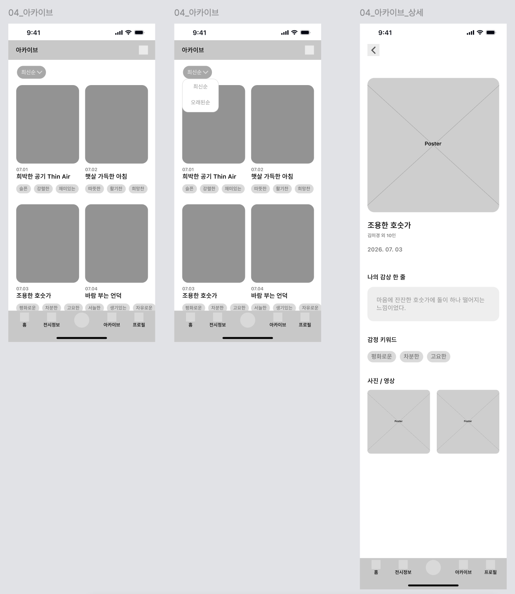

# [05] 아카이브 — 화면별 호출 API

> 이 폴더 이미지: `05-01`(아카이브 그리드·정렬·상세).
> API 상세 스펙 → [기록·아카이브](../../도메인별%20기능%20목록정리/기록/README.md).

## 05-01 아카이브



| 시점 | API | 렌더/비고 |
|---|---|---|
| 하단 내비 "아카이브" 탭 진입 | `GET /api/v1/records?sort=latest&size=20` | 그리드 카드: `thumbnailUrl`·`viewedAt`·`exhibitionTitle`·`emotionCodes`(칩 3개) |
| 정렬 변경(최신순/오래된순) | `GET /api/v1/records?sort=latest\|oldest&size=20` | 커서 초기화 후 재조회 |
| 무한 스크롤 | 동일 요청 + `cursor={nextCursor}` | |
| 카드 클릭(상세) | `GET /api/v1/records/{recordId}` | Poster·전시명·관람일·감상·감정 칩·미디어·`afterglows`(리마인드 여운) |

**목록 요청 예시**
```http
GET /api/v1/records?sort=latest&size=20 HTTP/1.1
Host: api.modi.app
Authorization: Bearer {accessToken}
```

**목록 응답 (200)** — `CursorResponse<RecordListItem>`
```json
{
  "meta": { "result": "SUCCESS", "errorCode": null, "message": null },
  "data": {
    "content": [
      { "recordId": 31, "exhibitionId": 51, "thumbnailUrl": "…", "viewedAt": "2026-07-01",
        "aiSummary": null, "representativeEmotion": null, "bookmarked": false,
        "emotionCodes": ["평화로운", "차분한", "고요한"],
        "exhibitionTitle": "조용한 호숫가", "exhibitionType": "CUSTOM", "exhibitionPosterUrl": "…",
        "exhibitionPlace": "아리랑 문화관", "exhibitionStartDate": "2026-06-24", "exhibitionEndDate": "2026-07-31" }
    ],
    "nextCursor": "eyJ...", "hasNext": true, "totalCount": 6
  }
}
```

**상세 요청 예시**
```http
GET /api/v1/records/31 HTTP/1.1
Host: api.modi.app
Authorization: Bearer {accessToken}
```

**에러 응답 예시** (타인/없는 기록)
```json
{ "meta": { "result": "FAIL", "errorCode": "NOT_FOUND", "message": "기록을 찾을 수 없습니다." }, "data": null }
```

**에러 표**

| errorCode | HTTP | 발생 조건 |
|---|---|---|
| `INVALID_CURSOR` | 400 | 커서-조건 불일치 |
| `NOT_FOUND` | 404 | 없는 기록(상세) |
| `FORBIDDEN` | 403 | 타인 기록 상세 접근 |
| `UNAUTHORIZED` | 401 | 미인증 |
