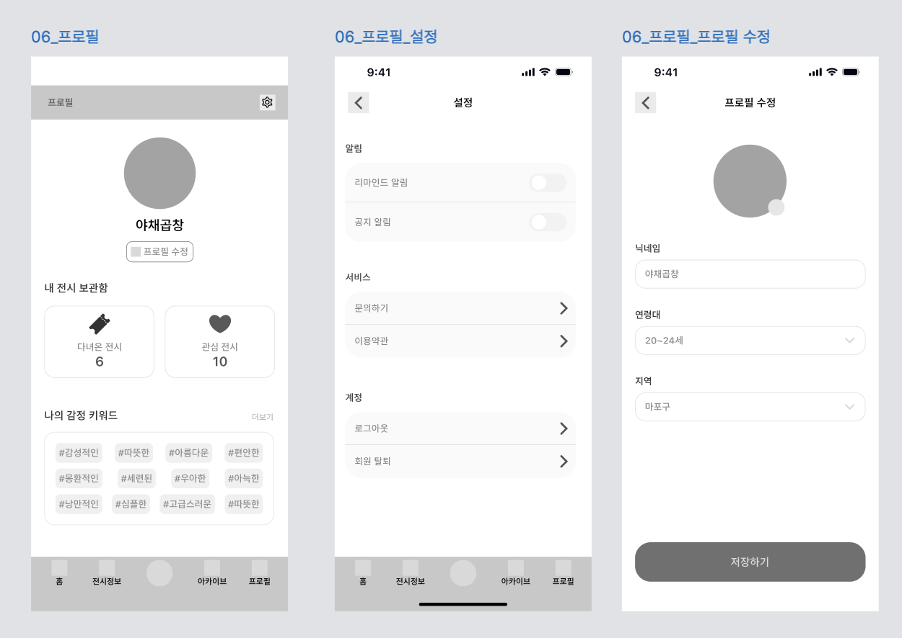
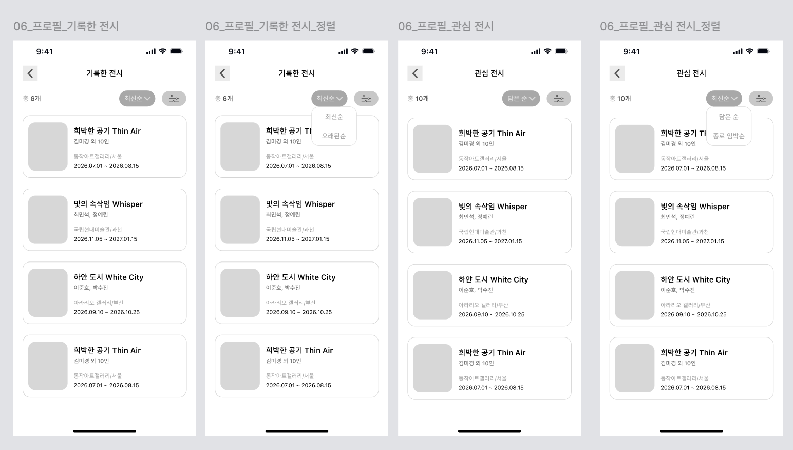

# [06] 프로필 — 화면별 호출 API

> 이 폴더 이미지: `06-01`(프로필·설정·프로필 수정), `06-02`(기록한 전시·관심 전시 목록).
> API 상세 스펙 → [회원·프로필](../../도메인별%20기능%20목록정리/유저/README.md) · [관심 전시](../../도메인별%20기능%20목록정리/북마크/README.md) · [기록·아카이브](../../도메인별%20기능%20목록정리/기록/README.md).

## 06-01 프로필 / 설정 / 프로필 수정



| 시점 | API | 렌더/비고 |
|---|---|---|
| 프로필 탭 진입 | `GET /api/v1/users/me` | 닉네임·`stats.exhibitionCount`(다녀온 6)·`stats.bookmarkCount`(관심 10)·`tasteKeywords` |
| "다녀온 전시" 카드 클릭 | → 기록한 전시 목록(06-02) | |
| "관심 전시" 카드 클릭 | → 관심 전시 목록(06-02) | |
| 설정 진입 | `GET /api/v1/users/me/notification-settings` | 리마인드/공지 알림 토글 초기값 |
| 알림 토글 변경 | `PUT /api/v1/users/me/notification-settings` | `{remindEnabled, noticeEnabled}` |
| 문의하기 / 이용약관 | (호출 없음 — 외부 링크) | |
| 로그아웃 | `POST /api/v1/auth/logout` | |
| 회원 탈퇴 | `DELETE /api/v1/users/me` | soft-delete |
| 프로필 이미지 변경 | `POST /api/v1/files` (`purpose=PROFILE_IMAGE`) | |
| "저장하기"(프로필 수정) | `PUT /api/v1/users/me/profile` | 닉네임·연령대·지역 |

**프로필 조회 응답 예시**
```json
{
  "meta": { "result": "SUCCESS", "errorCode": null, "message": null },
  "data": {
    "userId": 12, "provider": "KAKAO", "nickname": "야채곰창", "profileImageUrl": "…",
    "ageGroup": "TWENTIES", "residenceRegion": "SEOUL", "residenceDistrict": "마포구",
    "tasteKeywords": ["감성적인", "따뜻한", "아름다운", "편안한"],
    "stats": { "recordCount": 6, "exhibitionCount": 6, "bookmarkCount": 10 }
  }
}
```

## 06-02 기록한 전시 / 관심 전시 목록



| 화면 | 진입 API | 정렬 |
|---|---|---|
| 기록한 전시("총 6개") | `GET /api/v1/records/exhibitions/visited?sort=latest&size=20` | 최신순/오래된순 |
| 관심 전시("총 10개") | `GET /api/v1/users/me/bookmarks?sort=latest&size=20` | 최신순/종료 임박순(`ending`) |

| 동작 | API |
|---|---|
| 정렬 변경 | 각 API에 `sort=` 변경, 커서 초기화 |
| 무한 스크롤 | 동일 요청 + `cursor={nextCursor}` |
| 카드 클릭 | `GET /api/v1/exhibitions/{exhibitionId}` → [03] |

**관심 전시 요청 예시**
```http
GET /api/v1/users/me/bookmarks?sort=ending&size=20 HTTP/1.1
Host: api.modi.app
Authorization: Bearer {accessToken}
```

**에러 응답 예시** (미인증)
```json
{ "meta": { "result": "FAIL", "errorCode": "UNAUTHORIZED", "message": "인증이 필요합니다." }, "data": null }
```
