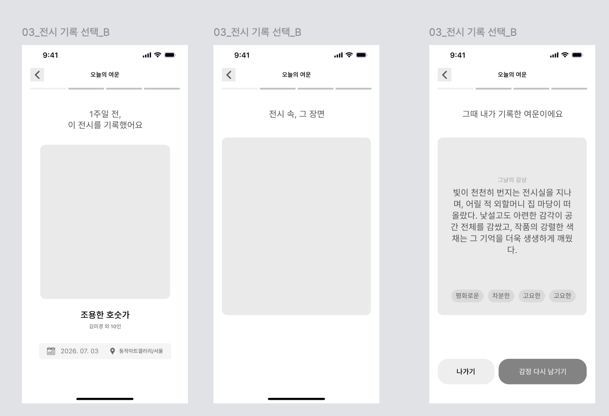
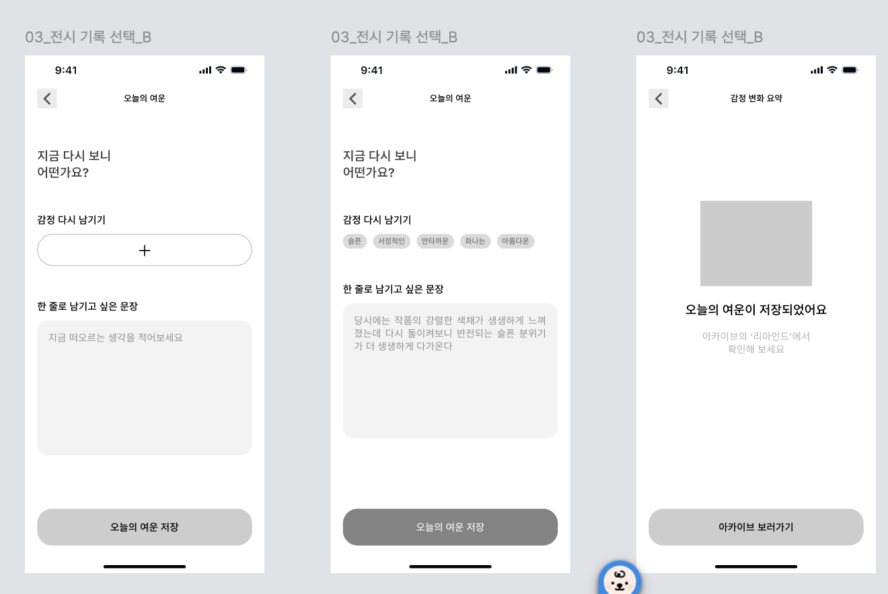

# [07] 리마인드 (오늘의 여운) — 화면별 호출 API

> 이 폴더 이미지: `07-01`(리마인드 인트로 3장), `07-02`(감정 다시 남기기 → 저장 완료·감정 변화 요약).
> API 상세 스펙 → [리마인드](../../도메인별%20기능%20목록정리/리마인드/README.md) · [기록·아카이브](../../도메인별%20기능%20목록정리/기록/README.md) · [알림](../../도메인별%20기능%20목록정리/알림/README.md).
> 리마인드 생성은 스케줄러(기록 저장 +7일)가 담당 — 아래는 조회·저장 API만.

## 07-01 리마인드 인트로 (3장)



"1주일 전, 이 전시를 기록했어요" → "전시 속, 그 장면" → "그때 내가 기록한 여운이에요".

| 시점 | API | 렌더 |
|---|---|---|
| 리마인드/알림 클릭 진입 | `GET /api/v1/reminds/today` | 응답 하나로 3장: 전시 카드(`title`·`artistSummary`·`posterUrl`·`viewedAt`) → `sceneMediaUrl` → `contentSnapshot`+`emotionCodes` |
| (알림 목록 경유 시) | `PUT /api/v1/notifications/{id}/read` | 읽음 처리 |
| "나가기" | (호출 없음) | |
| "감정 다시 남기기" | (호출 없음 — 07-02로) | |

**요청 예시**
```http
GET /api/v1/reminds/today HTTP/1.1
Host: api.modi.app
Authorization: Bearer {accessToken}
```

**성공 응답 (200) — 리마인드 있음**
```json
{
  "meta": { "result": "SUCCESS", "errorCode": null, "message": null },
  "data": {
    "remindId": 5, "recordId": 31, "daysAgo": 7,
    "exhibition": { "exhibitionId": 51, "title": "조용한 호숫가", "artistSummary": "김선명", "posterUrl": "…", "place": "동작아트갤러리/서울" },
    "viewedAt": "2026-07-03",
    "sceneMediaUrl": "https://cdn.modi.app/records/31/1.jpg",
    "contentSnapshot": "빛이 천천히 번지는 전시실을 지나며…",
    "emotionCodes": ["평화로운", "차분한", "고요한"],
    "answered": false
  }
}
```

**성공 응답 (200) — 리마인드 없음**
```json
{ "meta": { "result": "SUCCESS", "errorCode": null, "message": null }, "data": null }
```

## 07-02 감정 다시 남기기 → 저장 완료



"지금 다시 보니 어떤가요?" → 감정 재선택 + 한 줄 → 저장 → 감정 변화 요약(AI).

| 시점 | API | 비고 |
|---|---|---|
| 감정 칩 시트 | `GET /api/v1/emotion-keywords` | 기록 작성과 동일 프리셋 |
| 한 줄 문장 입력 | (호출 없음) | `sentence` 로컬 상태(≤300자) |
| "오늘의 여운 저장" | `POST /api/v1/reminds/{remindId}/afterglow` | 응답에 `emotionChangeSummary`(AI 생성) |
| 저장 완료 "아카이브 보러가기" | `GET /api/v1/records/{recordId}` | 상세 `afterglows[]`에 방금 저장분 포함 |

**저장 요청 예시**
```http
POST /api/v1/reminds/5/afterglow HTTP/1.1
Host: api.modi.app
Authorization: Bearer {accessToken}
Content-Type: application/json

{
  "emotionCodes": ["슬픈", "생생한"],
  "sentence": "당시에는 강렬한 세계가 생생했는데, 다시 보니 반전되는 슬픈 분위기가 더 다가온다"
}
```

**성공 응답 (200)**
```json
{
  "meta": { "result": "SUCCESS", "errorCode": null, "message": null },
  "data": {
    "afterglowId": 2, "recordId": 31,
    "beforeEmotions": ["평화로운", "차분한", "고요한"],
    "afterEmotions": ["슬픈", "생생한"],
    "emotionChangeSummary": "고요했던 첫 감상이 시간이 지나며 아련한 슬픔으로 번졌어요"
  }
}
```

**에러 응답 예시** (이미 여운 저장함)
```json
{ "meta": { "result": "FAIL", "errorCode": "REMIND_ALREADY_ANSWERED", "message": "이미 오늘의 여운을 남겼습니다." }, "data": null }
```

**에러 표**

| errorCode | HTTP | 발생 조건 |
|---|---|---|
| `INVALID_INPUT` | 400 | emotionCodes 빈 값/10자 초과, sentence 300자 초과 |
| `REMIND_NOT_FOUND` | 404 | 없는/타인 리마인드 |
| `REMIND_ALREADY_ANSWERED` | 409 | 여운 중복 저장 |
| `AI_GENERATION_FAILED` | 502 | 요약 생성 실패 |
