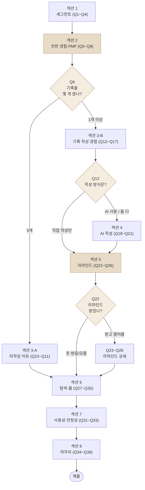
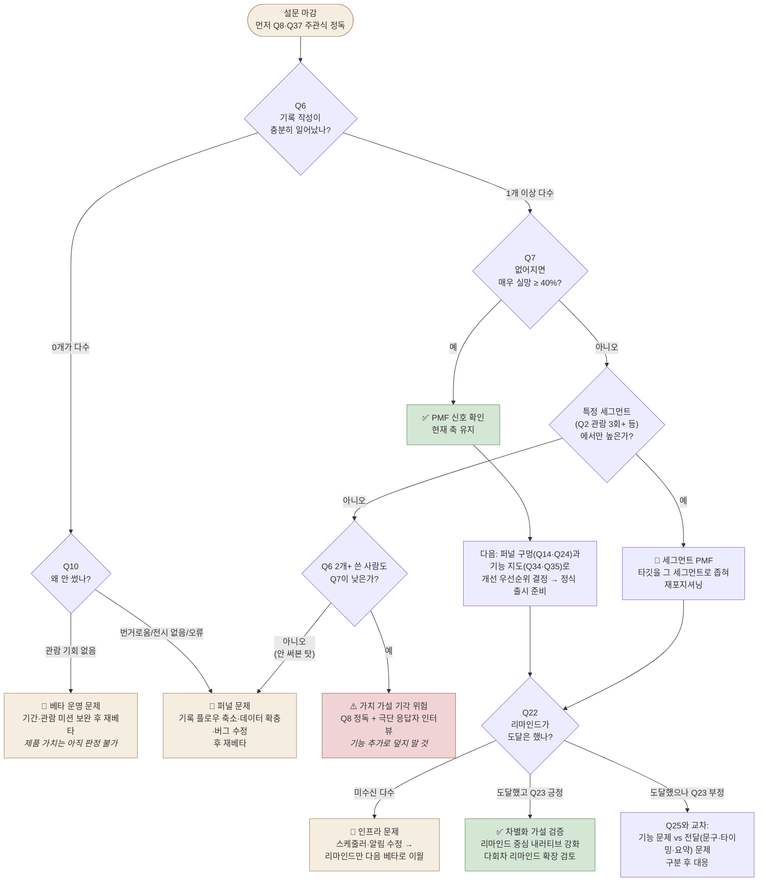

# 여운(餘韻) 베타테스트 설문조사

## 한눈에

여운 베타테스트가 끝날 때 참여자에게 보낼 **구글폼 설문 설계서**예요. 섹션 구성, 문항 유형(객관식/체크박스/배율/주관식), 필수 여부, 분기 규칙까지 적어 두었으니 그대로 구글폼에 옮기기만 하면 됩니다.

이 설문의 목표를 먼저 분명히 해 둘게요. 우리가 알고 싶은 건 "유저가 여운을 좋아하는가?"가 아니라 **"현재 기능이 실제 유저에게 의미가 있는가?"**입니다. 그래서 기능마다 만족도를 묻는 대신, ① 핵심 가치(기록 → 리마인드)가 진짜 작동했는지 ② 유저가 어디서 멈추고 이탈했는지 ③ 다음에 무엇을 만들고 무엇을 버릴지 — 이 세 가지 결정에 필요한 데이터만 묻도록 설계했어요.

예상 소요 시간은 5~7분이고, 분기를 적용하면 응답자 한 명이 실제로 보는 문항은 20~25개 정도입니다.

한 가지 중요한 전제가 있어요. **이번 베타는 2~3일만 진행합니다.** 그래서 문항들도 짧은 베타에 맞게 조정했어요 — 사용 '일수' 대신 '몇 번 열어봤는지'를 묻고, 기록 개수 선택지를 현실적인 범위(0/1/2개 이상)로 줄이고, 기록한 전시가 대부분 '예전에 본 전시'일 거라는 점을 문항에 반영했습니다. 그리고 가장 중요한 것 — 원래 리마인드는 기록 7일 뒤에 도착하는데, 2~3일 베타에서는 아무도 받아볼 수 없어요. 그래서 **베타 기간 동안 발송 주기를 7일 → 1일로 단축해 둔다는 전제**로 섹션 5를 설계했습니다. 단축이 어렵다면 섹션 5 아래에 붙여둔 대체 문항을 쓰세요.

> 문서는 두 부분으로 나뉘어요. **PART 1**은 구글폼에 그대로 옮길 설문 전문이고, **PART 2**는 각 질문을 왜 넣었는지, 어떤 응답이 나오면 무엇을 의미하고 그다음에 뭘 해야 하는지를 정리한 해석 가이드입니다.

---

## 이 설문을 이렇게 설계했어요 (5가지 원칙)

설문 초보자가 가장 흔히 빠지는 함정이 "이 기능 좋았나요?"를 기능 개수만큼 나열하는 거예요. 그런 설문은 모든 문항이 3.5~4점으로 수렴하고, 결과를 받아 들어도 아무 결정을 내릴 수 없습니다. 그걸 피하려고 아래 다섯 가지 원칙을 깔고 문항을 만들었어요.

### 1. 과거 행동을 묻고, 미래 의향은 최소화했어요

"AI 기능을 앞으로 쓰시겠어요?" 같은 가정형 질문에 사람들은 예의상 긍정적으로 답합니다. 하지만 실제 행동은 거짓말을 하지 않아요. 그래서 "쓰시겠어요?" 대신 **"AI 초안을 저장하기 전에 얼마나 고치셨나요?"**처럼 이미 일어난 행동을 묻습니다. 수정을 거의 안 했다면 AI 품질이 좋았던 거고, 절반 이상 다시 썼다면 말로는 "괜찮았어요"라고 해도 실제로는 만족하지 못한 거예요. (이건 고객 인터뷰 방법론인 Mom Test의 핵심 원칙이기도 합니다 — "그들의 삶과 과거를 물어라, 당신의 아이디어에 대한 의견을 묻지 마라.")

### 2. 답을 유도하는 표현(리딩 질문)을 쓰지 않았어요

"리마인드 기능이 감동적이었나요?"라고 물으면 이미 '감동'이라는 답을 깔아 준 셈이라 응답이 오염돼요. 그래서 문항은 중립적으로 쓰고, 선택지에는 반드시 부정적인 선택지("오히려 번거롭게 느껴졌다" 등)를 함께 넣었습니다. 부정 선택지가 있어야 유저가 솔직해질 수 있는 자리가 생기거든요.

### 3. 안 쓴 기능은 묻지 않고, "왜 안 썼는지"를 물어요

기록을 0개 작성한 사람에게 AI 작성 만족도를 물으면 대충 중간 점수를 찍고, 그게 데이터를 오염시킵니다. 그래서 구글폼의 섹션 분기 기능으로 **기록을 안 쓴 사람 → 안 쓴 이유를 묻는 별도 섹션**으로 보내요. 사실 "왜 안 썼는가"가 만족도 점수보다 훨씬 값진 데이터입니다. 이탈의 원인이 거기 있으니까요.

### 4. 주관식은 꼭 필요한 자리에만 뒀어요

주관식이 많으면 응답자가 지쳐서 중도 이탈하거나 대충 씁니다. 그래서 대부분 객관식으로 만들되, 숫자만으로는 해석이 불가능한 핵심 지점 — "왜 그렇게 느꼈는지"(Q8), "무엇이 아쉬웠는지"(Q36·37) — 에는 반드시 주관식을 넣었어요. 나중에 보시면 알겠지만, 이 몇 개의 주관식에서 가장 좋은 인사이트가 나옵니다.

### 5. 표본이 작다는 걸 처음부터 전제했어요

베타 응답자가 10~30명이라면 "몇 %가 만족했다"는 통계적으로 거의 의미가 없어요. 그 대신 **"어떤 사람이, 왜 그렇게 답했는가"**를 볼 수 있어야 합니다. 그래서 설문 맨 앞에 세그먼트 문항(전시 관람 빈도, 기존 기록 습관)을 배치했어요. 이게 있어야 나중에 "전시를 자주 보는 사람들만큼은 확실히 좋아하더라" 같은, 작은 표본에서도 유효한 결론을 뽑을 수 있습니다.

---

# PART 1. 설문지 전문 (구글폼용)

> 여기부터는 구글폼에 들어갈 실제 텍스트예요. 문항·선택지는 그대로 복사해서 쓰시면 되고, `객관식 · 필수` 같은 표기는 구글폼에서 문항 유형과 필수 여부를 설정할 때 참고하세요. **※ 분기** 표기는 구글폼의 "답변을 기준으로 섹션 이동" 기능으로 설정합니다(맨 아래 분기 설정표 참고).

## 폼 제목·설명

**제목:** 여운 베타테스트 설문 — 솔직한 이야기를 들려주세요 (5분)

**설명(폼 상단):**
> 안녕하세요, 전시 기록 서비스 '여운' 팀입니다.
> 베타테스트에 참여해 주셔서 감사합니다. 이 설문은 여운을 더 낫게 만들기 위한 것으로, **좋은 답도 나쁜 답도 없습니다. 불편했던 점일수록 저희에게 가장 큰 도움이 됩니다.**
> 응답은 서비스 개선 목적으로만 사용되며, 통계 처리 후 개별 응답은 외부에 공개되지 않습니다.
> 소요 시간: 약 5분

**구글폼 설정:** 이메일 수집 OFF(익명성 확보, 연락처는 마지막에 선택 수집) / 응답 후 수정 허용 OFF / 진행률 표시줄 ON

---

## 섹션 1. 당신에 대해 (세그먼트)

**Q1. 연령대를 알려주세요.** `객관식 · 필수`
- 10대
- 20~24세
- 25~29세
- 30대
- 40대 이상

**Q2. 최근 6개월 동안 전시(미술관·갤러리 등)를 몇 번 관람하셨나요?** `객관식 · 필수`
- 0회
- 1~2회
- 3~5회
- 6회 이상

**Q3. 여운을 쓰기 전, 전시를 보고 나서 기록을 남긴 적이 있다면 주로 어떤 방식이었나요?** `체크박스(복수 선택) · 필수`
- 사진만 찍어두는 편이었다
- 인스타그램 등 SNS에 올렸다
- 메모앱·일기장에 적었다
- 블로그에 후기를 썼다
- 기록을 남기지 않았다
- 기타: ___

**Q4. 전시를 기록하면서(또는 기록하려다가) 가장 아쉬웠거나 번거로웠던 점이 있다면 적어주세요.** `장문형 · 선택`
> (여운 이야기가 아니어도 좋습니다. 평소 경험을 들려주세요.)

---

## 섹션 2. 여운 전반 경험 (핵심 검증)

**Q5. 베타 기간 동안 여운을 얼마나 열어보셨나요?** `객관식 · 필수`
- 1번 정도 둘러봤다
- 2~3번 열어봤다
- 거의 매일, 하루에도 여러 번 열어봤다

**Q6. 베타 기간 동안 전시 관람 기록을 몇 개 작성하셨나요?** `객관식 · 필수`
- 0개 → **※ 구글폼 분기: 섹션 3-A(기록 미작성)로 이동**
- 1개 → 섹션 3-B로 이동
- 2개 이상 → 섹션 3-B로 이동

**Q7. 만약 내일부터 여운을 더 이상 사용할 수 없게 된다면, 어떤 기분일 것 같나요?** `객관식 · 필수`
- 매우 실망스러울 것 같다
- 조금 아쉬울 것 같다
- 별로 상관없다
- (사실 이미 사용하지 않고 있다)

**Q8. 그렇게 답하신 이유를 한두 문장으로 적어주세요.** `장문형 · 필수`

**Q9. 여운을 친구에게 소개한다면 뭐라고 말할 것 같나요? 한 문장으로 적어주세요.** `단답형 · 선택`

---

## 섹션 3-A. 기록을 작성하지 않으셨군요 (Q6=0개 응답자만)

**Q10. 기록을 작성하지 않은 이유에 가장 가까운 것은 무엇인가요?** `객관식 · 필수`
- 최근에 관람한 전시가 없어서, 기록할 게 떠오르지 않았다
- 예전에 본 전시도 기록할 수 있다는 걸 몰랐다
- 기록하고 싶은 전시가 목록(검색)에 없었다
- 작성 과정이 길거나 번거로워 보여서 그만뒀다
- 작성을 시도했지만 오류나 문제로 완료하지 못했다
- 굳이 기록할 필요를 못 느꼈다
- 기타: ___

**Q11. 작성을 시도했다가 멈추셨다면, 어느 단계에서 멈추셨나요?** `객관식 · 선택`
- 전시 선택 화면
- 전시 직접 추가(정보 입력) 단계
- 관람일·감정 키워드·사진 입력 단계
- 감상 글쓰기 단계
- 시도한 적 없다

> **분기:** 섹션 3-A 종료 후 → **섹션 6(전시 탐색·홈)으로 이동** (섹션 4·5 건너뜀)

---

## 섹션 3-B. 기록 작성 경험 (기록 1개 이상 작성자만)

**Q12. 기록을 작성할 때 주로 어떤 방식을 사용하셨나요?** `객관식 · 필수`
- 직접 작성만 사용했다
- 질문으로 작성(AI)만 사용했다
- 둘 다 사용해봤다
> **분기:** "직접 작성만" 선택 시 → 섹션 4(AI)를 건너뛰고 섹션 5(리마인드)로 이동

**Q13. 그 방식을 선택한 이유는 무엇인가요?** `단답형 · 선택`

**Q14. 기록 작성 과정(전시 선택 → 관람일 → 감정 키워드 → 사진/영상 → 글 작성)에서 가장 번거로웠던 단계는 무엇인가요?** `객관식 · 필수`
- 기록할 전시를 찾아 선택하는 것
- 전시가 목록에 없어 직접 추가한 것
- 관람일 입력
- 감정 키워드 선택
- 사진/영상 업로드
- 감상 글 작성
- 번거로운 단계가 없었다

**Q15. 감정 키워드 선택은 어땠나요?** `객관식 · 필수`
- 기본 제공 키워드(슬픈, 강렬한, 유쾌한 등)로 충분했다
- 기본 키워드에 없어서 '나만의 키워드'를 직접 입력했다
- 내 감정에 맞는 말을 고르기 어려웠다
- 감정 키워드를 고르는 것 자체가 번거로웠다

**Q16. 감상 글 300자 제한은 어땠나요?** `객관식 · 필수`
- 더 길게 쓰고 싶었다 (부족했다)
- 적당했다
- 300자까지 쓸 일이 없었다 (짧게 썼다)

**Q17. 이번 베타에서 기록한 전시는 주로 언제 관람했던 전시였나요?** `객관식 · 필수`
- 베타 기간 중에 관람했다
- 최근 1~2주 안에 관람했다
- 최근 한 달 안에 관람했다
- 한 달도 더 전에 관람한 전시다

---

## 섹션 4. AI로 작성하기 경험 (Q12에서 AI 사용자만)

**Q18. AI가 던진 3개의 질문은 감상을 떠올리는 데 도움이 되었나요?** `선형 배율 1~5 · 필수`
- 1 = 전혀 도움 안 됨 ↔ 5 = 매우 도움 됨

**Q19. AI가 만들어준 감상문 초안을 저장하기 전에 얼마나 수정하셨나요?** `객관식 · 필수`
- 거의 그대로 저장했다
- 몇 군데 고쳐서 저장했다
- 절반 이상 다시 썼다
- 마음에 들지 않아 저장하지 않았다 (직접 작성으로 바꿈 등)

**Q20. AI 감상문이 '내가 쓴 것 같은 내 감상'처럼 느껴졌나요?** `선형 배율 1~5 · 필수`
- 1 = 전혀 내 것 같지 않음 ↔ 5 = 정말 내 감상 같음

**Q21. AI 작성 기능에 대해 아쉬웠던 점이 있다면 적어주세요.** `장문형 · 선택`

---

## 섹션 5. 리마인드 — "오늘의 여운" (기록 작성자만)

> 정식 버전에서는 기록 저장 7일 뒤에 "1주일 전, 이 전시를 기록했어요" 알림·화면이 도착하는 기능입니다. **이번 베타에서는 기간이 짧아, 기록 다음 날 도착하도록 앞당겨 두었습니다.**

**Q22. 베타 기간 중 리마인드(오늘의 여운)를 받아보셨나요?** `객관식 · 필수`
- 받았고, 열어봤다
- 받은 것 같은데 열어보지 않았다
- 받지 못했다 / 기억나지 않는다 → **※ 분기: 섹션 6으로 이동**

**Q23. (열어본 분만) 얼마 전 남긴 내 기록을 다시 마주했을 때 어땠나요?** `객관식 · 필수`
- 반갑고 좋았다 — 이 기능 때문에라도 기록을 남기고 싶다
- 나쁘지 않았지만 없어도 그만이다
- 별 감흥이 없었다
- 오히려 번거롭게 느껴졌다 (알림이 방해됨)

**Q24. '감정 다시 남기기'(감정 재선택 + 한 줄)까지 하셨나요?** `객관식 · 필수`
- 했다
- 안 했다 — 귀찮아서
- 안 했다 — 뭘 써야 할지 몰라서
- 안 했다 — 기타: ___

**Q25. (여운을 저장한 분만) 저장 후 나온 '감정 변화 요약' 문장(예: "고요했던 첫 감상이 아련한 슬픔으로 번졌어요")은 어땠나요?** `객관식 · 선택`
- 내 감정 변화를 잘 담았다
- 그럴듯하지만 딱히 와닿지 않았다
- 어색하거나 틀린 느낌이었다
- 기억나지 않는다

**Q26. 정식 버전에서 리마인드는 기록 후 7일 뒤에 보낼 예정이에요. 이 시점은 어떻게 느껴지시나요?** `객관식 · 필수`
- 7일보다 빨리 왔으면 좋겠다
- 7일이 적당할 것 같다
- 7일보다 나중에 왔으면 좋겠다
- 시점을 직접 정하고 싶다

> **⚠️ 섹션 5의 운영 전제 — 리마인드 발송 단축(7일 → 1일)이 필요해요.** 이 섹션은 베타 기간 동안 스케줄러의 리마인드 생성 기준을 '기록 +7일'에서 '기록 +1일'로 바꿔 둔다는 전제로 설계했습니다. 서버 설정값 하나를 바꾸는 작은 작업이지만, 이게 안 되면 2~3일 베타에서 리마인드를 받아볼 사람이 아무도 없어서 여운의 핵심 차별화 가설을 통째로 검증하지 못하게 돼요.
>
> **만약 단축 발송이 정말 어렵다면**, 섹션 5(Q22~Q26)를 전부 빼고 아래 두 문항으로 교체하세요. 실제 경험이 아니라 미래 의향을 묻는 약한 질문이라 어디까지나 차선책입니다.
>
> **Q22′. 여운에는 "기록 7일 뒤, 그때의 기록과 감정을 다시 보여주고 지금의 감정을 한 번 더 남기게 하는" 리마인드 기능이 준비되어 있어요. 이 설명을 들었을 때 어떤 생각이 드나요?** `객관식 · 필수`
> - 꼭 받아보고 싶다
> - 나쁘지 않을 것 같다
> - 별로 필요 없을 것 같다
> - 알림이 올 것 같아 오히려 부담스럽다
>
> **Q23′. 그렇게 느낀 이유를 적어주세요.** `장문형 · 선택`

---

## 섹션 6. 전시 탐색과 홈 (전원)

**Q27. 여운을 쓰는 동안, 몰랐던 전시 중 '가보고 싶다'는 생각이 든 전시를 발견한 적이 있나요?** `객관식 · 필수`
- 발견해서 실제로 관람했거나 관람 계획을 잡았다
- 발견해서 관심 전시(북마크)에 저장해뒀다
- 눈에 띄는 전시는 있었지만 그걸로 끝이었다
- 없었다

**Q28. 홈 화면에서 실제로 눌러보거나 유용했던 영역을 모두 골라주세요.** `체크박스(복수 선택) · 필수`
- 상단 배너 (대표 전시)
- 곧 끝나기 전에 봐야 할 전시
- 이번 달 새로 열리는 전시
- 무료로 볼 수 있는 전시
- 유용한 영역이 없었다 / 홈을 거의 안 봤다

**Q29. 검색·필터(지역/장르)로 원하는 전시를 찾을 수 있었나요?** `선형 배율 1~5 · 필수`
- 1 = 원하는 걸 거의 못 찾음 ↔ 5 = 쉽게 찾음

**Q30. 찾는 전시가 목록에 없어서 '전시 직접 추가'를 써본 적이 있나요?** `객관식 · 필수`
- 있다 — 어렵지 않게 등록했다
- 있다 — 입력할 게 많아 번거로웠다
- 필요했지만 직접 추가까지는 하지 않았다
- 그럴 일이 없었다 (찾는 전시가 다 있었다 / 검색 안 함)

---

## 섹션 7. 사용성과 안정성 (전원)

**Q31. 사용 중 오류, 멈춤, 이상한 동작을 겪은 적이 있나요? 있었다면 어떤 상황이었는지 적어주세요.** `장문형 · 선택`
> (예: "사진 업로드가 안 됐다", "로그인이 풀렸다" — 기억나는 대로면 충분합니다.)

**Q32. '이게 뭐지?' 싶거나 다음에 뭘 해야 할지 헤맨 화면이 있었나요?** `장문형 · 선택`

**Q33. 화면 로딩이나 반응 속도는 어땠나요?** `객관식 · 필수`
- 신경 쓰인 적 없다
- 가끔 느렸지만 참을 만했다
- 자주 느려서 답답했다

---

## 섹션 8. 마무리 (전원)

**Q34. 여운에서 가장 좋았던 기능 하나만 골라주세요.** `객관식 · 필수`
- 전시 탐색 (홈 섹션·검색·필터)
- 관람 기록 — 직접 작성
- 관람 기록 — AI(질문)로 작성
- 감정 키워드로 남기기
- 아카이브 (내 기록 모아보기)
- 리마인드 (오늘의 여운)
- 관심 전시 저장 (북마크)
- 딱히 없다

**Q35. 반대로, 없어져도 아쉽지 않을 것 같은 기능 하나를 골라주세요.** `객관식 · 필수`
- (Q34와 동일한 선택지 + "모두 필요하다")

**Q36. "이런 게 있었다면 여운을 더 썼을 텐데" 싶은 것이 있다면 자유롭게 적어주세요.** `장문형 · 선택`

**Q37. 마지막으로 여운 팀에게 하고 싶은 말이 있다면 무엇이든 적어주세요.** `장문형 · 선택`

**Q38. 15~20분 정도의 후속 인터뷰(커피 기프티콘 제공)에 참여해주실 수 있다면 연락처(이메일 또는 카카오톡 ID)를 남겨주세요.** `단답형 · 선택`

---

## 구글폼 분기 설정 요약

구글폼에서 각 섹션 끝의 "다음 섹션으로 이동" 설정과, 객관식 문항의 "답변을 기준으로 섹션 이동" 옵션을 조합하면 아래 분기를 그대로 구현할 수 있어요. 분기가 꼬이면 응답자가 안 쓴 기능에 대해 답하게 되니, 배포 전에 미리보기로 네 가지 경로(기록 0개 / 직접 작성만 / AI 사용 / 리마인드 미수신)를 한 번씩 직접 밟아보시길 권합니다.

| 분기 지점 | 조건 | 이동 |
|---|---|---|
| Q6 (기록 개수) | 0개 | 섹션 3-A → (완료 후) 섹션 6 |
| Q6 | 1개 이상 | 섹션 3-B |
| Q12 (작성 방식) | 직접 작성만 | 섹션 4(AI) 건너뛰고 섹션 5 |
| Q22 (리마인드 수신) | 못 받음/모름 | 섹션 6 |

---
---

# PART 2. 질문 설계 의도 & 응답 해석 가이드

여기서부터는 각 질문을 **왜 넣었는지**, 그리고 어떤 응답이 나오면 **그게 무엇을 의미하고 그다음에 뭘 해야 하는지**를 섹션별로 설명할게요.

시작하기 전에 한 가지만 당부드리면 — 베타 응답자가 30명 미만이라면 퍼센트는 참고치일 뿐이에요. "60%가 만족"보다 "전시를 자주 보는 응답자 5명 중 4명이 매우 실망이라고 답했고, 그 이유가 전부 리마인드였다"가 훨씬 강한 근거입니다. 그래서 아래 해석 가이드도 대부분 **교차 분석**(이 답과 저 답을 묶어 보기)을 중심으로 썼어요. 주관식 원문 한 줄이 숫자 하나보다 힘이 셀 때가 많다는 것도 기억해 주세요.

## 섹션 1 — 세그먼트: "누구의 답인지"를 알기 위한 기반

이 섹션은 여운에 대해 묻는 게 아니라 **응답자가 어떤 사람인지**를 묻습니다. 왜 이게 맨 앞에 있어야 하냐면, 뒤에 나오는 모든 답의 무게가 응답자에 따라 달라지기 때문이에요. 전시를 한 번도 안 보는 사람이 "기록 기능이 별로였다"고 답한 것과, 한 달에 두 번 전시를 보는 사람이 같은 답을 한 것은 완전히 다른 신호거든요.

**Q1(연령대)**은 우리가 상정한 타깃(20대 중심)과 실제 베타 참여자가 일치하는지 확인하는 용도예요. 타깃 밖 응답자의 답은 버리라는 게 아니라, 해석할 때 가중치를 낮추라는 뜻입니다.

**Q2(관람 빈도)**가 이 섹션에서 가장 중요한 문항이에요. 이후 모든 응답을 "헤비 관람러(3회 이상) vs 라이트(0~2회)" 두 그룹으로 쪼개서 보는 기준축이 됩니다. 초기 제품은 모두를 만족시킬 수 없어서, "누구에게 먼저 사랑받을 것인가"를 정해야 하는데 그 판단이 여기서 나와요.

**Q3(기존 기록 방식)**은 여운의 진짜 경쟁자를 알려줍니다. 여운의 경쟁자는 다른 전시 앱이 아니라 '인스타 스토리'와 '기록 안 함'일 가능성이 높거든요. 유저가 지금 뭘로 이 문제를 해결하고 있는지(혹은 해결 안 하고 사는지) 알아야, 여운이 뭘 이겨야 하는지가 보여요.

**Q4(기존 기록의 아쉬움)**는 여운 이야기가 아니라 평소 경험을 묻는 주관식인데, 일부러 그렇게 했어요. 유저의 언어로 된 pain point가 여기서 나오고, 이건 나중에 온보딩 문구나 마케팅 카피의 원천 재료가 됩니다. "사진만 쌓이고 그때 기분은 다 까먹어요" 같은 문장이 나온다면, 그게 그대로 서비스 소개 문구가 될 수 있는 거죠.

**이런 결과가 나오면 이렇게 해석하세요:**
- Q2에서 관람 3회 이상인 유저들이 Q7(PMF)에서 긍정적이라면 → "전시를 자주 보는 사람에게는 확실히 가치가 있다"는 뜻이에요. 초기에는 이 좁은 세그먼트에 집중하는 게 정석입니다. 모두에게 애매하게 좋은 것보다 소수에게 확실히 좋은 게 훨씬 낫거든요.
- Q3에서 "기록을 남기지 않았다"가 다수인데 Q7도 부정적이라면 → 기록 습관이 아예 없는 사람에게 습관을 만들어주는 건 기존 습관을 옮겨오는 것보다 훨씬 어려운 게임이라는 신호예요. 타깃 재정의를 고민해야 합니다.
- Q3에서 "인스타그램"이 다수라면 → 유저 머릿속에서 여운은 인스타와 비교당하고 있다는 뜻이에요. 여운만의 차별점(비공개, 감정 중심, 리마인드)을 온보딩에서 훨씬 세게 말해줘야 합니다.

## 섹션 2 — PMF 신호: 이 설문의 심장

이 섹션이 설문 전체에서 가장 중요해요. 나머지 섹션이 다 무너져도 이 섹션만 건지면 설문은 성공입니다.

**Q5(사용 일수)와 Q6(기록 개수)**는 자기보고식이긴 하지만 리텐션과 핵심 행동의 실측치예요. 만족도 점수는 착하게 나오지만 "며칠 썼어요? 몇 개 썼어요?"는 부풀리기 어렵거든요. 특히 Q6은 여운의 핵심 행동(기록 작성)이 실제로 일어났는지를 재는 문항이라, 이후 분기의 기준점이기도 합니다.

**Q7("내일부터 못 쓴다면?")**은 Sean Ellis의 PMF(Product-Market Fit) 질문이라고 불리는 유명한 문항이에요. 왜 "만족하세요?"라고 안 묻고 이렇게 묻냐면 — 만족도 질문에는 다들 예의상 좋게 답하지만, **잃는 상황을 가정하면 진짜 의존도가 드러나기** 때문입니다. 업계에서 통용되는 기준은 "매우 실망"이 40% 이상이면 PMF 신호가 있다고 봐요.

**Q8(이유)**은 이 설문에서 유일하게 필수로 지정한 주관식인데, Q7의 숫자에 의미를 부여하는 문항이라 그렇습니다. "매우 실망"이라고 답한 사람의 이유가 곧 **제품의 진짜 가치 제안**이고, "상관없다"고 답한 사람의 이유가 곧 **제품의 핵심 결함**이에요. 설문 결과를 분석할 때 이 문항의 원문부터 전부 읽으시길 권합니다.

**Q9(친구에게 한 문장)**는 포지셔닝 확인용이에요. 팀이 의도한 정체성("감정을 기록하고 여운을 되새기는 앱")과 유저가 인식한 정체성이 다를 수 있거든요. 만약 다수가 "전시 정보 찾는 앱"이라고 답하면, 기능이 아니라 메시징이 실패한 겁니다.

**이런 결과가 나오면 이렇게 해석하세요:**
- **"매우 실망"이 40% 이상** → PMF 신호예요. 지금 기능 축을 유지하면서 완성도를 올리고 확장을 준비하면 됩니다.
- **40% 미만** → 여기서 낙담하고 끝내면 안 돼요. 전체 평균 대신 **"매우 실망"이라고 답한 소수가 누구인지**를 Q2(관람 빈도)·Q6(기록 개수)과 교차해서 보세요. 특정 세그먼트 안에서만 40%를 넘는다면, 제품이 틀린 게 아니라 타깃이 넓었던 거예요. 그 세그먼트로 좁히면 됩니다.
- Q6에서 **0개가 다수** → 다른 문항이 다 좋게 나와도 위험 신호입니다. 핵심 행동이 일어나지 않는 제품은 유지될 수 없어요. 원인은 섹션 3-A에서 찾습니다.
- 가장 아픈 조합은 **Q6에서 2개 이상 쓴 사람이 Q7에서 "상관없다"**고 답하는 경우예요. 충분히 써봤는데 가치를 못 느꼈다는 뜻이라, 이건 UX 개선으로 해결되는 문제가 아니라 **가치 가설 자체**를 다시 봐야 하는 신호입니다.

## 섹션 3-A — 기록 미작성 이유: 퍼널의 첫 번째 구멍

기록을 0개 쓴 사람은 만족도를 답할 자격이 없는 게 아니라, **더 중요한 걸 답해줄 수 있는 사람**이에요. 바로 "왜 핵심 행동이 일어나지 않았는가"요.

**Q10(미작성 이유)**의 선택지를 자세히 보시면, "기회가 없었음"(전시를 안 봄)과 "제품 문제"(번거로움, 전시 데이터 없음, 오류)를 구분하도록 짜여 있어요. 이 구분이 없으면 0개 응답을 해석할 방법이 없습니다. 전시를 안 본 사람이 기록을 안 쓴 건 제품 잘못이 아니니까요.

**Q11(중단 단계)**은 작성 퍼널의 이탈 지점을 특정하는 문항이에요. 서버에 단계별 이탈 로그를 심어두지 않았더라도, 이 문항 하나로 대략의 퍼널 그림을 그릴 수 있습니다.

**이런 결과가 나오면 이렇게 해석하세요:**
- "관람한 전시가 없었다"가 다수 → 제품 문제가 아니라 **베타 운영 설계 문제**예요. 다음 베타에서는 테스트 기간에 전시 관람 미션을 주거나, 과거에 본 전시를 기록하도록 안내해야 합니다. (관람일 `viewedAt`을 과거로 입력할 수 있으니 기능적으로는 이미 가능해요.)
- "전시가 목록에 없었다"가 다수 → 전시 데이터 커버리지 문제입니다. 공공데이터 수집 범위를 넓히거나, '직접 추가하기' 진입점을 더 눈에 띄게 만들어야 해요.
- "과정이 길어 보여서"가 다수 → 기록 플로우 자체를 줄여야 합니다. 예를 들어 감정 키워드·사진을 필수처럼 보이지 않게 뒤로 미루고, 최소 입력만으로 일단 저장되게 하는 식으로요.
- "오류로 실패"가 **단 1건이라도** 나오면 → Q31의 서술과 대조해서 반드시 재현·수정하세요. 베타에서 오류로 이탈한 유저는 거의 돌아오지 않습니다.

## 섹션 3-B — 기록 작성 경험: 핵심 플로우의 마찰 찾기

기록은 여운의 핵심 행동이라서, 이 플로우의 마찰 하나하나가 곧 이탈률이에요. 그래서 단계별로 쪼개서 묻습니다.

**Q12(작성 방식)**는 직접 작성 vs AI 작성의 실사용 비율을 재요. AI 기능은 개발·운영(모델 호출) 비용이 계속 드는 기능이라, 실제 수요를 확인해 둘 필요가 있습니다. **Q13(선택 이유)**은 그 선택의 동기를 유저 언어로 받아두는 짧은 주관식이고요 — "AI는 왠지 내 글 같지 않아서"처럼 숫자로는 절대 안 나오는 신호가 여기서 나옵니다.

**Q14(가장 번거로운 단계)**는 유저가 직접 마찰 지점을 지목하게 하는 문항이에요. 최다 응답으로 나온 단계가 그대로 **다음 스프린트 UX 개선 1순위**가 됩니다. 우선순위 회의가 필요 없을 정도로 직접적인 데이터예요.

**Q15(감정 키워드)**를 따로 물은 이유가 있어요. 감정 키워드는 단순 입력 항목이 아니라 여운의 정체성에 가까운 데이터거든요 — 프로필의 '나의 감정 키워드', 리마인드의 감정 변화 요약까지 전부 이 데이터에서 출발합니다. 그런데 현재 프리셋 8종(슬픈·강렬한·유쾌한 등)은 목업 기준 임시값이라, 실제로 유저의 감정을 담아내는지 확인이 필요해요.

**Q16(300자 제한)**은 스펙에 박아둔 제약(content ≤ 300자)이 실제 니즈와 맞는지 검증하는 문항이에요. 개발자가 정한 숫자가 유저에게도 맞으리라는 보장은 없으니까요.

**Q17(관람→기록 시차)**은 언뜻 사소해 보이지만 리마인드 정책과 직결됩니다. 현재 리마인드는 **'기록일' 기준 +7일**에 발송되는데, 만약 유저가 관람 후 한참 지나서 기록한다면 "일주일 전 그 전시"라는 리마인드 문구의 체감 시점이 어긋나 버려요.

**이런 결과가 나오면 이렇게 해석하세요:**
- Q12에서 AI 사용이 소수이고, Q34/Q35(기능 가치)에서도 AI가 선택받지 못하면 → AI 기능 투자를 줄이거나 진입점을 다시 설계해야 해요. 반대로 AI가 주력으로 나오면 프롬프트 품질에 투자할 근거가 생깁니다.
- Q14의 최다 응답이 "사진 업로드"라면 업로드 속도·실패율(파일 업로드 API 쪽)을, "전시 선택"이라면 검색 품질을 먼저 점검하세요. 응답이 곧 작업 지시서예요.
- Q15에서 "고르기 어려웠다/번거로웠다"가 다수 → 프리셋 라벨 세트를 다시 짜야 합니다. 다행히 감정 키워드 마스터는 배열만 교체하면 되는 구조라 비용이 낮아요.
- Q16에서 "부족했다"가 다수 → 300자 완화를 검토하되, 그 전에 팀 논의가 필요해요. DB·API 변경 자체는 작지만, '부담 없는 짧은 기록'이라는 제품 철학과 충돌할 수 있는 결정이거든요.
- Q17에서 "1주일 이상 지나서"가 다수 → 리마인드 기준을 '기록일 +7일'에서 **'관람일(viewedAt) +7일'**로 바꾸는 걸 검토하세요. 관람일은 이미 받고 있는 데이터라 스케줄러 기준만 바꾸면 됩니다.

## 섹션 4 — AI 작성: "있어 보이는 기능"인지 "진짜 쓰는 기능"인지

AI 기능은 데모에서 제일 화려하지만, 그래서 더 냉정하게 검증해야 하는 기능이에요. 이 섹션의 문항들은 전부 "좋았나요?" 대신 행동과 체감을 쪼개서 묻습니다.

**Q18(질문 3개의 도움 정도)**은 AI 플로우의 1단계인 질문 생성 품질을 재고, **Q19(초안 수정량)**는 2단계인 감상문 생성 품질을 잽니다. 특히 Q19는 이 섹션에서 가장 정직한 지표예요. "만족하세요?"에는 후하게 답해도, "얼마나 고치셨어요?"는 실제 행동이라 거짓말이 안 되거든요. 거의 그대로 저장했다면 진짜 만족한 거고, 절반 이상 다시 썼다면 그 어떤 좋은 말도 무효입니다.

**Q20('내 감상' 같은가)**은 AI 대필 기능의 근본 리스크를 재는 문항이에요. 글이 아무리 매끄러워도 유저가 "예쁘긴 한데 남의 글 같아"라고 느끼면 기록의 주인 의식이 사라지고, 다시는 안 쓰게 됩니다. 문장 품질과는 별개의 축이라 따로 물었어요.

**이런 결과가 나오면 이렇게 해석하세요:**
- Q19 "거의 그대로 저장" 다수 + Q20 4점 이상 → AI 작성이 여운의 차별화 무기라는 뜻이에요. 온보딩에서 첫 기록을 AI로 유도하는 실험을 해볼 가치가 있습니다.
- Q19 "절반 이상 다시 씀 / 저장 안 함" 다수 → compose 프롬프트 개선이 시급해요. Q21 주관식에서 실패 패턴(과장됨, 말투가 어색함, 없는 내용을 지어냄 등)을 뽑아 프롬프트에 반영하세요.
- 흥미로운 조합 하나: **Q18은 높은데 Q20이 낮은 경우** → "질문은 좋은데 결과물이 별로"라는 뜻이라, 질문 생성은 그대로 두고 **초안 생성만** 고치면 됩니다. 문제 범위를 절반으로 좁혀주는 고마운 교차 신호예요.

## 섹션 5 — 리마인드: 여운의 차별화 가설 검증 (가장 중요한 섹션)

솔직히 말하면, 전시 탐색도 기록도 아카이브도 다른 서비스에 어딘가 있는 기능이에요. 여운이 다른 기록 앱과 다른 단 하나는 **"7일 뒤에 여운을 되새기게 한다"**는 것이고, 그래서 이 섹션이 사실상 제품 가설의 본체를 검증하는 자리입니다.

문항들은 리마인드를 하나의 퍼널로 쪼개서 따라가요. **Q22**가 도달·오픈(받았고 열었는가 — 겸사겸사 알림 인프라가 실제 동작했는지도 확인됩니다), **Q23**이 열었을 때의 감정적 가치, **Q24**가 행동 전환(여운 저장까지 갔는가), **Q25**가 마무리 경험(AI 감정 변화 요약의 품질)입니다. 어느 단계에서 새는지를 알아야 고칠 곳이 정해지니까요.

**Q23**의 첫 번째 선택지("반갑고 좋았다 — 이 기능 때문에라도 기록을 남기고 싶다")는 일부러 저렇게 썼어요. 이 선택지가 많이 나온다면 **기록 → 리마인드 → 또 기록**이라는 리텐션 루프가 작동한다는 직접 증거가 되거든요.

**Q26(7일 주기)**은 스펙에 박은 '7일'이 근거 있는 숫자인지 확인하는 문항이에요. 사실 7일은 가설이지 검증된 값이 아니잖아요. "직접 정하고 싶다"가 많이 나오면 리마인드 시점 설정 기능이 로드맵 후보가 됩니다.

**이런 결과가 나오면 이렇게 해석하세요:**
- Q23 "반갑고 좋았다" 다수 → **핵심 가설 검증 성공입니다.** 리마인드를 제품 내러티브의 중심에 두고, 다회차 리마인드(30일 뒤, 1년 뒤 "작년 오늘의 전시") 같은 확장을 검토할 근거가 생겨요.
- Q23 "감흥 없음/번거로움" 다수 → 가설이 위태롭다는 뜻이지만, 바로 기각하지는 마세요. Q22(도달)·Q25(요약 품질)와 교차해서 "기능 자체가 별로"인지 "전달 방식(문구·타이밍·AI 요약 품질)이 별로"인지 먼저 구분해야 합니다. 후자라면 고칠 수 있는 문제예요.
- Q22 "받지 못했다" 다수 → 여기서 함정이 하나 있어요. 기능이 유저에게 **도달조차 안 했는데** 가치를 판정하면 안 됩니다. 이 경우 리마인드 가치 검증은 "실패"가 아니라 "미검증"이에요. 스케줄러와 알림 발송부터 점검하고, 리마인드 검증은 다음 베타로 이월하세요.
- Q24 "귀찮아서 안 함" 다수 → 여운 저장 입력(감정 재선택 + 한 줄 문장)이 무겁다는 뜻이에요. 감정만 탭하면 끝나고 문장은 선택으로 두는 식으로 가볍게 만들 수 있습니다.

## 섹션 6 — 탐색·홈: 발견 가치와 데이터 커버리지

탐색 기능의 존재 이유는 "새 전시 발견 → 관람 → 기록"이라는 사이클의 시작점이 되는 거예요. 그래서 이 섹션은 기능 만족도가 아니라 **발견이 실제 행동으로 이어졌는지**를 묻습니다.

**Q27(가보고 싶은 전시 발견)**의 선택지가 "실제 관람/계획 → 북마크 → 눈에 띄었지만 끝 → 없음"으로 층층이 나뉜 게 그 이유예요. 발견의 깊이를 층위로 재는 거죠. **Q28(홈 섹션별 유용성)**은 배너·곧 종료·이번 달 신규·무료라는 홈의 네 영역 중 뭐가 일하고 뭐가 자리만 차지하는지 확인합니다. 섹션마다 API까지 따로 만들어 둔 만큼, 안 쓰이는 섹션은 정리 대상이에요. **Q29(검색·필터 체감)**와 **Q30(직접 추가 경험)**은 짝으로 봐야 하는 문항인데, 아래 해석에서 설명할게요.

**이런 결과가 나오면 이렇게 해석하세요:**
- Q27에서 "실제로 관람했거나 계획을 잡았다"가 **한 명이라도** 나오면 → 그분을 Q38 인터뷰로 꼭 만나세요. "여운에서 전시를 발견하고 실제로 다녀와서 기록까지 남긴" 스토리는 서비스 소개와 포트폴리오에서 쓸 수 있는 가장 강력한 실증 사례입니다.
- Q28에서 특정 섹션이 0표라면 → 홈 개편 때 그 섹션은 강등하거나 제거하세요. 반대로 1위 섹션은 홈 최상단 배치 후보입니다.
- Q29 평균이 3점 미만이라면 → 원인이 둘 중 하나인데, Q30과 교차하면 구분됩니다. Q30에서 "직접 추가가 필요했다"는 응답이 많으면 **데이터가 부족한 것**(검색은 죄가 없어요)이고, 직접 추가 수요는 적은데 점수만 낮으면 **검색 UX 문제**(2글자 제한, 필터 동작 등)예요. 처방이 완전히 다르니 꼭 나눠서 보세요.
- Q30에서 "번거로웠다"가 다수 → 직접 추가 폼의 필수 입력을 줄여야 해요. 예를 들어 포스터·장르를 선택 입력으로 바꾸는 것만으로도 완료율이 달라질 겁니다.

## 섹션 7 — 사용성·안정성: 정성 버그 리포트

이 섹션은 인사이트용이라기보다 **수리 목록**을 받는 자리예요.

**Q31(오류 경험)**은 크래시 로그가 잡지 못하는 "유저 체감 오류"를 수집합니다. 서버는 200을 내려줬는데 유저 눈에는 뭔가 이상했던 상황이 분명 있거든요. **Q32(헤맨 화면)**는 오류는 아니지만 이탈로 이어지는 인지적 마찰을 찾는 문항이에요. 만든 사람에게는 당연한 화면이 처음 온 유저에게는 미로일 수 있어서, 이건 물어보지 않으면 절대 알 수 없습니다. **Q33(속도 체감)**은 성능 개선(인덱스·쿼리 튜닝)에 투자할지 판단하는 근거가 되고요.

**이런 결과가 나오면 이렇게 해석하세요:**
- Q31·Q32의 서술은 한 건도 빠짐없이 이슈 트래커에 등록하세요. 그리고 **2명 이상이 같은 지점을 언급하면 우선순위 P1**로 올리세요. 표본이 작은 베타에서 2명이 겹쳤다는 건 실제로는 훨씬 많은 유저가 겪을 문제라는 뜻입니다.
- Q33에서 "자주 느렸다"가 나오는데 서버 지표는 멀쩡하다면 → 병목이 백엔드가 아니라 프론트 렌더링이나 이미지 로딩에 있을 가능성이 높아요. 포스터 이미지 최적화부터 살펴보세요.

## 섹션 8 — 마무리: 우선순위 강제 선택과 다음 연결고리

**Q34(가장 좋았던 기능)**를 복수 선택이 아니라 **하나만 고르게 강제**한 데는 이유가 있어요. 복수 선택으로 물으면 다들 서너 개씩 골라서 "다 좋았다"는 무의미한 결과가 나오거든요. 하나만 고르게 해야 진짜 킬러 기능이 드러납니다.

**Q35(없어도 될 기능)**는 좀 불편한 질문처럼 보이지만 꼭 필요해요. 기능을 빼는 결정은 넣는 결정보다 어려운데, 유저에게 직접 물어보는 게 가장 안전한 방법이거든요. Q34와 나란히 놓고 보면 기능별 가치 지도가 그려집니다 — 아무도 Q35에서 고르지 않은 기능은 유지, 표가 몰린 기능은 축소·제거 후보예요.

**Q36(있었으면 하는 것)**은 로드맵 아이디어 수집인데, 한 가지 주의할 점이 있어요. 유저가 제안한 해결책을 그대로 만들면 안 됩니다. 유저는 자기 문제는 정확히 알지만 해결책 설계는 우리 일이에요. 제안 밑에 깔린 **욕구**를 읽고, 그 욕구를 푸는 가장 좋은 방법을 따로 고민하세요.

**Q37(자유 의견)**은 설문 틀이 놓친 걸 담는 안전망이에요. 설문을 아무리 잘 짜도 우리가 상상 못 한 관점이 있고, 의외로 여기서 가장 좋은 인사이트가 나옵니다.

**Q38(인터뷰 동의)**이 이 설문의 진짜 마지막 목적이에요. **설문은 '무엇이 일어났는지'를 알려주고, 인터뷰는 '왜'를 알려줍니다.** 특히 극단 응답자 — "매우 실망"이라고 답한 사람과 "이미 안 쓴다"고 답한 사람 — 를 골라 인터뷰하면, 설문 전체보다 깊은 통찰을 얻는 경우가 많아요.

**이런 결과가 나오면 이렇게 해석하세요:**
- Q34의 1위 기능이 곧 마케팅 메시지와 온보딩의 중심이 됩니다. Q9(친구에게 한 문장)와 일치하는지도 확인해 보세요. 일치하면 포지셔닝이 잘 전달된 거예요.
- 재미있는 조합 하나: **Q34에서 리마인드가 상위인데 Q22에서 도달률이 낮았다면** → "받아본 사람은 다 좋아한다"는 뜻이라, 기능 개선 없이 **도달률만 올리면 되는** 가장 싸고 확실한 개선 기회입니다.
- Q35에서 AI 작성에 표가 몰리면 → AI는 호출 비용이 계속 드는 기능이라 특히 민감하게 재검토하세요.

---

## 종합 판정 매트릭스 — 설문 결과를 한 장으로

분석이 끝나면 결과가 대략 아래 다섯 패턴 중 하나로 떨어질 거예요. 각 패턴에서 뭘 해야 하는지 미리 정리해 둡니다.

| 신호 조합 | 판정 | 다음 행동 |
|---|---|---|
| Q7 "매우 실망" ≥40% + Q6 기록 2개 이상 다수 | **PMF 신호 확인** | 현재 축 유지. 리마인드 고도화·정식 출시 준비 |
| Q7 전체는 낮지만 특정 세그먼트(관람 3회+)에서만 높음 | 세그먼트 PMF | 타깃을 그 세그먼트로 좁혀 재포지셔닝 |
| Q6 0개 다수 + Q10 "번거로움/전시 없음" | 퍼널 문제 (가치 판정은 보류) | 기록 플로우 축소·데이터 확충 후 **재베타** |
| Q22 "받지 못했다" 다수 | 인프라 문제 (핵심 가설 미검증) | 알림·스케줄러 수정 후 리마인드만 다시 검증 |
| Q6 2개 이상 다수인데 Q7 "상관없다" 다수 | **가치 가설 기각 위험** | Q8 주관식 정독 + 극단 응답자 인터뷰로 원인 규명. 기능 추가로 덮으려 하지 말 것 |

마지막 행에 대해 한마디 덧붙이면 — 이 결과가 나왔을 때 가장 하기 쉬운 실수가 "기능이 부족해서 그런가 보다, 뭘 더 만들자"예요. 충분히 써본 사람이 가치를 못 느꼈다면 기능의 양이 아니라 방향의 문제일 가능성이 높습니다. 만들기 전에 반드시 인터뷰로 원인을 확인하세요.

## 운영 팁

**배포 시점이 생각보다 중요해요.** 설문은 베타 종료 직전~직후 48시간 안에 보내세요. 경험이 생생할 때 받아야 답이 구체적입니다. 그리고 한 가지 함정이 있는데 — 리마인드는 기록 후 7일이 지나야 도착하잖아요. 베타 기간이 일주일이면 아무도 리마인드를 못 받아본 채 설문에 답하게 되고, 그러면 이 설문에서 가장 중요한 섹션 5가 통째로 무의미해집니다. **베타 기간을 최소 10일 이상**으로 잡으세요.

**응답률은 이렇게 올려요.** 단체 공지 링크보다 개별 DM이 응답률이 훨씬 높습니다. "5분이면 끝나요"라고 소요 시간을 명시하고, 마감 하루 전에 리마인드를 한 번만 보내세요. 소규모 베타에서는 전수 응답이 목표입니다. 참여자가 20명인데 8명만 답하면, 안 답한 12명이 대부분 "조용히 이탈한 유저"라 결과가 실제보다 좋게 왜곡되거든요.

**분석은 이 순서로 하세요.** ① Q8·Q37 주관식 원문을 전부 정독 (숫자보다 먼저!) → ② Q7을 Q2·Q6과 교차해서 세그먼트별 PMF 확인 → ③ 퍼널(Q6 → Q14 → Q22 → Q24)에서 새는 구멍 찾기 → ④ Q34/Q35로 기능 가치 지도 그리기 → ⑤ Q38에서 인터뷰 대상 선정(극단 응답자 우선).

**이것만은 하지 마세요.** 평균 점수 하나로 결론 내리기, 표본 15명에서 퍼센트끼리 비교하기, 유저가 제안한 기능을 검증 없이 백로그에 넣기. 셋 다 작은 표본의 베타 설문에서 가장 흔한 오독입니다.

---
---

# PART 3. 의사 결정 트리

설문을 실제로 굴릴 때 필요한 두 종류의 결정 트리를 그려둘게요. 하나는 **응답자가 설문을 어떻게 통과하는지**(설문을 만들 때 분기 설정용), 다른 하나는 **결과를 받은 뒤 팀이 무엇을 결정할지**(분석이 끝난 뒤 액션용)입니다. 앞의 표·문단으로 설명한 내용과 같은 이야기지만, 트리로 보면 "지금 내가 어느 갈래에 서 있는지"가 한눈에 잡혀요.

## 트리 1. 응답자 분기 흐름 (구글폼 설정용)

응답자 한 명이 자기 경험에 따라 서로 다른 길로 설문을 통과합니다. 이 그림이 곧 구글폼의 섹션 이동 설정도예요. 배포 전에 이 네 갈래(기록 0개 / 직접 작성만 / AI 사용 / 리마인드 미수신)를 미리보기로 직접 한 번씩 밟아보시면 분기가 꼬였는지 바로 확인됩니다.



> 핵심만 다시 짚으면 — **기록 0개**인 사람은 섹션 3-A만 거치고 기록·AI·리마인드(4·5) 질문을 건너뛴 채 탐색(6)으로 갑니다. 안 해본 걸 묻지 않으려는 거예요. **직접 작성만** 한 사람은 AI 섹션(4)을 건너뛰고, **리마인드를 못 받은** 사람은 리마인드 상세(Q23~26)를 건너뜁니다.

## 트리 2. 결과 해석 의사 결정 트리 (분석 후 액션용)

설문을 닫고 응답이 모이면, 아래 순서대로 질문을 던지며 내려가세요. 위에서부터 내려가는 순서 자체가 중요해요 — **PMF부터 확인하고, 그다음에 세부 기능을 본다**는 원칙이 트리 구조에 담겨 있습니다. 세부 기능 점수가 아무리 좋아도 맨 위 PMF 갈래에서 막히면 그 아래는 다 부차적이거든요.



이 트리에서 꼭 기억하실 두 갈래가 있어요.

- **왼쪽 위(기록 0개) 갈래는 "제품이 나쁨"이 아니에요.** 관람 기회가 없었거나 퍼널이 막힌 거라, 여기서 나온 부정 신호로 제품 가치를 판단하면 안 됩니다. 원인을 고치고 다시 베타를 돌리는 게 답이에요.
- **오른쪽 아래(빨간 박스) 갈래가 가장 위험합니다.** 충분히 써본 사람이 가치를 못 느낀 경우인데, 이때 "기능을 더 넣자"는 반사적 반응이 제일 흔한 실수예요. 양이 아니라 방향의 문제일 가능성이 높으니, 만들기 전에 반드시 인터뷰로 원인부터 확인하세요.

## 트리를 텍스트로 (mermaid가 안 보일 때)

깃허브·노션이 아닌 곳에서 열면 위 다이어그램이 코드로 보일 수 있어서, 트리 2를 글로도 남겨둘게요.

```
설문 마감 → Q8·Q37 주관식부터 정독
│
├─ 기록이 충분히 일어났나? (Q6)
│   └─ 0개가 다수 → 왜 안 썼나? (Q10)
│       ├─ 관람 기회 없음      → 베타 운영 문제 (기간·미션 보완 후 재베타, 가치 판정 보류)
│       └─ 번거로움/없음/오류  → 퍼널 문제 (플로우 축소·데이터·버그 수정 후 재베타)
│
└─ 1개 이상 다수 → 없어지면 "매우 실망" ≥ 40%? (Q7)
    ├─ 예 → ✅ PMF 확인 → 현재 축 유지, 우선순위(Q14·Q34·Q35) 잡고 출시 준비
    │        └─ 그다음: 리마인드 도달했나? (Q22)
    │            ├─ 미수신 다수        → 인프라 문제 (스케줄러 수정, 리마인드는 다음 베타로)
    │            ├─ 도달 + Q23 긍정    → ✅ 차별화 가설 검증, 리마인드 확장
    │            └─ 도달 + Q23 부정    → Q25와 교차해 기능 vs 전달 문제 구분
    │
    └─ 아니오 → 특정 세그먼트에서만 높은가? (Q2 등과 교차)
        ├─ 예   → 🎯 세그먼트 PMF, 타깃 좁혀 재포지셔닝
        └─ 아니오 → Q6 2개+ 쓴 사람도 Q7 낮은가?
            ├─ 예   → ⚠️ 가치 가설 기각 위험 (인터뷰로 원인 규명, 기능 추가로 덮지 말 것)
            └─ 아니오 → 퍼널 문제로 회귀 (덜 써본 탓)
```
